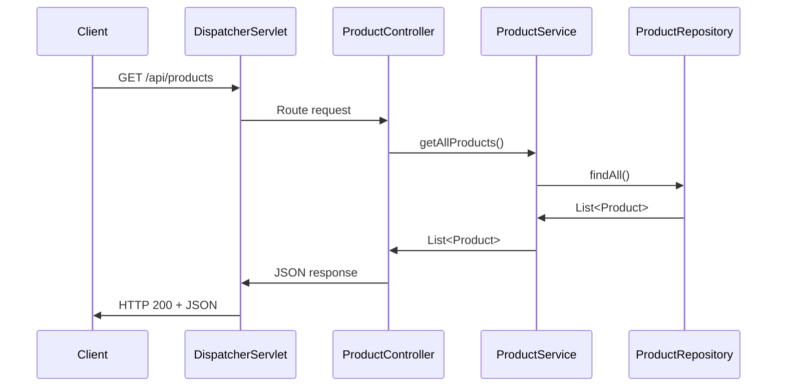

# Chapter 1: Spring MVC Architecture Pattern

## What Problem Does Spring MVC Solve?

Imagine you're running a pizza restaurant. Without proper organization, chaos ensues: customers place orders directly with the kitchen staff, the cashier tries to cook pizzas, and nobody knows what ingredients are available. You need a clear structure!

Spring MVC solves the same problem for web applications. It organizes your code so that each part has a specific job, just like a well-run restaurant has waiters, chefs, and managers with distinct responsibilities.

Let's say we want to build a **product catalog REST API** where customers can view, add, and manage products. Without Spring MVC, all our code would be jumbled together. With Spring MVC, we get a clean, organized structure that's easy to understand and maintain.

## The Model-View-Controller Pattern Explained

Spring MVC is built on the **Model-View-Controller (MVC)** pattern. Think of it like the different roles in our pizza restaurant:

### Model: The Data and Business Rules
The **Model** represents your data and business logic - like the pizza recipes, ingredient inventory, and pricing rules. In our product catalog, this includes:
- Product information (name, price, description)
- Business rules (e.g., "price must be positive")

### View: The Presentation Layer
The **View** is what customers see - like the menu display or receipt. In a REST API, the "view" is the JSON response format that gets sent back to clients.

### Controller: The Request Handler
The **Controller** is like the waiter - it takes customer requests, talks to the kitchen (business logic), and brings back the response. It handles incoming HTTP requests and coordinates everything.

## Key Components of Spring MVC

Let's break down the main players in our Spring MVC architecture:

### 1. DispatcherServlet: The Front Door
```java
// This is configured in web.xml - acts as the main entry point
<servlet>
    <servlet-name>rest</servlet-name>
    <servlet-class>org.springframework.web.servlet.DispatcherServlet</servlet-class>
</servlet>
```

The **DispatcherServlet** is like the host at a restaurant - every customer (HTTP request) goes through them first. They decide which waiter (controller) should handle each table (request).

### 2. Controllers: The Request Handlers
```java
@Controller
@RequestMapping("/api/products")
public class ProductController {
    
    @RequestMapping(method = RequestMethod.GET)
    public ResponseEntity<List<Product>> getAllProducts() {
        // Handle GET /api/products request
        return new ResponseEntity<>(products, HttpStatus.OK);
    }
}
```

Controllers are like waiters - they take your order (HTTP request), validate it, and coordinate with other parts of the restaurant to fulfill it.

### 3. Services: The Business Logic
```java
@Service
public class ProductService {
    
    public List<Product> findAllProducts() {
        // Business logic goes here
        return repository.findAll();
    }
}
```

Services contain the core business rules - like a head chef who knows all the recipes and decides how to prepare each dish.

### 4. Repositories: The Data Access Layer
```java
@Repository  
public class ProductRepository {
    
    public List<Product> findAll() {
        // Data access logic - could be database, file, etc.
        return allProducts;
    }
}
```

Repositories manage data storage and retrieval - like the kitchen staff who know where everything is stored and how to get it.

### 5. Models: The Data Structure
```java
public class Product {
    private String name;
    private double price;
    // getters and setters
}
```

Models represent your data structure - like having a standardized recipe card format that everyone understands.

## How Spring MVC Handles a Request

Let's trace what happens when a customer makes a request to `GET /api/products`:



Here's what happens step by step:

1. **Client sends request**: A customer makes an HTTP GET request to `/api/products`
2. **DispatcherServlet receives it**: The front door (DispatcherServlet) catches all requests
3. **Routes to Controller**: It finds the right controller method to handle `/api/products`
4. **Controller delegates to Service**: The controller asks the service layer for all products
5. **Service calls Repository**: The service asks the repository to fetch the data
6. **Repository returns data**: Raw data comes back up the chain
7. **Response sent to client**: Finally, JSON response goes back to the customer

## Dependency Injection: The Magic Glue

Spring's **Dependency Injection** is like having an amazing HR department that automatically connects the right people to work together:

```java
@Controller
public class ProductController {
    
    @Autowired
    private ProductService productService;  // Spring automatically provides this!
}
```

Instead of you manually creating and connecting objects, Spring does it automatically. It's like having a restaurant manager who ensures every waiter knows which chef to work with, without the waiter having to figure it out themselves.

## Configuration Files: The Organization Chart

Spring MVC uses configuration files to set up the structure:

```xml
<!-- applicationContext.xml - defines your beans -->
<bean id="productService" class="com.example.ProductService"/>
<bean id="productRepository" class="com.example.ProductRepository"/>
```

These XML files are like the restaurant's organization chart - they tell Spring which classes exist and how they should work together.

## Benefits of This Architecture

1. **Separation of Concerns**: Each layer has one job, making code easier to understand
2. **Testability**: You can test each piece independently  
3. **Maintainability**: Changes in one layer don't break others
4. **Reusability**: Business logic in services can be used by different controllers

## Real-World Example: Adding a Product

When a client sends a POST request to create a new product:

```bash
curl -X POST \
  -H "Content-Type: application/json" \
  -d '{"name":"Wireless Mouse","price":49.99}' \
  http://localhost:8080/api/products
```

The flow follows our architecture:
- **Controller** receives and validates the JSON
- **Service** applies business rules (e.g., "price must be positive") 
- **Repository** stores the data
- **Model** represents the product structure throughout

## Conclusion

Spring MVC Architecture Pattern provides a proven way to organize web applications, just like a well-run restaurant has clear roles and responsibilities. By separating concerns into Controllers, Services, Repositories, and Models, we create applications that are easier to understand, test, and maintain.

The key insight is that each layer has a single responsibility:
- Controllers handle web requests
- Services contain business logic  
- Repositories manage data
- Models represent data structure

In the next chapter, we'll dive deeper into the foundation of our product catalog by exploring the [Product Domain Model](02_product_domain_model_.md), where we'll see how to design and structure our core data.

