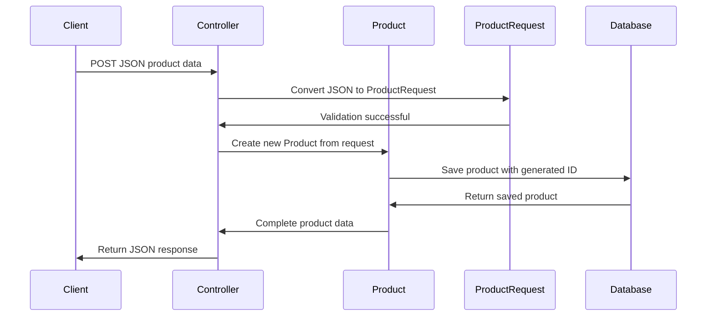

# Chapter 2: Product Domain Model

Now that we understand the [Spring MVC Architecture Pattern](01_spring_mvc_architecture_pattern_.md) and how different layers work together, let's dive into the heart of our product catalog system: the **Product Domain Model**. This is where we define the core data structures that represent products in our system.

## What Problem Does a Domain Model Solve?

Imagine you're organizing a physical store's inventory. Without a standardized product card system, chaos would ensue: one employee writes product info on sticky notes, another uses index cards, and someone else scribbles details on napkins. When a customer asks about a product, nobody can find consistent information!

The Product Domain Model solves this exact problem in our software. It's like creating a **standardized digital product card** that everyone in our system uses. Whether we're displaying products to customers, updating prices, or managing inventory, everyone speaks the same "product language."

Let's say a customer wants to browse products in our catalog. Our system needs to:
1. **Store** product information consistently
2. **Accept** new product data from users  
3. **Display** product details in a standardized format
4. **Update** product information reliably

## Key Concepts: Product vs ProductRequest

Our domain model has two main players, like having different forms for different purposes:

### Product: The Complete Digital Product Card
The `Product` class is our **master product record** - like a complete product file that contains everything we know about an item.

### ProductRequest: The New Product Application Form  
The `ProductRequest` class is what we use when someone wants to **create or update** a product - like a simplified form that customers fill out.

## The Product Class: Our Master Data Structure

Let's look at our main `Product` class step by step:

```java
public class Product {
    private Long id;
    private String sku;
    private String name;
    private String description;
    private BigDecimal price;
}
```

Each field serves a specific purpose:
- **`id`**: Like a unique product number assigned by our system
- **`sku`**: Stock Keeping Unit - a business identifier (like "MOUSE-001")  
- **`name`**: The display name customers see (like "Wireless Mouse")
- **`description`**: Detailed product information
- **`price`**: Product cost using `BigDecimal` for precise money calculations

```java
public class Product {
    // ... previous fields ...
    private String category;
    private boolean active;
    
    // Constructors
    public Product() {}
    
    public Product(Long id, String sku, String name, /*...*/) {
        this.id = id;
        this.sku = sku;
        // ... set other fields
    }
}
```

The additional fields complete our product card:
- **`category`**: Groups products (like "Electronics", "Books")
- **`active`**: Whether the product is available for sale

We have two constructors: an empty one (required by Spring) and a full one for creating products with all details.

## Getter and Setter Methods: Controlled Access

```java
public String getName() { 
    return name; 
}

public void setName(String name) { 
    this.name = name; 
}

public BigDecimal getPrice() { 
    return price; 
}

public void setPrice(BigDecimal price) { 
    this.price = price; 
}
```

These methods provide **controlled access** to our product data. Instead of directly touching the fields, other parts of our system use these methods. It's like having a librarian manage book access instead of letting people directly handle the archive.

## The ProductRequest Class: Simplified Input Form

```java
public class ProductRequest {
    private String sku;
    private String name;
    private String description;
    private BigDecimal price;
    private String category;
    private Boolean active;
}
```

Notice the differences from `Product`:
- **No `id` field**: The system generates IDs automatically
- **`Boolean` instead of `boolean`** for `active`: Allows null values (optional field)

This is like having a simplified form for customers - they provide the essential info, and our system handles the technical details.

## Using the Domain Model: A Complete Example

Let's trace how our domain model works when a user creates a new product:

**Input**: User sends this JSON to create a product:
```json
{
  "sku": "MOUSE-001",
  "name": "Wireless Mouse",
  "description": "Ergonomic wireless mouse with USB receiver",
  "price": 49.99,
  "category": "Electronics",
  "active": true
}
```

**Step 1**: Spring converts JSON to `ProductRequest`:
```java
ProductRequest request = new ProductRequest();
request.setSku("MOUSE-001");
request.setName("Wireless Mouse");
request.setPrice(new BigDecimal("49.99"));
// ... other fields set automatically
```

**Step 2**: Our system creates a complete `Product`:
```java
Product product = new Product();
product.setId(1L); // System generates this
product.setSku(request.getSku());
product.setName(request.getName());
product.setPrice(request.getPrice());
// ... copy other fields
```

**Output**: System returns the complete product with generated ID:
```json
{
  "id": 1,
  "sku": "MOUSE-001", 
  "name": "Wireless Mouse",
  "description": "Ergonomic wireless mouse with USB receiver",
  "price": 49.99,
  "category": "Electronics",
  "active": true
}
```

## Under the Hood: How Domain Models Work

Let's see what happens step-by-step when our system processes product data:



Here's what happens at each step:

1. **Client sends data**: Raw JSON comes from a mobile app, website, etc.
2. **JSON to ProductRequest**: Spring automatically converts JSON to our `ProductRequest` object
3. **Validation**: The `ProductRequest` structure ensures we have required fields
4. **Create Product**: System creates full `Product` with generated ID and timestamps
5. **Database storage**: Complete product gets saved to persistent storage
6. **Response**: Client receives the full product data including system-generated fields

## Why Use BigDecimal for Money?

```java
// WRONG - loses precision!
private double price = 19.99;

// CORRECT - precise decimal arithmetic
private BigDecimal price = new BigDecimal("19.99");
```

Using `BigDecimal` instead of `double` prevents rounding errors that could cost money. For example, `double` might calculate `0.1 + 0.2 = 0.30000000000000004`, but `BigDecimal` gives exact `0.3`.

## Internal Implementation: Field Access Patterns

Our domain model uses the **JavaBean pattern** for consistent field access:

```java
// Private fields - data encapsulation
private String name;
private BigDecimal price;

// Public getters - controlled read access  
public String getName() { return name; }
public BigDecimal getPrice() { return price; }

// Public setters - controlled write access
public void setName(String name) { this.name = name; }
public void setPrice(BigDecimal price) { this.price = price; }
```

This pattern allows:
- **Encapsulation**: Internal data stays protected
- **Validation**: Setters can validate input (future enhancement)
- **Spring Integration**: Spring uses these methods for JSON conversion
- **Debugging**: We can add logging to see when fields change

## Product Lifecycle in Our System

Our domain model supports the complete product lifecycle:

```java
// 1. Create new product from request
Product product = new Product(null, request.getSku(), 
    request.getName(), /*...*/);

// 2. System assigns ID when saved
product.setId(123L);

// 3. Update existing product
product.setPrice(new BigDecimal("59.99"));
product.setDescription("Updated description");

// 4. Deactivate instead of delete
product.setActive(false);
```

This approach maintains data history - we never lose product information, just mark items as inactive.

## Integration with Other Layers

Our domain model seamlessly works with other parts of our Spring MVC architecture:

- **[REST API Controller Layer](03_rest_api_controller_layer_.md)**: Controllers receive `ProductRequest` and return `Product`
- **[Business Logic Service Layer](04_business_logic_service_layer_.md)**: Services operate on `Product` objects
- **[Data Access Repository Layer](05_data_access_repository_layer_.md)**: Repositories store and retrieve `Product` entities

The beauty is that each layer speaks the same "product language" defined by our domain model.

## Conclusion

The Product Domain Model serves as the universal language for our product catalog system. By defining clear, consistent data structures (`Product` and `ProductRequest`), we ensure that every part of our system - from user input to database storage - works with standardized product information.

Key takeaways:
- `Product` represents complete product data with system-generated fields
- `ProductRequest` handles user input for creating/updating products  
- `BigDecimal` ensures accurate money calculations
- JavaBean pattern provides controlled, consistent data access
- The domain model integrates seamlessly with all Spring MVC layers

Now that we have our core data structures defined, let's explore how to expose them to the outside world through our [REST API Controller Layer](03_rest_api_controller_layer_.md), where we'll learn to handle HTTP requests and responses.

