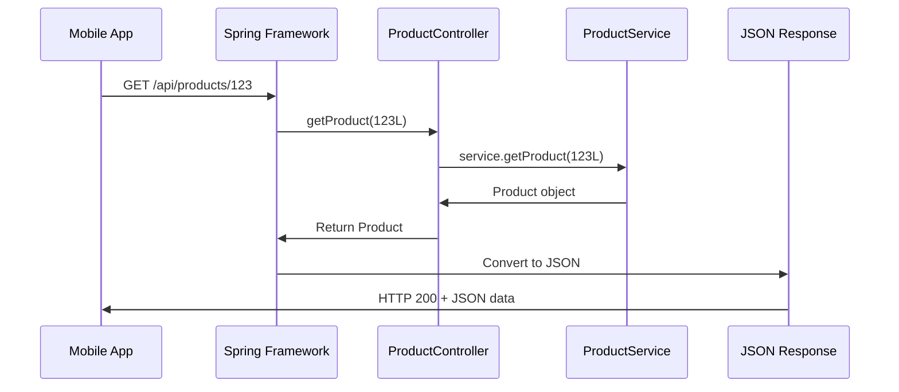
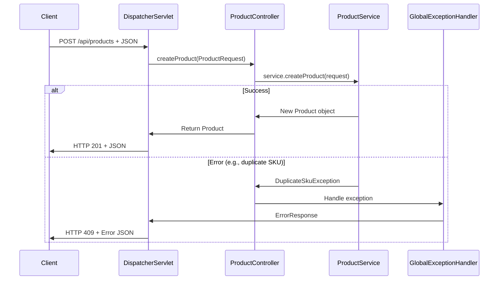

# Chapter 3: REST API Controller Layer

Now that we have our [Product Domain Model](02_product_domain_model_.md) with standardized `Product` and `ProductRequest` structures, we need a way for the outside world to interact with our product catalog. This is where the **REST API Controller Layer** comes in - it's like the front desk of our digital product store.

## What Problem Does the Controller Layer Solve?

Imagine you run a physical electronics store. Customers want to browse products, ask about specific items, and place orders. Without a organized front desk system, chaos would ensue: customers would wander into your storage room looking for products, employees wouldn't know how to handle different types of requests, and there'd be no consistent way to communicate with customers.

The REST API Controller Layer solves this exact problem for our web application. It acts as the **organized front desk** that:
- Receives customer requests (HTTP calls from mobile apps, websites, etc.)
- Understands what customers want (GET products, POST new product, etc.)
- Coordinates with the back office (service layer) to fulfill requests
- Responds to customers in a consistent format (JSON)

Let's say a mobile app wants to display all electronics products to a user. Our controller layer will handle this request professionally and return the data in the exact format the app expects.

## Key Players: ProductController and GlobalExceptionHandler

Our controller layer has two main components, like having specialized staff at our front desk:

### ProductController: The Main Receptionist
The `ProductController` handles all normal product-related requests - like a helpful receptionist who knows exactly how to help customers find, create, or update products.

### GlobalExceptionHandler: The Customer Service Manager
The `GlobalExceptionHandler` handles problems and complaints - like a customer service manager who steps in when something goes wrong and ensures customers get helpful error messages instead of confusion.

## The ProductController: Your API's Front Desk

Let's explore our main controller step by step:

```java
@Controller
@RequestMapping("/api/products")
public class ProductController {
    
    private final ProductService service;
```

The `@Controller` annotation tells Spring "this class handles web requests," while `@RequestMapping("/api/products")` means "all methods in this class handle URLs starting with `/api/products`." It's like putting up a sign that says "Product Information Desk."

The `ProductService` is our connection to the business logic - like having a phone line to the warehouse manager.

### Constructor Injection: Getting the Right Tools

```java
public ProductController(ProductService service) {
    this.service = service;
}
```

This constructor uses **dependency injection** - Spring automatically provides the `ProductService` when creating the controller. It's like the company automatically giving our receptionist a phone to call the warehouse.

### Getting All Products: The Browse Request

```java
@GetMapping
@ResponseBody
public List<Product> getProducts(
    @RequestParam(value = "category", required = false) String category,
    @RequestParam(value = "active", required = false) Boolean active) {
    return service.getProducts(category, active);
}
```

This method handles `GET /api/products` requests - when customers want to browse products. The annotations break down like this:
- `@GetMapping`: "Handle HTTP GET requests to this URL"
- `@ResponseBody`: "Convert the return value to JSON automatically" 
- `@RequestParam`: "Accept optional filter parameters"

**Example Usage:**
```bash
GET /api/products?category=Electronics&active=true
```

**What happens:** Returns JSON list of all active electronics products.

### Getting One Product: The Specific Inquiry

```java
@GetMapping("/{id}")
@ResponseBody  
public Product getProduct(@PathVariable("id") Long id) {
    return service.getProduct(id);
}
```

This handles requests for specific products, like "show me product #123." The `{id}` in the URL is a placeholder that gets filled with the actual product ID.

**Example Usage:**
```bash
GET /api/products/123
```

**What happens:** Returns JSON for product with ID 123, or an error if not found.

### Creating Products: The New Product Form

```java
@PostMapping
@ResponseBody
@ResponseStatus(HttpStatus.CREATED)
public Product createProduct(@RequestBody ProductRequest request) {
    return service.createProduct(request);
}
```

This handles creating new products. The `@RequestBody` means "take the JSON from the request and convert it to a `ProductRequest` object automatically."

**Example Usage:**
```bash
POST /api/products
Content-Type: application/json

{
  "sku": "MOUSE-001",
  "name": "Wireless Mouse", 
  "price": 49.99,
  "category": "Electronics"
}
```

**What happens:** Creates a new product and returns the complete product data with generated ID.

### Updating Products: The Change Request

```java
@PutMapping("/{id}")
@ResponseBody
public Product updateProduct(@PathVariable("id") Long id,
                           @RequestBody ProductRequest request) {
    return service.updateProduct(id, request);
}
```

This updates existing products by combining a product ID from the URL with new data from the request body.

### Deleting Products: The Removal Request

```java
@DeleteMapping("/{id}")
@ResponseStatus(HttpStatus.NO_CONTENT)
public void deleteProduct(@PathVariable("id") Long id) {
    service.deleteProduct(id);
}
```

This handles product deletion. The `@ResponseStatus(HttpStatus.NO_CONTENT)` means "return HTTP 204 - success with no content" since there's nothing to return after deletion.

## How a Request Flows Through the Controller

Let's trace what happens when a mobile app requests `GET /api/products/123`:



Here's what happens step by step:

1. **Client Request**: Mobile app sends `GET /api/products/123`
2. **Spring Routing**: Spring sees the URL pattern and calls `getProduct(123L)`
3. **Controller Delegates**: Controller asks the service layer for product 123
4. **Service Processing**: Service layer handles business logic and data retrieval
5. **Return Data**: Product object comes back up the chain
6. **JSON Conversion**: Spring automatically converts `Product` to JSON
7. **HTTP Response**: Client receives HTTP 200 with product data

## The GlobalExceptionHandler: When Things Go Wrong

Sometimes things don't go as planned - a product doesn't exist, or someone tries to create a product with invalid data. Our `GlobalExceptionHandler` acts like a customer service manager:

```java
@ControllerAdvice
public class GlobalExceptionHandler {

    @ExceptionHandler(ProductNotFoundException.class)
    @ResponseStatus(HttpStatus.NOT_FOUND)  
    @ResponseBody
    public ErrorResponse handleNotFound(ProductNotFoundException ex) {
        return new ErrorResponse("PRODUCT_NOT_FOUND", ex.getMessage());
    }
}
```

The `@ControllerAdvice` annotation means "this class helps all controllers handle errors." When any controller throws a `ProductNotFoundException`, this method automatically handles it.

**Example Error Response:**
```json
{
  "code": "PRODUCT_NOT_FOUND",
  "message": "Product with ID 999 not found"
}
```

### Different Types of Problems

```java
@ExceptionHandler(DuplicateSkuException.class)
@ResponseStatus(HttpStatus.CONFLICT)
public ErrorResponse handleDuplicate(DuplicateSkuException ex) {
    return new ErrorResponse("DUPLICATE_SKU", ex.getMessage());
}

@ExceptionHandler(InvalidProductException.class) 
@ResponseStatus(HttpStatus.BAD_REQUEST)
public ErrorResponse handleInvalid(InvalidProductException ex) {
    return new ErrorResponse("INVALID_PRODUCT", ex.getMessage());
}
```

Each exception type gets a specific HTTP status code:
- `404 NOT_FOUND`: Product doesn't exist
- `409 CONFLICT`: SKU already exists
- `400 BAD_REQUEST`: Invalid product data

## Under the Hood: How Controllers Process Requests

Let's see what happens internally when someone creates a new product:



The process involves these key steps:

1. **Request Reception**: `DispatcherServlet` receives the HTTP request
2. **JSON Parsing**: Spring automatically converts JSON to `ProductRequest`
3. **Method Invocation**: Controller method gets called with the parsed object
4. **Business Logic**: Service layer processes the request
5. **Success Path**: New product gets returned and converted to JSON
6. **Error Path**: If something fails, `GlobalExceptionHandler` creates a user-friendly error message

## Request/Response Examples: Complete Interactions

Let's see complete examples of how our controller handles different scenarios:

### Creating a Product - Success Case

**Request:**
```http
POST /api/products HTTP/1.1
Content-Type: application/json

{
  "sku": "KEYBOARD-001",
  "name": "Mechanical Keyboard",
  "description": "RGB backlit mechanical gaming keyboard", 
  "price": 129.99,
  "category": "Electronics",
  "active": true
}
```

**Response:**
```http
HTTP/1.1 201 Created
Content-Type: application/json

{
  "id": 42,
  "sku": "KEYBOARD-001", 
  "name": "Mechanical Keyboard",
  "description": "RGB backlit mechanical gaming keyboard",
  "price": 129.99,
  "category": "Electronics", 
  "active": true
}
```

### Error Case - Duplicate SKU

**Request:**
```http
POST /api/products HTTP/1.1
Content-Type: application/json

{
  "sku": "KEYBOARD-001",  // This SKU already exists!
  "name": "Another Keyboard",
  "price": 89.99
}
```

**Response:**
```http
HTTP/1.1 409 Conflict
Content-Type: application/json

{
  "code": "DUPLICATE_SKU",
  "message": "Product with SKU 'KEYBOARD-001' already exists"  
}
```

## Integration with Other Layers

Our controller layer seamlessly connects with the rest of our Spring MVC architecture:

- **Receives [Product Domain Model](02_product_domain_model_.md) objects**: Uses `Product` and `ProductRequest` as the common language
- **Delegates to [Business Logic Service Layer](04_business_logic_service_layer_.md)**: Controllers focus on web concerns, services handle business rules
- **Relies on [Exception Handling System](06_exception_handling_system_.md)**: `GlobalExceptionHandler` provides consistent error responses across all endpoints

The beauty is that controllers stay focused on their single responsibility: translating between HTTP requests/responses and business operations.

## HTTP Status Codes: Speaking the Web's Language

Our controller uses standard HTTP status codes to communicate results:

```java
@ResponseStatus(HttpStatus.CREATED)      // 201 - New resource created
@ResponseStatus(HttpStatus.NO_CONTENT)   // 204 - Success, no content returned
@ResponseStatus(HttpStatus.NOT_FOUND)    // 404 - Resource doesn't exist  
@ResponseStatus(HttpStatus.CONFLICT)     // 409 - Business rule violation
@ResponseStatus(HttpStatus.BAD_REQUEST)  // 400 - Invalid input data
```

This makes our API predictable - client applications know exactly what each response code means.

## Conclusion

The REST API Controller Layer serves as the professional front desk of our product catalog system. Like a well-trained receptionist, it:

- **Receives requests gracefully**: Handles HTTP calls from any client (mobile apps, websites, etc.)
- **Speaks the right language**: Converts between JSON and our domain objects automatically
- **Delegates appropriately**: Passes business operations to the service layer
- **Handles problems professionally**: Provides clear, helpful error messages when things go wrong

Key components:
- `ProductController` manages all product-related endpoints (GET, POST, PUT, DELETE)
- `GlobalExceptionHandler` ensures consistent, user-friendly error responses
- Spring annotations (`@GetMapping`, `@PostMapping`, etc.) make request routing declarative and clear
- Automatic JSON conversion eliminates boilerplate code

Our controller layer creates a clean separation between web concerns (HTTP, JSON, status codes) and business logic, making our system easier to test, maintain, and extend.

Next, we'll dive deeper into what happens after the controller delegates to the [Business Logic Service Layer](04_business_logic_service_layer_.md), where the real product management rules and operations are implemented.

