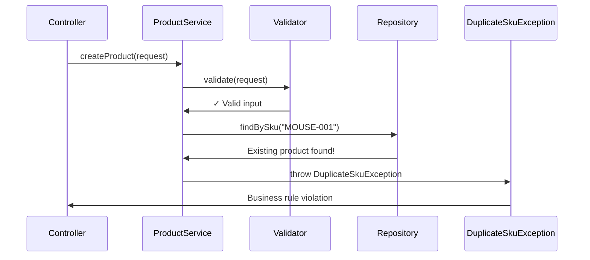
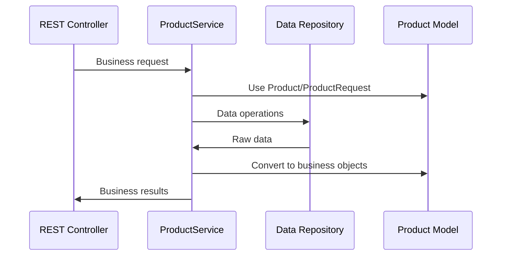

# Chapter 4: Business Logic Service Layer

Building on our [REST API Controller Layer](03_rest_api_controller_layer_.md), we now have a front desk that can receive and respond to customer requests. But what happens when a customer asks to create a product? Who ensures the product has a valid price? Who checks if the SKU is unique? This is where the **Business Logic Service Layer** comes in - the brain of our product catalog system.

## What Problem Does the Service Layer Solve?

Imagine you're running a physical electronics store with multiple cashiers at the front desk. A customer wants to return a product, but each cashier handles returns differently: one accepts any return without checking, another requires a receipt but doesn't verify the purchase date, and a third makes up rules on the spot. This inconsistency creates chaos and potential losses for your business.

The Business Logic Service Layer solves this exact problem in our software. It's like having a **store manager who creates and enforces all the business policies**. Whether a request comes from a mobile app, website, or admin panel, the same business rules apply consistently:

- Product SKUs must be unique across the entire catalog
- Prices must be zero or greater (no negative prices)
- Required fields like name and category cannot be empty
- Only valid products can be saved to our system

Let's say a mobile app tries to create a new product with SKU "MOUSE-001", but that SKU already exists. Our service layer will catch this business rule violation and prevent the duplicate, just like a good store manager would stop two products from having the same barcode.

## Key Players: ProductService Interface and Implementation

Our service layer has two main components, like having a policy manual and a manager who implements those policies:

### ProductService Interface: The Policy Manual
The `ProductService` interface defines **what** business operations we can perform - like a policy manual that lists all the services our store offers.

### ProductServiceImpl: The Store Manager
The `ProductServiceImpl` class contains **how** we actually implement those business operations - like an experienced store manager who knows exactly how to follow each policy.

## The ProductService Interface: Our Business Contract

Let's look at our service interface:

```java
public interface ProductService {
    List<Product> getProducts(String category, Boolean active);
    Product getProduct(Long id);
    Product createProduct(ProductRequest request);
    Product updateProduct(Long id, ProductRequest request);
    void deleteProduct(Long id);
}
```

This interface defines our **business contract** - the operations our product catalog supports. It's like posting a sign that says "We offer these services: browse products, find specific products, create new products, update existing products, and remove products."

Each method represents a core business operation:
- **`getProducts`**: Browse products with optional filtering
- **`getProduct`**: Find one specific product by ID
- **`createProduct`**: Add a new product to the catalog
- **`updateProduct`**: Modify an existing product
- **`deleteProduct`**: Remove a product from the catalog

## The ProductServiceImpl: Where Business Logic Lives

Now let's see how our store manager (implementation) actually handles these operations:

```java
@Service
public class ProductServiceImpl implements ProductService {
    
    private final ProductRepository repository;
    
    public ProductServiceImpl(ProductRepository repository) {
        this.repository = repository;
    }
}
```

The `@Service` annotation tells Spring "this class contains business logic," while the constructor receives a `ProductRepository` - like giving our store manager access to the inventory system.

### Finding Products: The Browse Operation

```java
@Override
public List<Product> getProducts(String category, Boolean active) {
    List<Product> result = new ArrayList<Product>();
    for (Product product : repository.findAll()) {
        if (category != null && !category.equalsIgnoreCase(product.getCategory())) {
            continue; // Skip products that don't match category filter
        }
        if (active != null && active.booleanValue() != product.isActive()) {
            continue; // Skip products that don't match active filter
        }
        result.add(product);
    }
    return result;
}
```

This method implements the business logic for browsing products. It fetches all products from storage, then applies business rules for filtering:
- If customer specifies a category, only show products from that category
- If customer specifies active status, only show products matching that status
- Case-insensitive category matching (user-friendly behavior)

**Example Usage:**
- `getProducts("Electronics", true)` → Returns only active electronics
- `getProducts(null, null)` → Returns all products

### Creating Products: The Validation Master

```java
@Override
public Product createProduct(ProductRequest request) {
    validate(request);  // Check business rules
    
    if (repository.findBySku(request.getSku()) != null) {
        throw new DuplicateSkuException(request.getSku());
    }
    
    Product product = new Product();
    copy(request, product, true);  // Transfer data safely
    return repository.save(product);
}
```

This is where our business rules are enforced! The method:
1. **Validates input**: Ensures the request meets our business standards
2. **Checks uniqueness**: Prevents duplicate SKUs in our system
3. **Creates safely**: Transfers data using controlled methods
4. **Saves securely**: Persists the validated product

## Business Rule Validation: The Policy Enforcer

The heart of our service layer is the validation logic:

```java
private void validate(ProductRequest request) {
    if (request == null) {
        throw new InvalidProductException("Request body is required.");
    }
    if (isBlank(request.getSku())) {
        throw new InvalidProductException("sku is required.");
    }
    if (isBlank(request.getName())) {
        throw new InvalidProductException("name is required.");
    }
}
```

Each validation check enforces a specific business rule:
- **Null check**: "We need product information to proceed"
- **SKU validation**: "Every product must have a stock number"  
- **Name validation**: "Every product must have a display name"

### Advanced Business Rules

```java
if (request.getPrice() == null || request.getPrice().compareTo(BigDecimal.ZERO) < 0) {
    throw new InvalidProductException("price must be zero or greater.");
}
if (isBlank(request.getCategory())) {
    throw new InvalidProductException("category is required.");
}
```

These rules enforce more complex business logic:
- **Price rules**: No negative prices allowed (business policy)
- **Category requirements**: Every product must belong to a category (organizational policy)

## Data Processing: The Safe Transfer System

Our service layer also handles safe data processing:

```java
private void copy(ProductRequest request, Product product, boolean create) {
    product.setSku(request.getSku().trim());        // Remove extra spaces
    product.setName(request.getName().trim());      // Clean up name
    product.setDescription(request.getDescription()); 
    product.setPrice(request.getPrice());
    product.setCategory(request.getCategory().trim().toUpperCase()); // Standardize format
    product.setActive(request.getActive() == null ? true : request.getActive().booleanValue());
}
```

This method implements business logic for data processing:
- **Trim whitespace**: Clean up user input automatically
- **Standardize categories**: Convert to uppercase for consistency
- **Default values**: Set `active` to `true` if not specified
- **Safe copying**: Only transfer approved fields

## How Service Layer Processes Requests

Let's trace what happens when someone tries to create a product with duplicate SKU:



Here's what happens step by step:

1. **Controller Request**: Controller asks service to create a product
2. **Input Validation**: Service validates all required fields and business rules
3. **Uniqueness Check**: Service checks if SKU already exists in our catalog
4. **Rule Violation**: Discovers SKU "MOUSE-001" already exists
5. **Exception Thrown**: Service throws business exception to prevent duplicate
6. **Error Handling**: Controller receives exception and can return appropriate error to user

## Updating Products: Preserving Data Integrity

The update operation shows how business logic handles complex scenarios:

```java
@Override
public Product updateProduct(Long id, ProductRequest request) {
    Product existing = getProduct(id);  // Ensure product exists
    validate(request);                  // Apply same validation rules
    
    Product sameSku = repository.findBySku(request.getSku());
    if (sameSku != null && !sameSku.getId().equals(id)) {
        throw new DuplicateSkuException(request.getSku());  // Prevent SKU conflicts
    }
    
    copy(request, existing, false);     // Update existing product safely
    return repository.update(existing);
}
```

This method implements sophisticated business logic:
- **Existence check**: Make sure we're updating a real product
- **Validation**: Apply the same rules as creation
- **Smart SKU checking**: Allow keeping the same SKU, but prevent taking someone else's SKU
- **Safe updating**: Preserve the original product ID and system fields

## Integration with Other Layers

Our service layer acts as the central coordinator between different parts of our system:



The service layer:
- **Receives requests** from our [REST API Controller Layer](03_rest_api_controller_layer_.md)
- **Uses data structures** from our [Product Domain Model](02_product_domain_model_.md)
- **Coordinates data access** with the [Data Access Repository Layer](05_data_access_repository_layer_.md)
- **Throws business exceptions** handled by our [Exception Handling System](06_exception_handling_system_.md)

## Under the Hood: Complete Request Processing

Let's see what happens internally when a valid product creation request comes through:

```java
// Step 1: Validate business rules
private void validate(ProductRequest request) {
    // Check all required fields and business constraints
}

// Step 2: Check business uniqueness rules  
Product existing = repository.findBySku(request.getSku());
if (existing != null) {
    throw new DuplicateSkuException(request.getSku());
}

// Step 3: Apply business data processing
private void copy(ProductRequest request, Product product, boolean create) {
    // Clean, standardize, and safely transfer data
}

// Step 4: Coordinate with data layer
return repository.save(product);
```

Each step ensures our business rules are followed:
1. **Input validation**: Prevents bad data from entering our system
2. **Business constraints**: Enforces uniqueness and other business rules
3. **Data processing**: Standardizes and cleans data according to business needs
4. **Data coordination**: Works with repository to persist valid business objects

## Helper Methods: The Business Utilities

Our service includes utility methods that implement business logic:

```java
private boolean isBlank(String value) {
    return value == null || value.trim().length() == 0;
}
```

This simple method implements our business definition of "blank" - either null or empty after trimming whitespace. It's used consistently throughout our validation logic.

## Error Handling: Business Rule Enforcement

When business rules are violated, our service layer throws specific exceptions:

```java
// Business rule violations
throw new InvalidProductException("price must be zero or greater.");
throw new DuplicateSkuException(request.getSku());
throw new ProductNotFoundException(id);
```

Each exception represents a specific business rule violation:
- **InvalidProductException**: Input doesn't meet our business standards
- **DuplicateSkuException**: Violates our uniqueness business rule
- **ProductNotFoundException**: Requested resource doesn't exist in our system

## Real-World Example: Complete Product Creation

Let's trace a complete example where a mobile app creates a product:

**Input Request:**
```json
{
  "sku": "HEADSET-001",
  "name": "  Gaming Headset  ",
  "price": 89.99,
  "category": "electronics",
  "active": null
}
```

**Service Processing:**
1. **Validation**: Checks required fields, validates price ≥ 0
2. **SKU Check**: Verifies "HEADSET-001" doesn't exist
3. **Data Processing**: Trims name → "Gaming Headset", uppercases category → "ELECTRONICS", defaults active → true
4. **Persistence**: Saves cleaned product to repository

**Output Result:**
```json
{
  "id": 15,
  "sku": "HEADSET-001", 
  "name": "Gaming Headset",
  "price": 89.99,
  "category": "ELECTRONICS",
  "active": true
}
```

Notice how our business logic:
- Generated a system ID (15)
- Cleaned the name by trimming whitespace
- Standardized the category format
- Applied default business rules for the active flag

## Conclusion

The Business Logic Service Layer serves as the intelligent brain of our product catalog system. Like an experienced store manager, it:

- **Enforces business rules consistently**: Same policies apply regardless of how requests arrive
- **Validates all input**: Ensures only valid data enters our system
- **Coordinates operations**: Works between controllers and data access to orchestrate business processes
- **Handles complex scenarios**: Manages edge cases like duplicate SKUs and missing products
- **Processes data safely**: Cleans, standardizes, and transforms data according to business needs

Key components:
- `ProductService` interface defines our business contract
- `ProductServiceImpl` contains the actual business logic and rules
- Validation methods enforce data quality and business constraints
- Helper methods provide consistent business utilities
- Exception handling communicates business rule violations clearly

Our service layer creates a clean separation between web concerns (handled by controllers) and data concerns (handled by repositories), while containing all the business intelligence that makes our product catalog work correctly.

Next, we'll explore how our service layer coordinates with the [Data Access Repository Layer](05_data_access_repository_layer_.md), where we'll learn how business objects get stored and retrieved from persistent storage.

