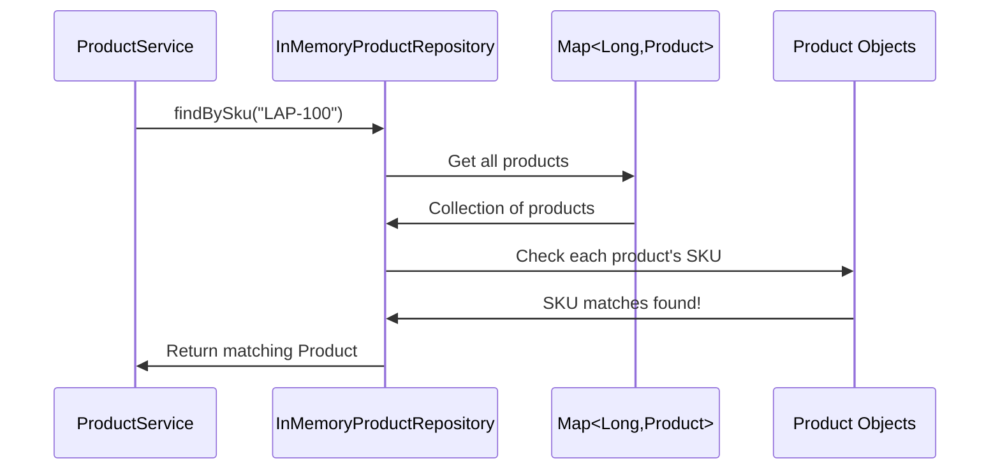
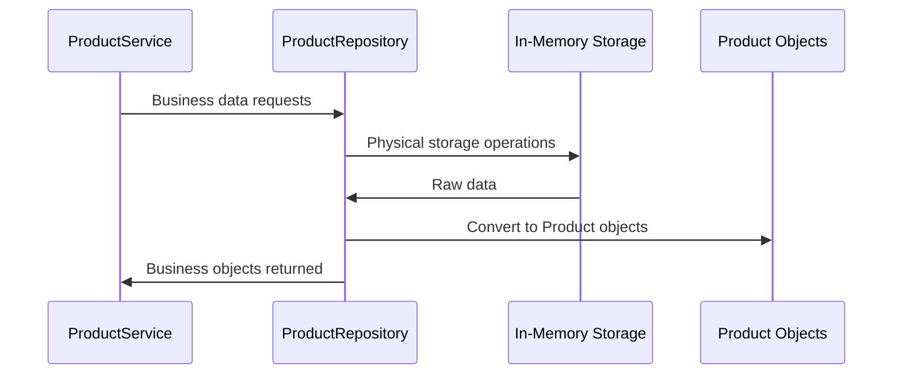

# Chapter 5: Data Access Repository Layer

Building on our [Business Logic Service Layer](04_business_logic_service_layer_.md), we now have a smart brain that can validate products and enforce business rules. But where does our service layer actually store and retrieve product data? This is where the **Data Access Repository Layer** comes in - the warehouse manager of our product catalog system.

## What Problem Does the Repository Layer Solve?

Imagine you're running a physical electronics store with a brilliant store manager who knows all the business rules. A customer wants to buy a specific laptop, so the manager needs to check if it's in stock. Without an organized warehouse system, the manager would have to:
- Search through random boxes scattered around the building
- Remember where each item was placed (if they can remember at all)
- Manually count inventory every time someone asks about stock
- Have no consistent way to add new products to storage

The Data Access Repository Layer solves this exact problem for our software. It's like having a **professional warehouse manager** who:
- Knows exactly where every product is stored
- Can quickly find any product by ID or SKU
- Has a systematic way to add, update, and remove products
- Provides the same storage interface whether products are kept in memory, files, or databases

Let's say our service layer needs to check if SKU "LAPTOP-001" already exists before creating a new product. Our repository layer will efficiently search through all stored products and give a definitive answer, just like a good warehouse manager can quickly check their inventory system.

## Key Players: ProductRepository Interface and InMemoryProductRepository

Our repository layer has two main components, like having a warehouse operations manual and an actual warehouse manager:

### ProductRepository Interface: The Warehouse Operations Manual
The `ProductRepository` interface defines **what** storage operations are possible - like a manual that lists "you can store items, find items, update items, and remove items."

### InMemoryProductRepository: The Warehouse Manager
The `InMemoryProductRepository` class implements **how** we actually perform those storage operations - like an experienced warehouse manager who knows the specific procedures for each operation.

## The ProductRepository Interface: Our Storage Contract

Let's look at our repository interface:

```java
public interface ProductRepository {
    List<Product> findAll();
    Product findById(Long id);
    Product findBySku(String sku);
    Product save(Product product);
    Product update(Product product);
    boolean delete(Long id);
}
```

This interface defines our **storage contract** - the operations our warehouse supports. It's like posting a sign that says "Warehouse Services Available: Find All Items, Find by ID Number, Find by SKU Code, Store New Item, Update Existing Item, Remove Item."

Each method represents a core storage operation:
- **`findAll()`**: "Show me everything in the warehouse"
- **`findById(Long id)`**: "Find the item with ID number 123"
- **`findBySku(String sku)`**: "Find the item with SKU 'LAPTOP-001'"
- **`save(Product product)`**: "Store this new item and give it an ID number"
- **`update(Product product)`**: "Replace the existing item with this updated version"
- **`delete(Long id)`**: "Remove the item with ID number 123"

## The InMemoryProductRepository: Our Warehouse Manager

Now let's see how our warehouse manager actually handles storage operations:

```java
@Repository
public class InMemoryProductRepository implements ProductRepository {
    
    private final Map<Long, Product> products = new LinkedHashMap<Long, Product>();
    private long sequence = 3L;
}
```

The `@Repository` annotation tells Spring "this class handles data storage," while the `Map<Long, Product>` is our warehouse storage system - like having numbered shelves where each product has a specific location (ID number).

The `LinkedHashMap` preserves insertion order, so products appear in the order they were added. The `sequence` variable is like a numbering system for assigning unique ID numbers to new products.

### Pre-loaded Sample Data: The Starting Inventory

```java
public InMemoryProductRepository() {
    products.put(1L, new Product(1L, "LAP-100", "Developer Laptop",
            "16GB RAM, 512GB SSD", new BigDecimal("1299.99"), "COMPUTER", true));
    products.put(2L, new Product(2L, "MON-200", "27 Inch Monitor", 
            "4K IPS monitor", new BigDecimal("449.00"), "DISPLAY", true));
    products.put(3L, new Product(3L, "KEY-300", "Mechanical Keyboard",
            "Developer mechanical keyboard", new BigDecimal("129.50"), "ACCESSORY", true));
}
```

The constructor loads sample products into our warehouse - like starting with some initial inventory. Each product gets stored at its ID location (1L, 2L, 3L) for quick retrieval.

### Finding All Products: The Complete Inventory List

```java
@Override
public synchronized List<Product> findAll() {
    return new ArrayList<Product>(products.values());
}
```

This method returns all products in our warehouse. The `synchronized` keyword ensures thread safety - like making sure only one person can access the inventory system at a time to prevent conflicts.

**Example Usage:**
```java
List<Product> allProducts = repository.findAll();
// Returns: [Developer Laptop, 27 Inch Monitor, Mechanical Keyboard]
```

### Finding Specific Products: The Search Operations

```java
@Override
public synchronized Product findById(Long id) {
    return products.get(id);
}
```

This finds a product by its ID number - like looking up shelf location #2 to find what's stored there.

**Example Usage:**
```java
Product laptop = repository.findById(1L);
// Returns: Developer Laptop with all its details
```

### Finding by SKU: The Barcode Scanner

```java
@Override
public synchronized Product findBySku(String sku) {
    for (Product product : products.values()) {
        if (product.getSku() != null && product.getSku().equalsIgnoreCase(sku)) {
            return product;
        }
    }
    return null;
}
```

This searches through all products to find one with a matching SKU - like scanning through the warehouse with a barcode scanner. The `equalsIgnoreCase` makes the search user-friendly (case-insensitive).

**Example Usage:**
```java
Product keyboard = repository.findBySku("KEY-300");
// Returns: Mechanical Keyboard
Product notFound = repository.findBySku("MISSING-001");  
// Returns: null (not found)
```

## Storage Operations: Managing the Warehouse

### Saving New Products: Adding to Inventory

```java
@Override
public synchronized Product save(Product product) {
    product.setId(sequence++);
    products.put(product.getId(), product);
    return product;
}
```

This method stores a new product in our warehouse:
1. **Assign ID**: Give the product the next available ID number (`sequence++`)
2. **Store**: Place the product at that location in our storage map
3. **Return**: Give back the product with its new ID

**Example Usage:**
```java
Product newMouse = new Product(null, "MOUSE-001", "Wireless Mouse", /*...*/);
Product savedMouse = repository.save(newMouse);
// Result: newMouse now has id = 4L and is stored in the warehouse
```

### Updating Existing Products: Replacing Inventory

```java
@Override  
public synchronized Product update(Product product) {
    products.put(product.getId(), product);
    return product;
}
```

This replaces an existing product at its shelf location - like swapping out the old item with an updated version while keeping the same ID number.

### Removing Products: Taking from Inventory

```java
@Override
public synchronized boolean delete(Long id) {
    return products.remove(id) != null;
}
```

This removes a product from storage and returns `true` if something was actually removed, `false` if the ID didn't exist.

## How Repository Operations Work

Let's trace what happens when the service layer asks to find a product by SKU:



Here's what happens step by step:

1. **Service Request**: Service layer asks repository to find product with SKU "LAP-100"
2. **Storage Access**: Repository accesses the internal storage map
3. **Sequential Search**: Repository loops through all stored products
4. **SKU Comparison**: Each product's SKU gets compared with "LAP-100" (case-insensitive)
5. **Match Found**: When a matching SKU is found, that product is returned
6. **Result**: Service layer receives the complete Product object

## Thread Safety: Preventing Storage Conflicts

Notice every method uses `synchronized`:

```java
public synchronized List<Product> findAll() { /*...*/ }
public synchronized Product save(Product product) { /*...*/ }
```

This prevents problems when multiple requests access the warehouse simultaneously - like ensuring only one person can modify the inventory system at a time. Without this, two requests could interfere with each other and corrupt data.

## Internal Storage Structure: How Data is Organized

Let's see what our internal storage looks like after some operations:

```java
// Initial state after constructor:
Map<Long, Product> products = {
    1L -> Product(id=1, sku="LAP-100", name="Developer Laptop", ...),
    2L -> Product(id=2, sku="MON-200", name="27 Inch Monitor", ...),  
    3L -> Product(id=3, sku="KEY-300", name="Mechanical Keyboard", ...)
}
long sequence = 4L;  // Next ID to assign

// After saving a new product:
Product newProduct = repository.save(new Product(null, "MOUSE-001", "Gaming Mouse", ...));
// Storage becomes:
Map<Long, Product> products = {
    1L -> Product(id=1, sku="LAP-100", name="Developer Laptop", ...),
    2L -> Product(id=2, sku="MON-200", name="27 Inch Monitor", ...),
    3L -> Product(id=3, sku="KEY-300", name="Mechanical Keyboard", ...),
    4L -> Product(id=4, sku="MOUSE-001", name="Gaming Mouse", ...)  // New product
}
long sequence = 5L;  // Ready for next product
```

The `LinkedHashMap` maintains insertion order, so products appear in the sequence they were added. Each product is stored at its unique ID location for fast retrieval.

## Integration with Other Layers

Our repository layer seamlessly integrates with the rest of our Spring MVC architecture:



The repository layer:
- **Serves [Business Logic Service Layer](04_business_logic_service_layer_.md)**: Provides data operations that support business rules
- **Uses [Product Domain Model](02_product_domain_model_.md)**: Stores and retrieves `Product` objects
- **Abstracts storage details**: Service layer doesn't know whether data is in memory, database, or files
- **Supports system scalability**: Easy to swap storage implementations without changing business logic

## Under the Hood: Complete Operation Flow

Let's see what happens internally when the service layer creates a new product:

```java
// Service layer calls repository
Product savedProduct = repository.save(newProduct);

// Inside save() method:
// Step 1: Generate unique ID
product.setId(sequence++);  // sequence was 4, now becomes 4 then increments to 5

// Step 2: Store in map
products.put(product.getId(), product);  // Store at location 4L

// Step 3: Return the product with its new ID
return product;  // Product now has id=4L
```

Each step ensures data integrity:
1. **ID Generation**: Ensures each product has a unique identifier
2. **Safe Storage**: Places product in thread-safe storage location  
3. **Confirmation**: Returns the stored product to confirm successful operation

## Why Use This Abstraction Pattern?

The interface/implementation pattern provides powerful flexibility:

### Easy Storage Swapping
```java
// Could swap to different implementations:
@Repository
public class DatabaseProductRepository implements ProductRepository {
    // Same interface, different storage mechanism
}

@Repository  
public class FileProductRepository implements ProductRepository {
    // Same interface, file-based storage
}
```

The service layer code never changes - it just calls `ProductRepository` methods regardless of the underlying storage mechanism.

### Testability Benefits
```java
// Easy to create test versions:
public class MockProductRepository implements ProductRepository {
    // Simplified version for testing
}
```

This makes unit testing much easier since we can provide controlled test data without needing real storage.

## Real-World Example: Complete Storage Lifecycle

Let's trace a complete example where a mobile app creates, finds, and updates a product:

**Step 1: Create Product**
```java
Product headset = new Product(null, "HEADSET-001", "Gaming Headset", /*...*/);
Product saved = repository.save(headset);
// Result: saved.getId() = 4L, stored in map at location 4L
```

**Step 2: Find by SKU**  
```java
Product found = repository.findBySku("HEADSET-001");
// Result: Returns the same headset object with id=4L
```

**Step 3: Update Product**
```java
found.setPrice(new BigDecimal("79.99"));  // Change price
Product updated = repository.update(found);
// Result: Same location 4L now has updated price
```

**Step 4: Verify Update**
```java
Product verified = repository.findById(4L);
// Result: Returns headset with new price 79.99
```

Throughout this lifecycle, our repository ensures data consistency and provides reliable storage operations.

## Memory Management: Understanding the Trade-offs

Our in-memory implementation has specific characteristics:

**Benefits:**
- **Fast access**: No disk I/O, everything in RAM
- **Simple**: No database setup or configuration needed
- **Predictable**: Consistent performance for all operations

**Limitations:**
- **Data loss**: Everything disappears when application restarts
- **Memory usage**: All products stored in RAM
- **Scalability**: Limited by available memory

This makes it perfect for development, testing, and small applications, while larger production systems might use database-backed implementations.

## Error Handling: When Storage Operations Fail

Our repository handles various edge cases gracefully:

```java
// Not found scenarios return null
Product missing = repository.findById(999L);        // Returns null
Product notFound = repository.findBySku("MISSING"); // Returns null

// Delete operations return boolean success
boolean deleted = repository.delete(1L);    // Returns true (existed)  
boolean failed = repository.delete(999L);   // Returns false (didn't exist)
```

This allows the service layer to handle missing data appropriately and provide meaningful error messages to users.

## Conclusion

The Data Access Repository Layer serves as the reliable warehouse manager of our product catalog system. Like a professional inventory system, it:

- **Provides consistent storage interface**: Same operations work regardless of underlying storage mechanism
- **Ensures data integrity**: Thread-safe operations prevent data corruption
- **Offers efficient access**: Fast retrieval by ID or SKU for business operations  
- **Maintains abstraction**: Service layer doesn't need to know storage implementation details
- **Supports flexibility**: Easy to swap storage mechanisms without changing business logic

Key components:
- `ProductRepository` interface defines the storage contract
- `InMemoryProductRepository` provides in-memory storage implementation
- Thread synchronization ensures data safety in multi-user environments
- Auto-generated IDs provide unique product identification
- Integration patterns support clean architecture separation

Our repository layer creates a clean separation between business logic and data storage concerns, making our system easier to test, maintain, and extend. The abstraction allows easy swapping of storage mechanisms (database, file, cloud) without impacting other parts of the system.

Next, we'll explore how our entire system handles problems and errors gracefully through the [Exception Handling System](06_exception_handling_system_.md), where we'll learn to provide clear, helpful feedback when things don't go as planned.

