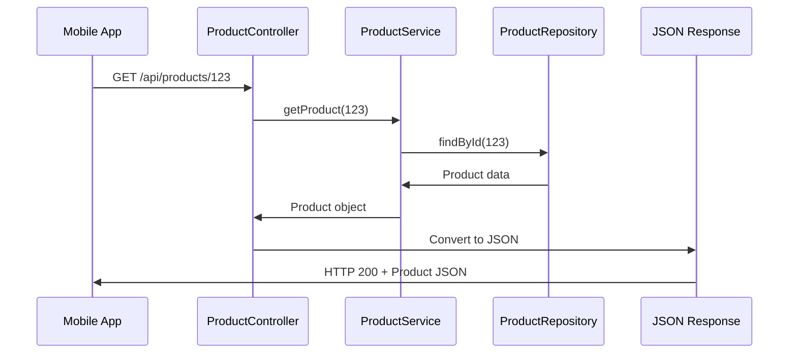
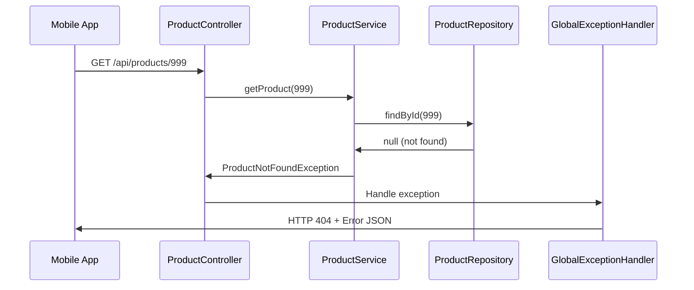
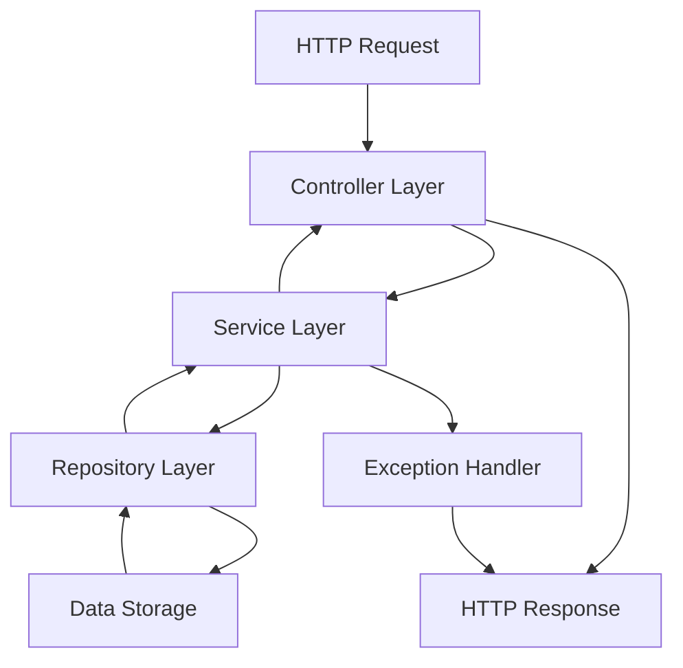

# Chapter 1: HTTP Request/Response Flow

Welcome to the world of REST APIs! Imagine you're ordering food through a delivery app on your phone. You browse the menu, select items, place your order, and then track it until it arrives at your door. Behind the scenes, there's a well-orchestrated process that handles your request, processes it through different systems, and delivers the response back to you.

This is exactly how our Spring REST Product Catalog works! When a mobile app wants to get product information, create a new product, or update existing data, it sends an HTTP request that travels through our system like your food order travels through the restaurant's process.

## What Problem Does HTTP Request/Response Flow Solve?

Let's say you're building a mobile app for an electronics store. Your app needs to:
- Show customers a list of available products
- Let customers search for specific items
- Allow store managers to add new products
- Enable updates to product information

Without a structured request/response flow, this would be chaos! Imagine if every request was handled differently, or if there was no standard way for your mobile app to communicate with the store's system. You'd have requests getting lost, responses in different formats, and no way to handle errors consistently.

The HTTP Request/Response Flow solves this by creating a **standardized highway** for communication between your mobile app (the client) and our product catalog system (the server). Every request follows the same path, gets processed by the same components, and returns a predictable response.

## Key Components of Our Request/Response Flow

Think of our system like a well-organized restaurant with different stations:

### 1. The Controller - The Front Door
The **Controller** is like the host at a restaurant who greets customers, takes their requests, and coordinates with the kitchen.

### 2. The Service Layer - The Kitchen Manager  
The **Service Layer** is like the kitchen manager who ensures food quality, follows recipes (business rules), and coordinates the cooking process.

### 3. The Repository - The Storage Room
The **Repository** is like the storage room where ingredients (data) are kept and retrieved when needed.

## A Simple Example: Getting Product Information

Let's trace what happens when a mobile app asks for product #123:

```http
GET /api/products/123
```

This simple request starts a journey through our system that will return product information as JSON.

## The Complete Request Journey

Here's how a request flows through our system:



Let's break this down step by step:

### Step 1: Request Arrives at the Controller

```java
@GetMapping("/{id}")
@ResponseBody
public Product getProduct(@PathVariable("id") Long id) {
    return service.getProduct(id);
}
```

When the mobile app sends `GET /api/products/123`, Spring routes this request to our `ProductController`. The controller acts like a receptionist - it understands what the client wants and knows who to ask for help.

**What happens here:**
- Spring converts the URL parameter `123` into a `Long` value
- The controller receives the request but doesn't do the actual work
- Instead, it delegates to the service layer (the business logic expert)

### Step 2: Service Layer Processes Business Logic

```java
@Override
public Product getProduct(Long id) {
    Product product = repository.findById(id);
    if (product == null) {
        throw new ProductNotFoundException(id);
    }
    return product;
}
```

The service layer is where the business rules live. It's like asking the kitchen manager to prepare your order - they know the recipes and quality standards.

**What happens here:**
- Service asks the repository to find product with ID 123
- If the product doesn't exist, it throws a business exception
- If found, it returns the product following business rules

### Step 3: Repository Retrieves Data

```java
@Override
public Product findById(Long id) {
    return products.get(id); // Get from our storage
}
```

The repository is our data access layer - like checking the storage room for ingredients. It knows how to find and retrieve data but doesn't know anything about business rules.

**What happens here:**
- Repository looks up product ID 123 in our data store
- Returns the raw product data if found
- Returns null if the product doesn't exist

### Step 4: Response Travels Back

The response follows the same path in reverse:
- Repository returns product data to Service
- Service applies any business rules and returns to Controller  
- Controller converts the Product object to JSON automatically
- JSON response goes back to the mobile app

## Example Request and Response

Let's see a complete example:

**Client Request:**
```http
GET /api/products/1 HTTP/1.1
Host: localhost:8080
Accept: application/json
```

**What our system returns:**
```http
HTTP/1.1 200 OK
Content-Type: application/json

{
  "id": 1,
  "sku": "LAP-001", 
  "name": "Gaming Laptop",
  "description": "High-performance gaming laptop",
  "price": 1299.99,
  "category": "ELECTRONICS",
  "active": true
}
```

Notice how our system automatically:
- Found the right product
- Converted it to JSON format
- Added proper HTTP headers
- Returned a success status code (200)

## When Things Go Wrong: Error Flow

Not every request succeeds. Let's see what happens when someone asks for a product that doesn't exist:



**Error Request:**
```http
GET /api/products/999 HTTP/1.1
```

**Error Response:**
```http
HTTP/1.1 404 Not Found
Content-Type: application/json

{
  "code": "PRODUCT_NOT_FOUND",
  "message": "Product with id 999 was not found."
}
```

Our system gracefully handles errors by:
- Detecting the business rule violation (product not found)
- Converting exceptions to user-friendly error messages
- Returning appropriate HTTP status codes
- Maintaining consistent error response format

## Creating New Products: A More Complex Flow

Let's see how our system handles creating a new product:

**Client Request:**
```http
POST /api/products HTTP/1.1
Content-Type: application/json

{
  "sku": "MOUSE-001",
  "name": "Wireless Mouse", 
  "price": 49.99,
  "category": "ACCESSORIES"
}
```

**The Flow:**
1. **Controller receives JSON**: Automatically converts JSON to ProductRequest object
2. **Service validates business rules**: Checks required fields, validates price, ensures SKU is unique
3. **Repository saves data**: Stores the new product and assigns an ID
4. **Response returns**: Sends back the complete product including generated ID

**Success Response:**
```http
HTTP/1.1 201 Created
Content-Type: application/json

{
  "id": 4,
  "sku": "MOUSE-001",
  "name": "Wireless Mouse",
  "price": 49.99,
  "category": "ACCESSORIES", 
  "active": true
}
```

## Under the Hood: Spring's Magic

Spring Framework handles a lot of the heavy lifting automatically:

### Automatic JSON Conversion
```java
@ResponseBody
public Product getProduct(@PathVariable("id") Long id) {
    return service.getProduct(id);  // Spring converts this to JSON
}
```

Spring sees the `@ResponseBody` annotation and automatically converts our Product object to JSON using Jackson library.

### URL Parameter Extraction  
```java
public Product getProduct(@PathVariable("id") Long id) {
    // Spring extracts "123" from "/api/products/123" and converts to Long
}
```

Spring parses the URL and extracts the ID parameter automatically.

### Exception Handling
```java
@ExceptionHandler(ProductNotFoundException.class)
@ResponseStatus(HttpStatus.NOT_FOUND)
public ErrorResponse handleNotFound(ProductNotFoundException ex) {
    return new ErrorResponse("PRODUCT_NOT_FOUND", ex.getMessage());
}
```

When business exceptions are thrown, Spring routes them to our error handlers automatically.

## The Complete Architecture

Our HTTP Request/Response Flow connects multiple layers seamlessly:



Each layer has a specific responsibility:
- **Controller**: Handles HTTP concerns (requests, responses, status codes)
- **Service**: Implements business logic and rules
- **Repository**: Manages data access and storage
- **Exception Handling**: Converts errors to user-friendly responses

## Why This Flow Matters

This structured approach provides several benefits:

### Consistency
Every request follows the same path, ensuring predictable behavior whether you're getting one product or creating a new one.

### Separation of Concerns  
Each layer focuses on its expertise:
- Controllers handle web requests
- Services handle business rules
- Repositories handle data access

### Error Handling
Problems are caught and handled gracefully at each layer, providing clear error messages to clients.

### Scalability
New features can be added by following the same flow pattern, making the system easier to extend and maintain.

## Real-World Benefits

In practice, this flow enables:
- **Mobile apps** can reliably get product data in expected JSON format
- **Web applications** can create and update products following business rules  
- **Admin tools** can manage the catalog with consistent error handling
- **Developers** can easily add new features by following established patterns

## Conclusion

The HTTP Request/Response Flow is the foundation that makes our Spring REST Product Catalog work reliably. Like a well-designed highway system, it provides:

- **Clear paths**: Every request knows exactly where to go
- **Consistent processing**: Same rules apply regardless of the request type  
- **Error handling**: Problems are caught and communicated clearly
- **Automatic conversion**: JSON and HTTP concerns are handled transparently

Key takeaways:
- Requests flow through Controller → Service → Repository layers
- Each layer has specific responsibilities and expertise
- Spring handles JSON conversion and URL parsing automatically
- Errors are converted to user-friendly responses at each layer
- The same flow pattern works for all operations (GET, POST, PUT, DELETE)

Now that we understand how requests flow through our system, let's dive deeper into the architectural pattern that makes this possible: the [Spring MVC Architecture Pattern](02_spring_mvc_architecture_pattern_.md), where we'll learn how Spring organizes these components to create our robust REST API.

