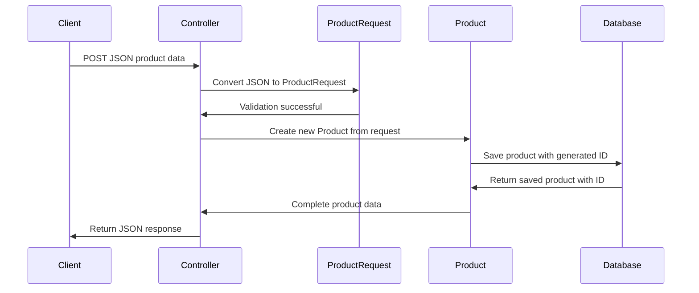

# Chapter 2: Product Domain Model

Now that we understand the [Spring MVC Architecture Pattern](01_spring_mvc_architecture_pattern_.md) and how different layers work together, let's dive into the heart of our product catalog system: the **Product Domain Model**. This is where we define the core data structures that represent products in our system.

## What Problem Does a Domain Model Solve?

Imagine you're organizing a physical store's inventory. Without a standardized product card system, chaos would ensue: one employee writes product info on sticky notes, another uses index cards, and someone else scribbles details on napkins. When a customer asks about a product, nobody can find consistent information!

The Product Domain Model solves this exact problem in our software. It's like creating a **standardized digital product card** that everyone in our system uses. Whether we're displaying products to customers, updating prices, or managing inventory, everyone speaks the same "product language."

Let's say a customer wants to browse products in our catalog. Our system needs to:
1. **Store** product information consistently
2. **Accept** new product data from users  
3. **Display** product details in a standardized format
4. **Update** product information reliably

## Key Concepts: Product vs ProductRequest

Our domain model has two main players, like having different forms for different purposes:

### Product: The Complete Digital Product Card
The `Product` class is our **master product record** - like a complete product file that contains everything we know about an item.

### ProductRequest: The New Product Application Form  
The `ProductRequest` class is what we use when someone wants to **create or update** a product - like a simplified form that customers fill out.

## The Product Class: Our Master Data Structure

Let's look at our main `Product` class step by step:

```java
public class Product {
    private Long id;
    private String sku;
    private String name;
    private String description;
    private BigDecimal price;
}
```

Each field serves a specific purpose:
- **`id`**: Like a unique product number assigned by our system
- **`sku`**: Stock Keeping Unit - a business identifier (like "MOUSE-001")  
- **`name`**: The display name customers see (like "Wireless Mouse")
- **`description`**: Detailed product information
- **`price`**: Product cost using `BigDecimal` for precise money calculations

```java
public class Product {
    // ... previous fields ...
    private String category;
    private boolean active;
    
    // Empty constructor for Spring
    public Product() {}
}
```

The additional fields complete our product card:
- **`category`**: Groups products (like "Electronics", "Books")
- **`active`**: Whether the product is available for sale

We have an empty constructor that Spring requires to create Product objects automatically.

## Getter and Setter Methods: Controlled Access

```java
public String getName() { 
    return name; 
}

public void setName(String name) { 
    this.name = name; 
}
```

These methods provide **controlled access** to our product data. Instead of directly touching the fields, other parts of our system use these methods. It's like having a librarian manage book access instead of letting people directly handle the archive.

```java
public BigDecimal getPrice() { 
    return price; 
}

public void setPrice(BigDecimal price) { 
    this.price = price; 
}
```

Notice we use `BigDecimal` for money - this prevents rounding errors that could cost real money! For example, `double` might calculate `0.1 + 0.2 = 0.30000000000000004`, but `BigDecimal` gives exact `0.3`.

## The ProductRequest Class: Simplified Input Form

```java
public class ProductRequest {
    private String sku;
    private String name;
    private String description;
    private BigDecimal price;
}
```

Notice the differences from `Product`:
- **No `id` field**: The system generates IDs automatically
- Only contains fields that users can input

```java
public class ProductRequest {
    // ... previous fields ...
    private String category;
    private Boolean active;  // Note: Boolean, not boolean!
}
```

We use `Boolean` (with capital B) instead of `boolean` for `active` because it allows null values - making this field optional when creating products.

## Using the Domain Model: A Complete Example

Let's trace how our domain model works when a user creates a new product:

**Input**: User sends this JSON to create a product:
```json
{
  "sku": "MOUSE-001",
  "name": "Wireless Mouse",
  "description": "Ergonomic wireless mouse",
  "price": 49.99,
  "category": "Electronics"
}
```

**Step 1**: Spring converts JSON to `ProductRequest`:
```java
ProductRequest request = new ProductRequest();
request.setSku("MOUSE-001");
request.setName("Wireless Mouse");
request.setPrice(new BigDecimal("49.99"));
```

Spring automatically fills the `ProductRequest` object from the JSON data.

**Step 2**: Our system creates a complete `Product`:
```java
Product product = new Product();
product.setId(1L); // System generates this
product.setSku(request.getSku());
product.setName(request.getName());
product.setActive(true); // Default value
```

The system takes the user input and creates a complete Product with generated fields like ID.

## How Domain Models Work Under the Hood

Let's see what happens step-by-step when our system processes product data:



Here's what happens at each step:

1. **Client sends data**: Raw JSON comes from a mobile app, website, etc.
2. **JSON to ProductRequest**: Spring automatically converts JSON to our `ProductRequest` object
3. **Validation**: The `ProductRequest` structure ensures we have required fields
4. **Create Product**: System creates full `Product` with generated ID
5. **Database storage**: Complete product gets saved
6. **Response**: Client receives the full product data including system-generated fields

## The JavaBean Pattern: How Spring Works with Our Classes

Our domain model uses a special pattern that Spring understands:

```java
// Private fields - data stays protected
private String name;

// Public getter - allows reading
public String getName() { 
    return name; 
}

// Public setter - allows writing  
public void setName(String name) { 
    this.name = name; 
}
```

This **JavaBean pattern** allows Spring to:
- Automatically convert JSON to objects
- Access our data in a controlled way
- Integrate with other Spring features

## Product Lifecycle in Our System

Our domain model supports the complete product lifecycle:

```java
// 1. Create new product from user request
Product product = new Product();
product.setSku("MOUSE-001");
product.setName("Wireless Mouse");
```

When a user submits product information, we create a new Product object.

```java
// 2. System assigns ID when saved  
product.setId(123L);
product.setActive(true);
```

The system automatically adds technical fields like ID and default values.

```java
// 3. Update existing product
product.setPrice(new BigDecimal("59.99"));
product.setDescription("Updated description");
```

Later, we can modify product information using the same setter methods.

## Why Two Different Classes?

You might wonder: "Why not just use one Product class for everything?" Here's the reason:

**ProductRequest** is like a **job application form** - it only has fields the user can fill out:
```java
// User provides this data
ProductRequest request = new ProductRequest();
request.setName("Wireless Mouse");
request.setPrice(new BigDecimal("49.99"));
// No ID - user doesn't create IDs!
```

**Product** is like the **complete employee file** - it has everything, including system-generated data:
```java
// System creates complete record
Product product = new Product();
product.setId(123L);           // System generates
product.setName("Wireless Mouse");  // From user
product.setPrice(new BigDecimal("49.99")); // From user  
```

This separation keeps user input and system data clearly organized.

## Integration with Spring MVC Layers

Our domain model seamlessly works with other parts of our Spring MVC architecture:

- **Controllers**: Receive `ProductRequest` from users, return `Product` in responses
- **Services**: Process `Product` objects with business rules  
- **Repositories**: Store and retrieve `Product` entities from databases

The beauty is that each layer speaks the same "product language" defined by our domain model.

## Conclusion

The Product Domain Model serves as the universal language for our product catalog system. By defining clear, consistent data structures (`Product` and `ProductRequest`), we ensure that every part of our system - from user input to database storage - works with standardized product information.

Key takeaways:
- `Product` represents complete product data with system-generated fields like ID
- `ProductRequest` handles user input for creating/updating products  
- `BigDecimal` ensures accurate money calculations without rounding errors
- JavaBean pattern (getters/setters) allows Spring to work with our objects automatically
- Two separate classes keep user input and system data properly organized

Now that we have our core data structures defined, let's explore how to expose them to the outside world through our [REST API Controller Layer](03_rest_api_controller_layer_.md), where we'll learn to handle HTTP requests and work with our Product domain model.

