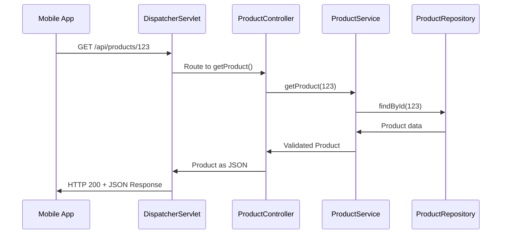
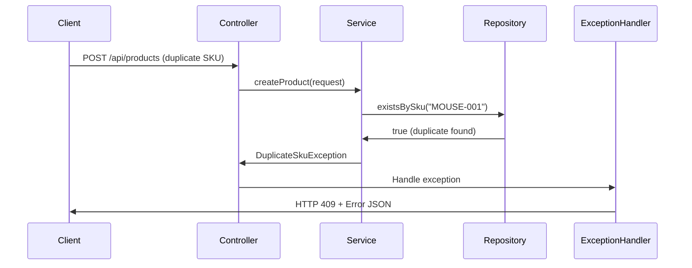

# Chapter 2: Spring MVC Architecture Pattern

Now that we understand how [HTTP Request/Response Flow](01_http_request_response_flow_.md) works in our system, let's explore the architectural pattern that makes this organized flow possible. Just like a well-run restaurant needs clear roles and responsibilities to serve customers efficiently, our Spring application needs a structured way to organize code and handle requests.

## What Problem Does Spring MVC Architecture Pattern Solve?

Imagine you're trying to build a product catalog system without any organizational structure. You might end up with one giant file that:
- Handles HTTP requests
- Validates business rules  
- Manages data storage
- Formats responses
- Handles errors

This would be like having one person in a restaurant who greets customers, takes orders, cooks food, serves tables, and manages inventory all at once. It's chaotic, error-prone, and impossible to maintain as your business grows!

The **Spring MVC Architecture Pattern** solves this by creating a clear organizational structure where each component has a specific job, just like different roles in a restaurant work together seamlessly.

## The Restaurant Analogy: Understanding MVC Layers

Let's use our restaurant analogy to understand the three main layers in Spring MVC:

### The Controller Layer - The Waiter/Host
```java
@Controller
@RequestMapping("/api/products")
public class ProductController {
    // Handles customer requests and coordinates responses
}
```

The **Controller** is like a skilled waiter who:
- Greets customers (receives HTTP requests)
- Takes orders (parses request parameters)
- Communicates with the kitchen (calls service layer)
- Serves the final dish (returns HTTP responses)

### The Service Layer - The Head Chef  
```java
@Service
public class ProductService {
    // Contains all the business recipes and rules
}
```

The **Service Layer** is like the head chef who:
- Knows all the recipes (business logic)
- Ensures food quality (validates business rules)
- Coordinates cooking processes (orchestrates operations)
- Makes decisions about ingredients (manages data flow)

### The Repository Layer - The Inventory Manager
```java
@Repository
public class ProductRepository {
    // Manages where ingredients are stored and retrieved
}
```

The **Repository** is like the inventory manager who:
- Knows where everything is stored (data access)
- Retrieves ingredients when needed (queries data)
- Keeps track of inventory (manages data persistence)
- Doesn't worry about recipes, just storage (pure data operations)

## Key Components of Spring MVC Architecture

Let's break down the essential components that make our product catalog work:

### 1. DispatcherServlet - The Restaurant Host
```java
<servlet>
    <servlet-name>rest</servlet-name>
    <servlet-class>org.springframework.web.servlet.DispatcherServlet</servlet-class>
</servlet>
```

The **DispatcherServlet** acts like the host at the restaurant entrance. Every customer (HTTP request) goes through the host first, who then directs them to the right waiter (controller) based on what they want.

**What it does:**
- Receives all incoming HTTP requests
- Decides which controller should handle each request
- Manages the overall request/response lifecycle

### 2. Controller - Request Handler
```java
@Controller
@RequestMapping("/api/products")
public class ProductController {
    
    @Autowired
    private ProductService productService;
    
    @RequestMapping(value = "/{id}", method = RequestMethod.GET)
    @ResponseBody
    public Product getProduct(@PathVariable Long id) {
        return productService.getProduct(id);
    }
}
```

The **Controller** handles the web-specific concerns:
- Mapping URLs to methods (`/api/products/{id}` → `getProduct()`)
- Converting HTTP parameters to Java objects
- Delegating business logic to services
- Converting results back to HTTP responses

### 3. Service - Business Logic
```java
@Service
public class ProductService {
    
    @Autowired
    private ProductRepository repository;
    
    public Product getProduct(Long id) {
        Product product = repository.findById(id);
        if (product == null) {
            throw new ProductNotFoundException(id);
        }
        return product;
    }
}
```

The **Service** contains pure business logic:
- Implements business rules ("product must exist")
- Coordinates complex operations
- Throws business exceptions when rules are violated
- Doesn't know anything about HTTP or web concerns

### 4. Repository - Data Access
```java
@Repository
public class ProductRepository {
    
    private Map<Long, Product> products = new HashMap<>();
    
    public Product findById(Long id) {
        return products.get(id);
    }
}
```

The **Repository** handles data storage and retrieval:
- Provides simple data operations (find, save, delete)
- Abstracts away storage details (could be database, file, memory)
- Returns null/empty results, doesn't make business decisions

## How the Layers Work Together

Let's see how these layers collaborate when a customer requests product information:



Here's what happens step-by-step:

**Step 1: Request Routing**
```java
// DispatcherServlet automatically routes based on @RequestMapping
@RequestMapping(value = "/{id}", method = RequestMethod.GET)
public Product getProduct(@PathVariable Long id) {
```

The DispatcherServlet sees the URL `/api/products/123` and matches it to our controller method.

**Step 2: Controller Delegates**
```java
public Product getProduct(@PathVariable Long id) {
    return productService.getProduct(id); // Delegate to business logic
}
```

The controller extracts the ID (123) and asks the service layer to handle the business logic.

**Step 3: Service Applies Business Rules**  
```java
public Product getProduct(Long id) {
    Product product = repository.findById(id);
    if (product == null) {
        throw new ProductNotFoundException(id); // Business rule!
    }
    return product;
}
```

The service gets raw data from repository and applies the business rule: "if product doesn't exist, that's an error."

**Step 4: Repository Retrieves Data**
```java
public Product findById(Long id) {
    return products.get(id); // Just get the data, no business logic
}
```

The repository simply retrieves data without making any business decisions.

**Step 5: Response Flows Back**
Each layer returns results to the layer above until the client gets a properly formatted JSON response.

## Dependency Injection: The Magic Connection

Spring's **Dependency Injection** automatically connects these layers together:

```java
@Controller
public class ProductController {
    
    @Autowired
    private ProductService productService; // Spring provides this automatically!
}
```

```java
@Service  
public class ProductService {
    
    @Autowired
    private ProductRepository repository; // Spring provides this too!
}
```

**How it works:**
- You tell Spring which classes are controllers, services, and repositories using annotations
- Spring automatically creates instances of these classes
- Spring "injects" the dependencies (connects them together)
- You don't have to write code to create and connect objects manually

Think of it like having an amazing restaurant manager who automatically ensures every waiter knows which chef to work with, without the waiter having to figure it out themselves.

## Configuration: Setting Up the Architecture

Spring MVC uses configuration files to set up this architecture:

### Web Configuration (web.xml)
```xml
<servlet>
    <servlet-name>rest</servlet-name>
    <servlet-class>org.springframework.web.servlet.DispatcherServlet</servlet-class>
    <init-param>
        <param-name>contextConfigLocation</param-name>
        <param-value>/WEB-INF/rest-servlet.xml</param-value>
    </init-param>
</servlet>
```

This tells the web server: "Use Spring's DispatcherServlet to handle requests."

### Spring Configuration (rest-servlet.xml)
```xml
<context:component-scan base-package="com.example.controller" />
<mvc:annotation-driven />
```

This tells Spring: "Look for controllers in the controller package and enable MVC features."

## Real Example: Creating a New Product

Let's trace a more complex example - creating a new product:

**Client Request:**
```http
POST /api/products
Content-Type: application/json

{
  "sku": "MOUSE-001",
  "name": "Wireless Mouse",
  "price": 49.99
}
```

**Controller Layer:**
```java
@RequestMapping(method = RequestMethod.POST)
@ResponseBody
public Product createProduct(@RequestBody ProductRequest request) {
    return productService.createProduct(request);
}
```

The controller receives JSON, converts it to a Java object, and delegates to service.

**Service Layer:**
```java
public Product createProduct(ProductRequest request) {
    // Business rule: SKU must be unique
    if (repository.existsBySku(request.getSku())) {
        throw new DuplicateSkuException(request.getSku());
    }
    
    Product product = new Product();
    product.setSku(request.getSku());
    product.setName(request.getName());
    product.setPrice(request.getPrice());
    product.setActive(true); // Business rule: new products are active
    
    return repository.save(product);
}
```

The service applies business rules and coordinates the creation process.

**Repository Layer:**
```java
public Product save(Product product) {
    product.setId(nextId++); // Assign new ID
    products.put(product.getId(), product);
    return product;
}
```

The repository handles the actual storage mechanics.

## Benefits of This Architecture

### Separation of Concerns
Each layer focuses on what it does best:
- Controllers handle web requests and responses
- Services handle business logic and rules  
- Repositories handle data storage and retrieval

### Testability
You can test each layer independently:
```java
// Test service logic without web concerns
@Test
public void shouldThrowExceptionForDuplicateSku() {
    // Test just the business logic
    ProductService service = new ProductService();
    assertThrows(DuplicateSkuException.class, () -> {
        service.createProduct(request);
    });
}
```

### Maintainability
Changes in one layer don't break others:
- Change data storage from memory to database? Only update repository
- Change business rules? Only update service
- Change API format? Only update controller

### Reusability
Business logic in services can be reused:
```java
// Same service can be used by web controllers, batch jobs, etc.
@Service
public class ProductService {
    public Product createProduct(ProductRequest request) {
        // This logic works for web requests, batch imports, etc.
    }
}
```

## Error Handling Across Layers

When something goes wrong, the architecture handles it gracefully:



**Service throws business exception:**
```java
if (repository.existsBySku(request.getSku())) {
    throw new DuplicateSkuException(request.getSku());
}
```

**Exception handler converts to HTTP response:**
```java
@ExceptionHandler(DuplicateSkuException.class)
@ResponseStatus(HttpStatus.CONFLICT)
public ErrorResponse handleDuplicateSku(DuplicateSkuException ex) {
    return new ErrorResponse("DUPLICATE_SKU", ex.getMessage());
}
```

## Conclusion

The Spring MVC Architecture Pattern provides a proven way to organize web applications by separating concerns into distinct layers. Like a well-run restaurant where waiters, chefs, and inventory managers each have specific roles, our product catalog separates web concerns (controllers), business logic (services), and data access (repositories).

**Key takeaways:**
- **Controllers** handle HTTP requests and responses
- **Services** contain business logic and rules
- **Repositories** manage data storage and retrieval
- **Dependency Injection** automatically connects layers together
- Each layer can be tested and modified independently
- The architecture scales well as applications grow

This organized structure makes our code easier to understand, test, and maintain. It also provides a solid foundation for building robust REST APIs.

Now that we understand the overall architecture, let's dive into the foundation of our system by exploring the [Product Domain Model](03_product_domain_model_.md), where we'll learn how to design and structure the core data that flows through all these layers.

