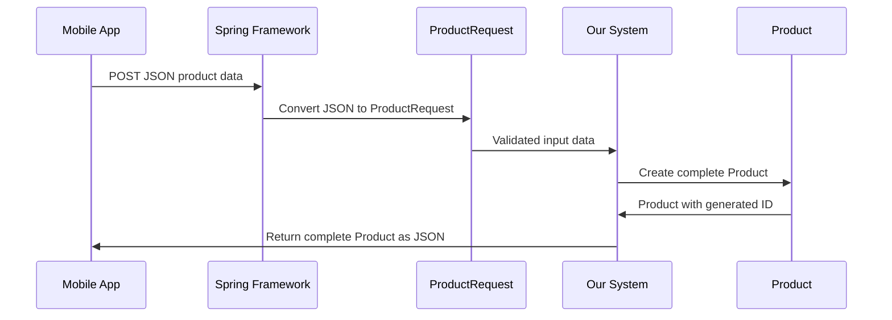

# Chapter 3: Product Domain Model

Now that we understand the [Spring MVC Architecture Pattern](02_spring_mvc_architecture_pattern_.md) and how different layers work together, let's dive into the heart of our product catalog system: the **Product Domain Model**. This is where we define the core data structures that represent products in our system.

## What Problem Does a Domain Model Solve?

Imagine you're organizing a physical store's inventory. Without a standardized product card system, chaos would ensue: one employee writes product info on sticky notes, another uses index cards, and someone else scribbles details on napkins. When a customer asks about a product, nobody can find consistent information!

The Product Domain Model solves this exact problem in our software. It's like creating **standardized digital product cards** that everyone in our system uses. Whether we're displaying products to customers, updating prices, or managing inventory, everyone speaks the same "product language."

Let's say a customer wants to browse products in our catalog. Our system needs to:
1. **Store** product information consistently
2. **Accept** new product data from users  
3. **Display** product details in a standardized format
4. **Update** product information reliably

## Key Concepts: Two Types of Product Cards

Our domain model has two main players, like having different forms for different purposes:

### Product: The Complete Digital Product Card
The `Product` class is our **master product record** - like a complete product file that contains everything we know about an item, including system-generated information.

### ProductRequest: The Customer Application Form  
The `ProductRequest` class is what we use when someone wants to **create or update** a product - like a simplified form that customers fill out, without the technical details.

Think of it this way: `Product` is like your complete driver's license with photo, ID number, and official stamps, while `ProductRequest` is like the application form you fill out to get that license.

## The Product Class: Our Master Data Structure

Let's look at our main `Product` class step by step:

```java
public class Product {
    private Long id;
    private String sku;
    private String name;
    private String description;
    private BigDecimal price;
}
```

Each field serves a specific purpose in our digital product card:
- **`id`**: Like a unique product number assigned by our system (auto-generated)
- **`sku`**: Stock Keeping Unit - a business identifier like "MOUSE-001"
- **`name`**: The display name customers see like "Wireless Mouse"
- **`description`**: Detailed product information for customers
- **`price`**: Product cost using `BigDecimal` for precise money calculations

```java
private String category;
private boolean active;

public Product() {}

public Product(Long id, String sku, String name, /*...*/) {
    this.id = id;
    this.sku = sku;
    // ... set other fields
}
```

The additional fields complete our product card:
- **`category`**: Groups products like "Electronics" or "Books"
- **`active`**: Whether the product is available for sale (true/false)

We have two constructors: an empty one (required by Spring for automatic object creation) and a full one for creating products with all details at once.

## Accessing Product Data: Getters and Setters

```java
public String getName() { 
    return name; 
}

public void setName(String name) { 
    this.name = name; 
}
```

These methods provide **controlled access** to our product data. Instead of directly touching the fields, other parts of our system use these methods. It's like having a librarian manage book access instead of letting people directly rummage through the archives.

```java
public BigDecimal getPrice() { 
    return price; 
}

public void setPrice(BigDecimal price) { 
    this.price = price; 
}
```

Every field has a "getter" (to read the value) and a "setter" (to change the value). This pattern allows us to control how data is accessed and potentially add validation later.

## The ProductRequest Class: Simplified Input Form

```java
public class ProductRequest {
    private String sku;
    private String name;
    private String description;
    private BigDecimal price;
    private String category;
    private Boolean active;
}
```

Notice the key differences from `Product`:
- **No `id` field**: The system generates IDs automatically
- **`Boolean` instead of `boolean`** for `active`: Allows null values (making this field optional)

This is like having a simplified customer form - they provide the essential information, and our system handles the technical details like assigning unique IDs.

## Using Our Domain Model: A Complete Example

Let's trace how our domain model works when a user creates a new product:

**Step 1: User Input**
A customer sends this JSON to create a product:
```json
{
  "sku": "MOUSE-001",
  "name": "Wireless Mouse",
  "description": "Ergonomic wireless mouse with USB receiver",
  "price": 49.99,
  "category": "Electronics"
}
```

**Step 2: Spring Creates ProductRequest**
Spring automatically converts the JSON into a `ProductRequest` object:
```java
ProductRequest request = new ProductRequest();
request.setSku("MOUSE-001");
request.setName("Wireless Mouse");
request.setPrice(new BigDecimal("49.99"));
// ... other fields set automatically by Spring
```

**Step 3: System Creates Complete Product**
Our system creates a full `Product` with generated system fields:
```java
Product product = new Product();
product.setId(1L); // System generates this unique ID
product.setSku(request.getSku());
product.setName(request.getName());
product.setActive(true); // Default for new products
```

**Step 4: System Response**
The system returns the complete product including generated fields:
```json
{
  "id": 1,
  "sku": "MOUSE-001", 
  "name": "Wireless Mouse",
  "description": "Ergonomic wireless mouse with USB receiver",
  "price": 49.99,
  "category": "Electronics",
  "active": true
}
```

## The Data Flow Journey

Let's see what happens step-by-step when our system processes product data:



Here's what happens at each step:

1. **Client sends data**: Raw JSON comes from a mobile app, website, etc.
2. **JSON to ProductRequest**: Spring automatically converts JSON fields to our `ProductRequest` object
3. **Input validation**: The `ProductRequest` structure ensures we have the right data types
4. **Create complete Product**: Our system creates a full `Product` with generated ID and default values
5. **Return response**: Client receives the complete product data including system-generated fields

## Why BigDecimal for Money Matters

```java
// WRONG - loses precision and causes money problems!
private double price = 19.99;

// CORRECT - precise decimal arithmetic
private BigDecimal price = new BigDecimal("19.99");
```

Using `BigDecimal` instead of `double` prevents rounding errors that could literally cost money. For example, `double` might calculate `0.1 + 0.2 = 0.30000000000000004`, but `BigDecimal` gives exactly `0.3`. When dealing with customer money, precision matters!

## Internal Implementation: The JavaBean Pattern

Our domain model uses the **JavaBean pattern** for consistent, controlled data access:

```java
// Private fields - data is protected
private String name;
private BigDecimal price;

// Public getters - controlled read access  
public String getName() { return name; }
public BigDecimal getPrice() { return price; }
```

```java
// Public setters - controlled write access
public void setName(String name) { this.name = name; }
public void setPrice(BigDecimal price) { this.price = price; }
```

This pattern provides several benefits:
- **Data Protection**: Internal data stays safe from direct manipulation
- **Spring Integration**: Spring uses these methods for automatic JSON conversion
- **Future Validation**: We can add input validation to setters later
- **Debugging**: We can add logging to track when fields change

## Product Lifecycle in Our System

Our domain model supports the complete product lifecycle from creation to retirement:

```java
// 1. Create new product from customer input
Product product = new Product();
product.setSku(request.getSku());
product.setName(request.getName());

// 2. System assigns unique ID when saved
product.setId(123L);

// 3. Update existing product information
product.setPrice(new BigDecimal("59.99"));
product.setDescription("Updated with new features");
```

```java
// 4. Deactivate instead of deleting (preserves history)
product.setActive(false);
```

This approach maintains data history - we never lose product information, just mark items as inactive when they're no longer sold.

## Integration with Spring MVC Layers

Our domain model seamlessly works with other parts of our Spring MVC architecture:

- **Controllers**: Receive `ProductRequest` from JSON and return `Product` as JSON
- **Services**: Apply business rules using `Product` objects  
- **Repositories**: Store and retrieve `Product` entities from data storage

The beauty is that each layer speaks the same "product language" defined by our domain model, making the system consistent and predictable.

## Real-World Benefits

This standardized approach provides several practical benefits:

### Consistency Across the System
```java
// Every layer uses the same Product structure
// Controller layer
public Product getProduct(@PathVariable Long id) { ... }

// Service layer  
public Product findProduct(Long id) { ... }

// Repository layer
public Product save(Product product) { ... }
```

### Type Safety
```java
// Compiler catches mistakes at development time
product.setPrice("invalid"); // Won't compile - needs BigDecimal
product.setActive("maybe");  // Won't compile - needs boolean
```

### Easy JSON Conversion
Spring automatically converts between JSON and our Java objects without any additional code, making our REST API simple and consistent.

## Conclusion

The Product Domain Model serves as the universal language for our product catalog system. By defining clear, consistent data structures (`Product` and `ProductRequest`), we ensure that every part of our system - from user input to database storage - works with standardized product information.

Just like standardized product cards make a physical store run smoothly, our domain model makes our software system predictable and maintainable.

**Key takeaways:**
- `Product` represents complete product data with system-generated fields like ID
- `ProductRequest` handles user input for creating/updating products without technical details
- `BigDecimal` ensures accurate money calculations without rounding errors
- The JavaBean pattern provides controlled, consistent data access across all layers
- Both classes work seamlessly with Spring's automatic JSON conversion

Now that we have our core data structures defined, let's explore how to expose them to the outside world through our [REST API Controller Layer](04_rest_api_controller_layer_.md), where we'll learn to handle HTTP requests and transform our domain objects into JSON responses.

