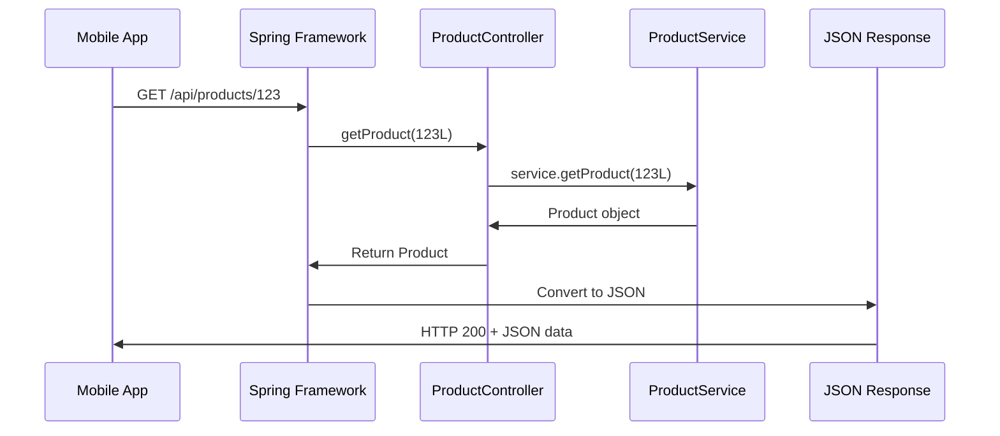
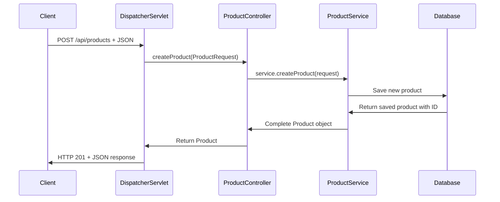

# Chapter 3: REST API Controller Layer

Now that we have our [Product Domain Model](02_product_domain_model_.md) with standardized `Product` and `ProductRequest` structures, we need a way for the outside world to interact with our product catalog. This is where the **REST API Controller Layer** comes in - it's like the front desk of our digital product store.

## What Problem Does the Controller Layer Solve?

Imagine you run a physical electronics store. Customers want to browse products, ask about specific items, and place orders. Without an organized front desk system, chaos would ensue: customers would wander into your storage room looking for products, employees wouldn't know how to handle different types of requests, and there'd be no consistent way to communicate with customers.

The REST API Controller Layer solves this exact problem for our web application. It acts as the **organized front desk** that:
- Receives customer requests (HTTP calls from mobile apps, websites, etc.)
- Understands what customers want (GET products, POST new product, etc.)
- Coordinates with the back office (service layer) to fulfill requests
- Responds to customers in a consistent format (JSON)

Let's say a mobile app wants to display all electronics products to a user. Our controller layer will handle this request professionally and return the data in the exact format the app expects.

## Key Players: ProductController and Spring Annotations

Our controller layer has specialized components working together, like having trained staff at our front desk:

### ProductController: The Main Receptionist
The `ProductController` handles all normal product-related requests - like a helpful receptionist who knows exactly how to help customers find, create, or update products.

### Spring Annotations: The Training Manual
Spring annotations like `@Controller` and `@GetMapping` are like a detailed training manual that tells our receptionist exactly how to handle each type of request.

## The ProductController: Your API's Front Desk

Let's explore our main controller step by step:

```java
@Controller
@RequestMapping("/api/products")
public class ProductController {
    
    private final ProductService service;
}
```

The `@Controller` annotation tells Spring "this class handles web requests," while `@RequestMapping("/api/products")` means "all methods in this class handle URLs starting with `/api/products`." It's like putting up a sign that says "Product Information Desk."

The `ProductService` is our connection to the business logic - like having a phone line to the warehouse manager.

### Getting the Right Tools: Dependency Injection

```java
public ProductController(ProductService service) {
    this.service = service;
}
```

This constructor uses **dependency injection** - Spring automatically provides the `ProductService` when creating the controller. It's like the company automatically giving our receptionist a phone to call the warehouse, so they don't have to figure out how to get one themselves.

### Browsing All Products: The Display Case Request

```java
@GetMapping
@ResponseBody
public List<Product> getProducts() {
    return service.getProducts(category, active);
}
```

This method handles `GET /api/products` requests - when customers want to browse products. The annotations work like this:
- `@GetMapping`: "Handle HTTP GET requests to this URL"
- `@ResponseBody`: "Convert the return value to JSON automatically"

**Example Usage:**
```bash
GET /api/products
```

**What happens:** Returns a JSON list of all products in the catalog. The controller asks the service layer for products, gets back a `List<Product>`, and Spring automatically converts it to JSON for the client.

### Finding a Specific Product: The Detailed Inquiry

```java
@GetMapping("/{id}")
@ResponseBody  
public Product getProduct(@PathVariable("id") Long id) {
    return service.getProduct(id);
}
```

This handles requests for specific products, like "show me product #123." The `{id}` in the URL is a placeholder that gets filled with the actual product ID, and `@PathVariable` tells Spring to extract that value.

**Example Usage:**
```bash
GET /api/products/123
```

**What happens:** Returns JSON for product with ID 123. If the product doesn't exist, the service layer will throw an exception that gets handled gracefully.

### Adding New Products: The Registration Form

```java
@PostMapping
@ResponseBody
@ResponseStatus(HttpStatus.CREATED)
public Product createProduct(@RequestBody ProductRequest request) {
    return service.createProduct(request);
}
```

This handles creating new products. The `@RequestBody` means "take the JSON from the request and convert it to a `ProductRequest` object automatically."

**Example Usage:**
```bash
POST /api/products
Content-Type: application/json

{
  "sku": "MOUSE-001",
  "name": "Wireless Mouse", 
  "price": 49.99,
  "category": "Electronics"
}
```

**What happens:** Spring converts the JSON to a `ProductRequest`, passes it to our service layer, and returns the complete `Product` with the system-generated ID. The `@ResponseStatus(HttpStatus.CREATED)` sends back HTTP 201 to indicate successful creation.

### Updating Products: The Change Request

```java
@PutMapping("/{id}")
@ResponseBody
public Product updateProduct(@PathVariable("id") Long id,
                           @RequestBody ProductRequest request) {
    return service.updateProduct(id, request);
}
```

This updates existing products by combining a product ID from the URL with new data from the request body. It's like saying "change product #123 to have this new information."

### Removing Products: The Deletion Request

```java
@DeleteMapping("/{id}")
@ResponseStatus(HttpStatus.NO_CONTENT)
public void deleteProduct(@PathVariable("id") Long id) {
    service.deleteProduct(id);
}
```

This handles product deletion. The `@ResponseStatus(HttpStatus.NO_CONTENT)` means "return HTTP 204 - success with no content" since there's nothing meaningful to return after deletion.

## How a Request Flows Through the Controller

Let's trace what happens when a mobile app requests `GET /api/products/123`:



Here's what happens step by step:

1. **Client Request**: Mobile app sends `GET /api/products/123`
2. **Spring Routing**: Spring sees the URL matches our `@GetMapping("/{id}")` pattern and calls `getProduct(123L)`
3. **Controller Delegates**: Controller asks the service layer for product 123 - it doesn't handle business logic itself
4. **Service Processing**: Service layer handles the actual work of finding the product
5. **Return Data**: Product object comes back up the chain
6. **JSON Conversion**: Spring automatically converts our `Product` object to JSON using the getters
7. **HTTP Response**: Client receives HTTP 200 with product data in JSON format

## Adding Filters: Smart Browsing Options

```java
@GetMapping
@ResponseBody
public List<Product> getProducts(
        @RequestParam(value = "category", required = false) String category,
        @RequestParam(value = "active", required = false) Boolean active) {
    return service.getProducts(category, active);
}
```

The `@RequestParam` annotations let customers add filters to their requests. The `required = false` makes these parameters optional - customers can use them or not.

**Example Usage:**
```bash
GET /api/products?category=Electronics&active=true
```

**What happens:** Returns only active products in the Electronics category. If no filters are provided, all products are returned.

## Under the Hood: How Controllers Process Requests

Let's see what happens internally when someone creates a new product:



The process involves these key steps:

1. **Request Reception**: Spring's `DispatcherServlet` receives the HTTP request and routes it to our controller
2. **JSON Parsing**: Spring automatically converts the incoming JSON to a `ProductRequest` object using our setters
3. **Method Invocation**: Our controller method gets called with the parsed object
4. **Business Delegation**: Controller immediately delegates to the service layer - controllers don't contain business logic
5. **Data Processing**: Service layer handles validation, business rules, and data persistence
6. **Response Building**: The complete product (with generated ID) comes back and gets converted to JSON

## The Receptionist Analogy in Action

Think of our controller methods like different types of customer service:

- **`getProducts()`**: "Can you show me your product catalog?" - Returns the display case
- **`getProduct(id)`**: "Tell me about product #123" - Looks up specific item details  
- **`createProduct(request)`**: "I'd like to add a new product to your system" - Processes registration paperwork
- **`updateProduct(id, request)`**: "I need to change the details for product #123" - Handles modification requests
- **`deleteProduct(id)`**: "Please remove product #123 from your system" - Processes removal requests

Each method knows exactly what type of request it handles and delegates the actual work to the appropriate back-office department (service layer).

## Request/Response Examples: Complete Interactions

Let's see complete examples of how our controller handles different scenarios:

### Creating a Product - Success Case

**Request:**
```http
POST /api/products HTTP/1.1
Content-Type: application/json

{
  "sku": "KEYBOARD-001",
  "name": "Mechanical Keyboard",
  "price": 129.99,
  "category": "Electronics"
}
```

**Response:**
```http
HTTP/1.1 201 Created
Content-Type: application/json

{
  "id": 42,
  "sku": "KEYBOARD-001", 
  "name": "Mechanical Keyboard",
  "price": 129.99,
  "category": "Electronics", 
  "active": true
}
```

Notice how the response includes the system-generated `id` field and default values like `active: true`.

### Filtering Products

**Request:**
```http
GET /api/products?category=Electronics&active=true HTTP/1.1
```

**Response:**
```http
HTTP/1.1 200 OK
Content-Type: application/json

[
  {
    "id": 42,
    "sku": "KEYBOARD-001",
    "name": "Mechanical Keyboard", 
    "category": "Electronics",
    "active": true
  }
]
```

## Integration with Other Layers

Our controller layer seamlessly connects with the rest of our Spring MVC architecture:

- **Uses [Product Domain Model](02_product_domain_model_.md)**: Controllers work with `Product` and `ProductRequest` as the standard data format
- **Delegates to Service Layer**: Controllers focus purely on web concerns (HTTP, JSON), while services handle business rules
- **Relies on Spring Framework**: Automatic JSON conversion, dependency injection, and request routing

The beauty is that controllers stay laser-focused on their single responsibility: being the professional front desk that translates between web requests and business operations.

## HTTP Status Codes: Speaking the Web's Language

Our controller uses standard HTTP status codes to communicate results clearly:

```java
@ResponseStatus(HttpStatus.CREATED)      // 201 - New resource created
@ResponseStatus(HttpStatus.NO_CONTENT)   // 204 - Success, no content
// 200 OK is the default for successful @GetMapping and @PutMapping
```

This makes our API predictable - client applications know exactly what each response code means without having to guess.

## Conclusion

The REST API Controller Layer serves as the professional front desk of our product catalog system. Like a well-trained receptionist, it:

- **Receives requests gracefully**: Handles HTTP calls from any client (mobile apps, websites, etc.)
- **Speaks the right language**: Converts between JSON and our [Product Domain Model](02_product_domain_model_.md) objects automatically
- **Delegates appropriately**: Passes business operations to the service layer without trying to handle business logic itself
- **Responds consistently**: Uses standard HTTP status codes and JSON formatting

Key takeaways:
- `ProductController` manages all product-related endpoints (GET, POST, PUT, DELETE)
- Spring annotations (`@GetMapping`, `@PostMapping`, etc.) make request routing declarative and clear
- `@RequestBody` and `@ResponseBody` handle automatic JSON conversion
- `@RequestParam` and `@PathVariable` extract data from URLs
- Controllers delegate business logic to services, focusing purely on web concerns

Our controller layer creates a clean separation between HTTP/web concerns and business logic, making our system easier to test, maintain, and extend. The front desk handles customer interactions professionally, while the back office focuses on the actual work.

Next, we'll explore how our controller layer communicates with clients through [HTTP Request/Response Mapping](04_http_request_response_mapping_.md), where we'll learn the detailed mechanics of how web requests become method calls and how our objects become JSON responses.

