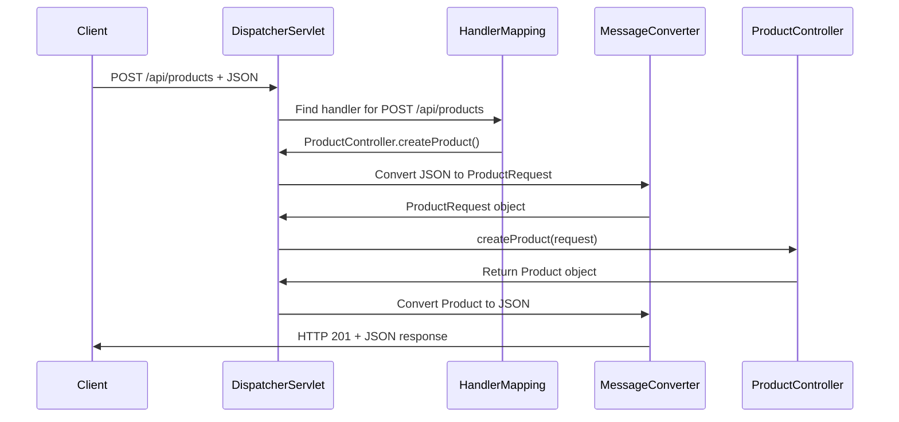

# Chapter 4: HTTP Request/Response Mapping

Now that we've built our [REST API Controller Layer](03_rest_api_controller_layer_.md) with methods like `getProduct()` and `createProduct()`, you might wonder: "How does Spring know when a web browser sends `GET /api/products/123` that it should call my `getProduct(123L)` method? And how does my `Product` object magically turn into JSON?" This is where **HTTP Request/Response Mapping** comes in - it's Spring's universal translator between the web world and your Java code.

## What Problem Does HTTP Request/Response Mapping Solve?

Imagine you're running an international hotel where guests speak different languages but your staff only speaks English. Without translators, chaos would ensue: a French guest says "Je voudrais une chambre" but your receptionist has no idea they want a room. You need professional translators who can instantly convert between languages so everyone can communicate smoothly.

HTTP Request/Response Mapping solves the same problem for web applications. It acts as a **universal translator** that:
- Converts web requests (HTTP/JSON) into Java method calls
- Translates Java objects back into web responses (JSON/HTTP)
- Routes URLs to the correct controller methods automatically
- Handles all the technical details so you can focus on business logic

Let's say a mobile app sends this request:
```http
POST /api/products
Content-Type: application/json

{"name": "Wireless Mouse", "price": 49.99}
```

HTTP Request/Response Mapping automatically:
1. **Routes** the request to your `createProduct()` method
2. **Converts** the JSON into a `ProductRequest` object
3. **Calls** your method with the converted object
4. **Transforms** your returned `Product` back into JSON
5. **Sends** the JSON response back to the mobile app

## Key Players: Annotations and Message Converters

Spring's mapping system has two main components working behind the scenes:

### Mapping Annotations: The Routing Rules
Annotations like `@GetMapping` and `@PostMapping` are like address labels that tell Spring "when someone sends this type of request to this URL, call this method."

### Message Converters: The Format Translators
Message converters automatically translate between JSON and Java objects, like having a translator who instantly converts between languages without you having to think about it.

## URL Mapping: Connecting Addresses to Methods

Let's see how Spring connects web addresses to your Java methods:

```java
@GetMapping("/{id}")
public Product getProduct(@PathVariable("id") Long id) {
    return service.getProduct(id);
}
```

This simple annotation does powerful work:
- `@GetMapping("/{id}")` means "handle GET requests to URLs like `/api/products/123`"
- `{id}` is a placeholder that captures the number from the URL
- `@PathVariable("id")` tells Spring to extract that number and pass it to your method

**Example in action:**
- Request: `GET /api/products/123`
- Spring extracts: `123` from the URL
- Spring calls: `getProduct(123L)`
- Your method runs with the correct ID automatically!

### Multiple URL Patterns: Flexible Routing

```java
@GetMapping
public List<Product> getProducts(
    @RequestParam(value = "category", required = false) String category) {
    return service.getProducts(category);
}
```

This method handles various URL patterns:
- `GET /api/products` → calls `getProducts(null)`
- `GET /api/products?category=Electronics` → calls `getProducts("Electronics")`

The `@RequestParam` annotation captures optional parameters from the URL, like having a translator who can handle both formal and casual conversations.

## HTTP Method Mapping: Understanding Intent

Different HTTP methods express different intentions, like using different tones of voice:

```java
@PostMapping  // "I want to create something new"
public Product createProduct(@RequestBody ProductRequest request) {
    return service.createProduct(request);
}

@PutMapping("/{id}")  // "I want to update something existing"  
public Product updateProduct(@PathVariable Long id, @RequestBody ProductRequest request) {
    return service.updateProduct(id, request);
}

@DeleteMapping("/{id}")  // "I want to remove something"
public void deleteProduct(@PathVariable Long id) {
    service.deleteProduct(id);
}
```

Each annotation corresponds to a specific HTTP method:
- `@GetMapping` = HTTP GET = "Show me data"
- `@PostMapping` = HTTP POST = "Create new data"
- `@PutMapping` = HTTP PUT = "Update existing data"
- `@DeleteMapping` = HTTP DELETE = "Remove data"

## JSON to Object Conversion: Automatic Translation

The most magical part is how JSON automatically becomes Java objects:

```java
@PostMapping
public Product createProduct(@RequestBody ProductRequest request) {
    // Spring automatically converted JSON to ProductRequest!
    return service.createProduct(request);
}
```

When a client sends this JSON:
```json
{
  "name": "Wireless Mouse",
  "price": 49.99,
  "category": "Electronics"
}
```

Spring's message converter automatically:
1. **Parses** the JSON structure
2. **Creates** a new `ProductRequest` object
3. **Calls** setter methods like `request.setName("Wireless Mouse")`
4. **Passes** the complete object to your method

It's like having a translator who not only converts languages but also organizes the information into the exact format you need.

## Object to JSON Conversion: The Return Journey

The magic works in reverse too:

```java
@GetMapping("/{id}")
@ResponseBody
public Product getProduct(@PathVariable Long id) {
    Product product = service.getProduct(id);
    // Spring automatically converts Product to JSON!
    return product;
}
```

When your method returns a `Product` object:
```java
Product product = new Product();
product.setId(123L);
product.setName("Wireless Mouse");
product.setPrice(new BigDecimal("49.99"));
```

Spring's message converter automatically creates this JSON:
```json
{
  "id": 123,
  "name": "Wireless Mouse", 
  "price": 49.99
}
```

The converter uses your object's getter methods (`getName()`, `getPrice()`, etc.) to extract values and build the JSON structure.

## How Request/Response Mapping Works Under the Hood

Let's trace what happens when a client sends `POST /api/products` with JSON data:



Here's what happens step by step:

1. **Request Reception**: Client sends HTTP request with JSON data
2. **Handler Mapping**: Spring finds which controller method should handle this URL and HTTP method
3. **Request Processing**: Message converter transforms JSON into Java object
4. **Method Invocation**: Your controller method gets called with the converted object
5. **Response Processing**: Message converter transforms your returned object back to JSON
6. **Response Delivery**: Client receives JSON response

## The Magic Behind @RequestBody and @ResponseBody

These annotations are the key to automatic conversion:

```java
public Product createProduct(@RequestBody ProductRequest request) {
    // @RequestBody tells Spring: "Convert the incoming JSON to ProductRequest"
}
```

Without `@RequestBody`, Spring wouldn't know to convert the JSON - it would try to interpret the data as form parameters instead.

```java
@ResponseBody
public Product getProduct(@PathVariable Long id) {
    // @ResponseBody tells Spring: "Convert the returned Product to JSON"
}
```

Without `@ResponseBody`, Spring would try to find a web page template instead of sending JSON.

## Message Converters: The Translation Engine

Spring uses **HttpMessageConverter** classes to handle the actual conversion work:

```xml
<!-- In your Spring configuration -->
<bean class="org.springframework.http.converter.json.MappingJacksonHttpMessageConverter"/>
```

This Jackson converter:
- **Reads** JSON from HTTP requests and creates Java objects
- **Writes** Java objects as JSON in HTTP responses
- **Uses** your class's getters and setters to map between JSON fields and object properties

The converter automatically matches JSON field names to Java property names:
- JSON `"name"` → calls `setName()` method
- Java `getName()` → becomes JSON `"name"` field

## Content Type Negotiation: Speaking the Right Language

Spring automatically handles different content types:

```java
@PostMapping
@ResponseBody
public Product createProduct(@RequestBody ProductRequest request) {
    // Handles both incoming and outgoing JSON automatically
}
```

When the client sends:
```http
Content-Type: application/json
Accept: application/json
```

Spring knows:
- **Incoming data** is JSON (use JSON message converter to read)
- **Outgoing data** should be JSON (use JSON message converter to write)

This happens automatically - you don't need to write any conversion code!

## Real-World Example: Complete Request Flow

Let's follow a complete example where a mobile app creates a new product:

**Step 1: Client Request**
```http
POST /api/products HTTP/1.1
Content-Type: application/json

{
  "sku": "MOUSE-001",
  "name": "Wireless Mouse",
  "price": 49.99
}
```

**Step 2: Spring Maps to Method**
```java
@PostMapping  // Matches POST method
public Product createProduct(@RequestBody ProductRequest request) {
    // Spring found this method based on URL and HTTP method
}
```

**Step 3: JSON to Object Conversion**
Spring creates a `ProductRequest` object:
```java
ProductRequest request = new ProductRequest();
request.setSku("MOUSE-001");           // From JSON "sku"
request.setName("Wireless Mouse");      // From JSON "name" 
request.setPrice(new BigDecimal("49.99")); // From JSON "price"
```

**Step 4: Method Execution**
```java
public Product createProduct(ProductRequest request) {
    return service.createProduct(request); // Business logic runs
}
```

**Step 5: Object to JSON Response**
Your service returns a `Product`:
```java
Product savedProduct = new Product();
savedProduct.setId(123L);              // System generated
savedProduct.setSku("MOUSE-001");      // From request
savedProduct.setName("Wireless Mouse"); // From request
```

Spring converts it to JSON:
```json
{
  "id": 123,
  "sku": "MOUSE-001", 
  "name": "Wireless Mouse",
  "price": 49.99
}
```

**Step 6: HTTP Response**
```http
HTTP/1.1 201 Created
Content-Type: application/json

{
  "id": 123,
  "sku": "MOUSE-001",
  "name": "Wireless Mouse", 
  "price": 49.99
}
```

## Advanced Mapping: URL Parameters and Query Strings

Spring handles different ways of passing data in URLs:

### Path Variables: Part of the URL
```java
@GetMapping("/{id}")
public Product getProduct(@PathVariable Long id) {
    // URL: /api/products/123 → id = 123L
}

@GetMapping("/{id}/reviews/{reviewId}")
public Review getReview(@PathVariable Long id, @PathVariable Long reviewId) {
    // URL: /api/products/123/reviews/456 → id=123L, reviewId=456L  
}
```

### Query Parameters: After the Question Mark
```java
@GetMapping
public List<Product> getProducts(
    @RequestParam(required = false) String category,
    @RequestParam(defaultValue = "true") Boolean active) {
    // URL: /api/products?category=Electronics&active=false
    // category = "Electronics", active = false
}
```

## Error Handling: When Translation Fails

Sometimes the translation process encounters problems:

```java
@PostMapping
public Product createProduct(@RequestBody ProductRequest request) {
    // What if the JSON is invalid?
}
```

If a client sends malformed JSON:
```json
{
  "name": "Wireless Mouse"
  "price": "invalid"  // Missing comma, invalid price format
}
```

Spring automatically:
1. **Detects** the conversion error
2. **Returns** HTTP 400 Bad Request
3. **Includes** a helpful error message

This happens before your controller method even runs - Spring's mapping layer protects you from invalid data.

## Configuration: Setting Up the Translation System

The magic is enabled by configuration in your Spring setup:

```xml
<!-- Enable annotation-driven controllers -->
<mvc:annotation-driven/>
```

This single line sets up:
- URL mapping based on annotations
- Automatic JSON conversion
- Parameter extraction from URLs
- Error handling for conversion failures

In Java configuration:
```java
@EnableWebMvc
public class WebConfig {
    // Enables all the HTTP mapping magic
}
```

## Integration with Other Layers

HTTP Request/Response Mapping seamlessly connects with other parts of our architecture:

- **Works with [REST API Controller Layer](03_rest_api_controller_layer_.md)**: Provides the routing and conversion that makes controllers possible
- **Uses [Product Domain Model](02_product_domain_model_.md)**: Converts JSON to/from our `Product` and `ProductRequest` objects
- **Enables [Business Logic Service Layer](05_business_logic_service_layer_.md)**: Controllers can focus on business logic because mapping handles all the web plumbing

The mapping layer acts as the bridge between the web world (HTTP, JSON, URLs) and your Java application world (objects, methods, business logic).

## Benefits of Declarative Mapping

Before Spring's mapping system, you would need to write code like this:

```java
// The old, painful way (DON'T do this!)
public void handleRequest(HttpServletRequest request, HttpServletResponse response) {
    String json = readJsonFromRequest(request);
    ProductRequest productRequest = parseJsonToProductRequest(json);
    Product result = service.createProduct(productRequest);
    String responseJson = convertProductToJson(result);
    writeJsonToResponse(response, responseJson);
}
```

With Spring's HTTP Request/Response Mapping, that becomes:

```java
// The Spring way - clean and simple!
@PostMapping
@ResponseBody
public Product createProduct(@RequestBody ProductRequest request) {
    return service.createProduct(request);
}
```

All the boilerplate code disappears, leaving you with clean, focused business logic.

## Conclusion

HTTP Request/Response Mapping is Spring's universal translator that eliminates the complexity of web communication. Like having a professional interpreter, it seamlessly converts between the web world (HTTP requests, JSON data, URLs) and your Java application world (method calls, objects, business logic).

Key benefits:
- **Declarative routing**: Annotations like `@GetMapping` make URL-to-method mapping clear and simple
- **Automatic conversion**: JSON becomes Java objects and vice versa without any boilerplate code
- **Type safety**: Spring ensures incoming data matches your method parameters
- **Error handling**: Invalid requests are caught and handled before reaching your business logic
- **Content negotiation**: Supports different data formats (JSON, XML) transparently

This mapping system allows you to focus on what matters - your [Product Domain Model](02_product_domain_model_.md) and business rules - while Spring handles all the technical details of web communication.

Next, we'll explore how to implement the actual business logic that gets called after Spring's mapping layer routes requests to your controllers. In the [Business Logic Service Layer](05_business_logic_service_layer_.md), you'll learn to organize and implement the core rules that govern your product catalog system.

