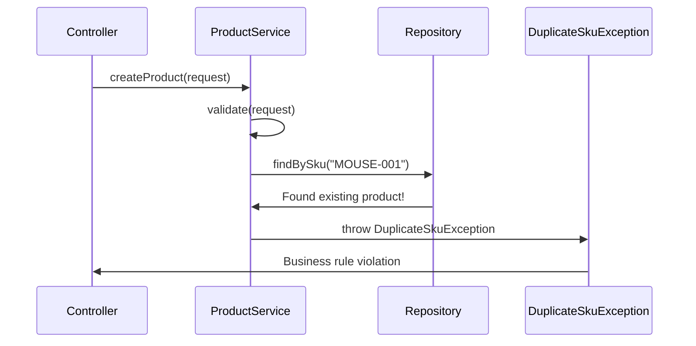
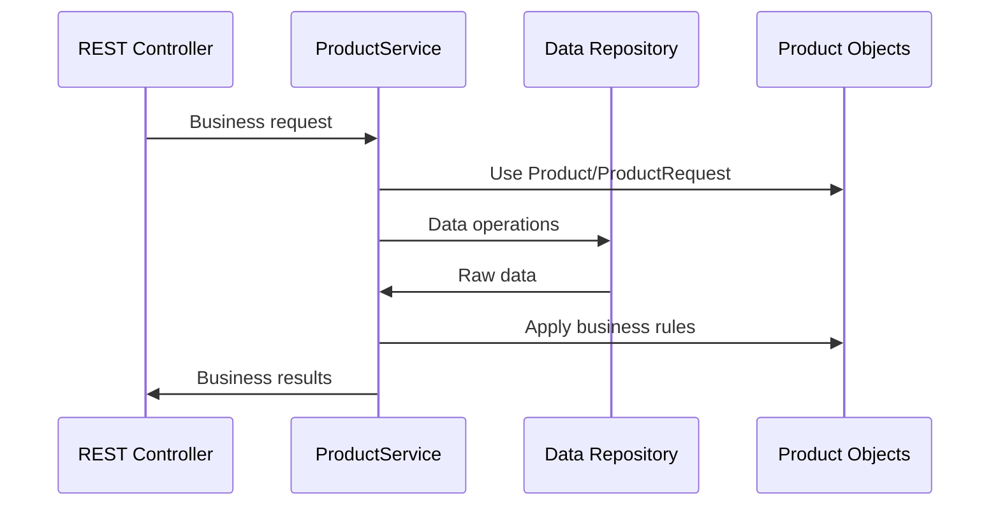

# Chapter 5: Business Logic Service Layer

Building on our [REST API Controller Layer](04_rest_api_controller_layer_.md), we now have a professional front desk that can receive requests and send responses. But when a customer asks to create a product, who makes sure the price isn't negative? Who checks that the product name isn't blank? Who prevents two products from having the same SKU? This is where the **Business Logic Service Layer** comes in - the intelligent brain of our product catalog system.

## What Problem Does the Service Layer Solve?

Imagine you're managing a large electronics store with multiple cashiers at different counters. A customer wants to return a product, but each cashier handles returns differently: one accepts any return without checking, another requires a receipt but doesn't verify dates, and a third makes up rules on the spot. This creates chaos, inconsistent customer experiences, and potential business losses.

The Business Logic Service Layer solves this exact problem in our software. It acts like a **smart store manager who creates and enforces consistent business policies**. Whether a request comes from a mobile app, website, or admin panel, the same business rules apply every time:

- Product SKUs must be unique (no duplicate barcodes)
- Product prices cannot be negative 
- Required information like name and category must be provided
- Only properly validated products enter our system

Let's say a mobile app tries to create a product with SKU "MOUSE-001", but that SKU already exists. Our service layer will catch this business rule violation and prevent the duplicate, just like a good store manager would stop two products from having the same barcode.

## The Store Manager: ProductService

Our service layer has one main player - the **ProductService** class. Think of it as our experienced store manager who knows all the business rules and makes sure they're followed consistently.

```java
@Service
public class ProductServiceImpl implements ProductService {
    private final ProductRepository repository;
    
    public ProductServiceImpl(ProductRepository repository) {
        this.repository = repository;
    }
}
```

The `@Service` annotation tells Spring "this class contains business logic," while the constructor gives our store manager access to the inventory system (repository).

## Creating Products: The Validation Master

Let's see how our service layer handles creating a new product:

```java
public Product createProduct(ProductRequest request) {
    validate(request);  // Check business rules first!
    
    if (repository.findBySku(request.getSku()) != null) {
        throw new DuplicateSkuException(request.getSku());
    }
    
    Product product = new Product();
    copy(request, product);
    return repository.save(product);
}
```

This method acts like a thorough store manager who:
1. **Validates the request** - checks all business rules
2. **Prevents duplicates** - ensures SKU is unique 
3. **Creates safely** - builds the product properly
4. **Saves securely** - stores the validated product

## Business Rules: The Policy Enforcer

The heart of our service layer is the validation logic that enforces our business policies:

```java
private void validate(ProductRequest request) {
    if (request == null) {
        throw new InvalidProductException("Request body is required.");
    }
    if (isBlank(request.getSku())) {
        throw new InvalidProductException("sku is required.");
    }
    if (isBlank(request.getName())) {
        throw new InvalidProductException("name is required.");
    }
}
```

Each check enforces a specific business rule:
- **Null check**: "We need product information to proceed"
- **SKU validation**: "Every product must have a stock number"
- **Name validation**: "Every product must have a display name"

## Advanced Business Rules

```java
if (request.getPrice() == null || 
    request.getPrice().compareTo(BigDecimal.ZERO) < 0) {
    throw new InvalidProductException("price must be zero or greater.");
}

if (isBlank(request.getCategory())) {
    throw new InvalidProductException("category is required.");
}
```

These rules enforce more sophisticated policies:
- **Price rules**: No negative prices (business policy)
- **Category requirements**: Every product needs organization

## Smart Data Processing

Our service layer also cleans and standardizes data:

```java
private void copy(ProductRequest request, Product product) {
    product.setSku(request.getSku().trim());  // Remove extra spaces
    product.setName(request.getName().trim()); // Clean up name
    product.setPrice(request.getPrice());
    product.setCategory(request.getCategory().trim().toUpperCase());
    product.setActive(request.getActive() == null ? true : request.getActive());
}
```

This method implements business logic for data processing:
- **Trim whitespace**: Clean up messy user input
- **Standardize categories**: Convert to uppercase for consistency
- **Apply defaults**: Set `active` to `true` if not specified

## How Service Layer Coordinates Operations

Let's trace what happens when someone tries to create a product with a duplicate SKU:



Here's what happens step by step:

1. **Controller Request**: Controller asks service to create a product
2. **Validation Check**: Service validates all required fields and rules
3. **Uniqueness Check**: Service asks repository if SKU already exists
4. **Rule Violation**: Discovers SKU "MOUSE-001" is already taken
5. **Exception Thrown**: Service prevents duplicate and throws business exception
6. **Error Communication**: Controller receives clear error about the business rule violation

## Finding Products: Smart Filtering

When customers want to browse products, our service layer applies intelligent filtering:

```java
public List<Product> getProducts(String category, Boolean active) {
    List<Product> result = new ArrayList<>();
    for (Product product : repository.findAll()) {
        if (category != null && 
            !category.equalsIgnoreCase(product.getCategory())) {
            continue; // Skip non-matching categories
        }
        if (active != null && active != product.isActive()) {
            continue; // Skip non-matching status
        }
        result.add(product);
    }
    return result;
}
```

This method implements smart business logic:
- **Optional filtering**: Only apply filters if customer specifies them
- **Case-insensitive matching**: "electronics" matches "ELECTRONICS" 
- **Flexible queries**: Return all products if no filters specified

## Updating Products: Preserving Data Integrity

The update operation shows how our service handles complex business scenarios:

```java
public Product updateProduct(Long id, ProductRequest request) {
    Product existing = getProduct(id);  // Make sure product exists
    validate(request);                  // Apply same validation rules
    
    Product sameSku = repository.findBySku(request.getSku());
    if (sameSku != null && !sameSku.getId().equals(id)) {
        throw new DuplicateSkuException(request.getSku());
    }
    
    copy(request, existing);
    return repository.update(existing);
}
```

This implements sophisticated business logic:
- **Existence check**: Ensure we're updating a real product
- **Same validation**: Apply identical rules as creation
- **Smart SKU checking**: Allow keeping same SKU, prevent stealing others' SKUs
- **Safe updating**: Preserve system-generated fields like ID

## Helper Methods: Business Utilities

Our service includes utility methods that define business concepts:

```java
private boolean isBlank(String value) {
    return value == null || value.trim().length() == 0;
}
```

This method implements our business definition of "blank" - either null or empty after removing whitespace. It's used consistently throughout our validation.

## When Business Rules Are Violated

When business rules are broken, our service throws specific exceptions:

```java
// Different types of business rule violations
throw new InvalidProductException("price must be zero or greater.");
throw new DuplicateSkuException(request.getSku());
throw new ProductNotFoundException(id);
```

Each exception represents a specific business problem:
- **InvalidProductException**: Input doesn't meet business standards
- **DuplicateSkuException**: Violates uniqueness business rule  
- **ProductNotFoundException**: Requested item doesn't exist

## Complete Example: Creating a Gaming Headset

Let's trace a complete example where a mobile app creates a product:

**Mobile App Sends:**
```json
{
  "sku": "HEADSET-001",
  "name": "  Gaming Headset  ",
  "price": 89.99,
  "category": "electronics"
}
```

**Service Layer Processing:**

**Step 1: Validation**
```java
validate(request);  // Checks: SKU ✓, name ✓, price ✓, category ✓
```

**Step 2: Uniqueness Check**
```java
if (repository.findBySku("HEADSET-001") != null) {
    // No existing product found - good to proceed!
}
```

**Step 3: Data Processing**
```java
product.setSku("HEADSET-001");           // Already clean
product.setName("Gaming Headset");       // Trimmed whitespace  
product.setPrice(89.99);                 // Valid price
product.setCategory("ELECTRONICS");      // Standardized format
product.setActive(true);                 // Applied default
```

**Step 4: Save and Return**
```java
return repository.save(product);  // Returns product with generated ID
```

**Final Result:**
```json
{
  "id": 15,
  "sku": "HEADSET-001",
  "name": "Gaming Headset", 
  "price": 89.99,
  "category": "ELECTRONICS",
  "active": true
}
```

Notice how our business logic:
- Cleaned up the messy name by trimming spaces
- Standardized the category to uppercase
- Applied the default `active: true` business rule
- Generated a unique system ID

## Integration with Other Layers

Our service layer acts as the coordination center between different parts:



The service layer:
- **Receives business requests** from controllers
- **Uses standardized objects** from our domain model
- **Coordinates data access** through repositories  
- **Applies business rules** consistently
- **Returns validated results** to controllers

## Why This Design Matters

### Consistent Business Rules
```java
// Same validation logic applies everywhere
private void validate(ProductRequest request) {
    // These rules apply whether request comes from:
    // - Mobile app, web app, admin panel, batch import, etc.
}
```

### Centralized Intelligence  
All business logic lives in one place, making it easy to:
- Update business rules in one location
- Ensure consistency across all entry points
- Test business logic independently

### Clean Separation
```java
// Service focuses ONLY on business concerns
public Product createProduct(ProductRequest request) {
    // No HTTP, JSON, or database concerns here
    // Just pure business logic!
}
```

## Conclusion

The Business Logic Service Layer serves as the intelligent brain of our product catalog system. Like an experienced store manager who ensures consistent operations, it:

- **Enforces business rules**: Same policies apply regardless of how requests arrive
- **Validates all input**: Ensures only quality data enters our system  
- **Coordinates operations**: Manages complex business processes safely
- **Handles edge cases**: Prevents duplicates, validates constraints, manages updates
- **Processes data intelligently**: Cleans, standardizes, and applies business defaults

**Key takeaways:**
- Service layer contains all business logic and rules
- Validation methods ensure data quality and business compliance
- Smart processing cleans and standardizes data automatically
- Exception handling communicates business rule violations clearly
- The layer coordinates between web concerns and data storage

Our service layer creates a reliable, intelligent system that makes business decisions consistently. It acts as the guardian of data quality and business rule compliance.

Next, we'll explore how our intelligent service layer works with the [Data Access Repository Layer](06_data_access_repository_layer_.md), where we'll learn how validated business objects get stored and retrieved from our data storage system.

