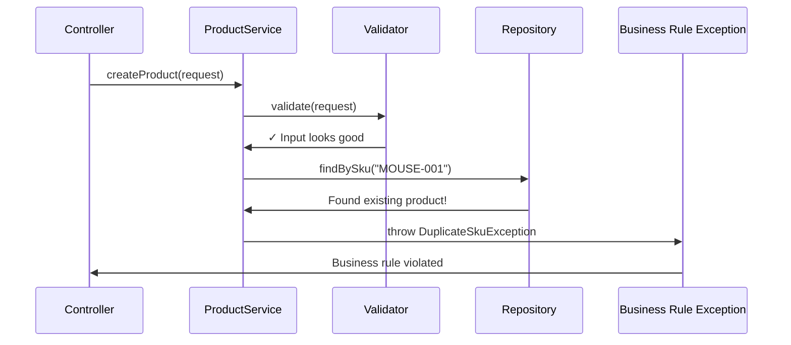
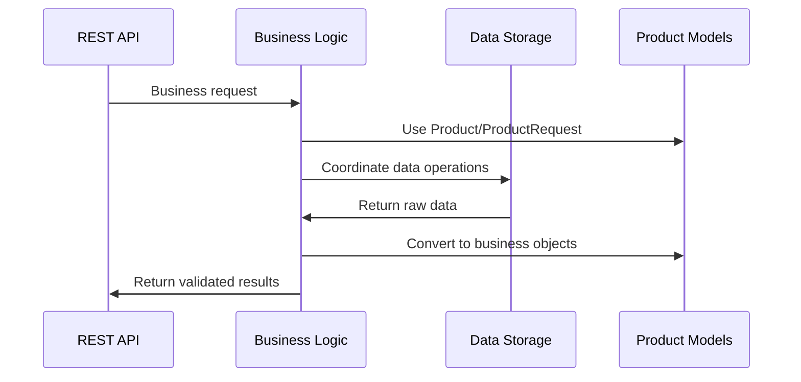

# Chapter 5: Business Logic Service Layer

Building on our [REST API Controller Layer](03_rest_api_controller_layer_.md), we now have a professional front desk that can receive and respond to customer requests. But what happens when someone tries to create a product with a negative price? Who ensures SKU codes are unique? Who enforces the business rules that keep our product catalog organized and reliable? This is where the **Business Logic Service Layer** comes in - the intelligent brain of our system.

## What Problem Does the Service Layer Solve?

Imagine you're running a chain of electronics stores with multiple locations. Each store has cashiers who handle customer requests, but without a store manager, chaos would ensue: one cashier accepts returns without receipts, another sells products at random prices, and a third allows duplicate product codes in the system. Each location operates differently, creating inconsistency and potential business losses.

The Business Logic Service Layer solves this exact problem in our software. It's like having an **experienced store manager who creates and enforces all the business policies**. Whether a request comes from a mobile app, website, or admin panel, the same intelligent rules apply consistently:

- Product SKU codes must be unique (no duplicates allowed)
- Prices must be zero or greater (no negative prices)
- Required information like product name cannot be empty
- Category names are standardized across the system

Let's say a mobile app tries to create a new product with SKU "MOUSE-001", but that SKU already exists in our catalog. Our service layer acts like a vigilant store manager - it catches this business rule violation and prevents the duplicate, protecting our data integrity.

## Key Players: ProductService Interface and Implementation

Our service layer has two main components, like having a policy manual and a manager who implements those policies:

### ProductService Interface: The Policy Manual
The `ProductService` interface defines **what** business operations we can perform - like a comprehensive policy manual that lists all the services our store offers.

### ProductServiceImpl: The Experienced Manager
The `ProductServiceImpl` class contains **how** we actually implement those business operations - like an experienced store manager who knows exactly how to follow each policy and handle edge cases.

## The ProductService Interface: Our Business Contract

Let's look at our service interface - the policy manual:

```java
public interface ProductService {
    List<Product> getProducts(String category, Boolean active);
    Product getProduct(Long id);
    Product createProduct(ProductRequest request);
}
```

This interface defines our **business contract** - the core operations our product catalog supports. It's like posting a clear sign that says "We offer these services: browse products with filters, find specific products, and create new products."

Each method represents a fundamental business operation:
- **`getProducts`**: Browse and filter products (like browsing a store catalog)
- **`getProduct`**: Find one specific product by its ID number
- **`createProduct`**: Add a new product with full validation and business rules

```java
Product updateProduct(Long id, ProductRequest request);
void deleteProduct(Long id);
```

The remaining operations complete our business services:
- **`updateProduct`**: Modify existing product information safely
- **`deleteProduct`**: Remove products from our catalog

Notice how the interface uses our [Product Domain Model](02_product_domain_model_.md) classes - it speaks the same "product language" throughout our system.

## The ProductServiceImpl: Where Intelligence Lives

Now let's see how our experienced store manager actually implements these policies:

```java
@Service
public class ProductServiceImpl implements ProductService {
    
    private final ProductRepository repository;
    
    public ProductServiceImpl(ProductRepository repository) {
        this.repository = repository;
    }
}
```

The `@Service` annotation tells Spring "this class contains business logic and intelligence," while the constructor receives a `ProductRepository` - like giving our store manager access to the inventory database and filing system.

### Smart Product Browsing: Intelligent Filtering

```java
@Override
public List<Product> getProducts(String category, Boolean active) {
    List<Product> result = new ArrayList<Product>();
    for (Product product : repository.findAll()) {
        if (category != null && !category.equalsIgnoreCase(product.getCategory())) {
            continue; // Skip products that don't match category
        }
    }
    return result;
}
```

This method implements intelligent browsing logic. It fetches all products from storage, then applies smart business rules:
- **Case-insensitive filtering**: Customers can search "electronics" or "ELECTRONICS" - both work
- **Optional filters**: If no category is specified, show all products
- **Flexible matching**: Business logic handles the complexity so controllers stay simple

**Example Usage:**
- `getProducts("Electronics", true)` → Returns only active electronics products
- `getProducts(null, null)` → Returns all products in the catalog

### Product Creation: The Validation Expert

```java
@Override
public Product createProduct(ProductRequest request) {
    validate(request);  // Apply all business rules
    
    if (repository.findBySku(request.getSku()) != null) {
        throw new DuplicateSkuException(request.getSku());
    }
    
    Product product = new Product();
    copy(request, product, true);
    return repository.save(product);
}
```

This is where our business intelligence shines! The method acts like a careful store manager:
1. **Validates everything**: Checks all business rules before proceeding
2. **Prevents duplicates**: Ensures SKU codes remain unique across the system
3. **Processes safely**: Transfers data using controlled, validated methods
4. **Coordinates storage**: Works with the repository to save validated products

If someone tries to create a product that violates business rules, our service layer catches it immediately - before any bad data reaches our database.

## Business Rule Validation: The Policy Enforcer

The heart of our service layer is intelligent validation:

```java
private void validate(ProductRequest request) {
    if (request == null) {
        throw new InvalidProductException("Request body is required.");
    }
    if (isBlank(request.getSku())) {
        throw new InvalidProductException("sku is required.");
    }
}
```

Each validation check enforces a specific business policy:
- **Null protection**: "We need actual product information to proceed"
- **SKU requirement**: "Every product must have a unique stock number"
- **Clear error messages**: Help users understand exactly what went wrong

### Advanced Business Intelligence

```java
if (request.getPrice() == null || request.getPrice().compareTo(BigDecimal.ZERO) < 0) {
    throw new InvalidProductException("price must be zero or greater.");
}
if (isBlank(request.getCategory())) {
    throw new InvalidProductException("category is required.");
}
```

These rules demonstrate sophisticated business logic:
- **Price validation**: Prevents negative prices that could break accounting systems
- **Category requirements**: Ensures products are properly organized for customers
- **Precise error handling**: Each violation gets a specific, helpful error message

## Smart Data Processing: The Standardization Engine

Our service layer also handles intelligent data processing:

```java
private void copy(ProductRequest request, Product product, boolean create) {
    product.setSku(request.getSku().trim());
    product.setName(request.getName().trim());
    product.setCategory(request.getCategory().trim().toUpperCase());
    product.setActive(request.getActive() == null ? true : request.getActive());
}
```

This method implements smart business processing:
- **Automatic cleanup**: Trims whitespace from user input without bothering them
- **Consistent formatting**: Standardizes categories to uppercase for system consistency
- **Intelligent defaults**: Sets new products to active if not specified
- **Safe data transfer**: Only processes approved fields through controlled methods

## How the Service Layer Thinks: Processing Intelligence

Let's trace what happens when someone tries to create a product with a duplicate SKU:



Here's what happens when our intelligent service layer processes the request:

1. **Initial Request**: Controller asks service to create a new product
2. **Input Intelligence**: Service validates all required fields and business rules
3. **Uniqueness Check**: Service intelligently checks if SKU already exists in catalog
4. **Smart Detection**: Discovers SKU "MOUSE-001" already exists (business rule violation!)
5. **Intelligent Response**: Service throws specific business exception to prevent duplicate
6. **Clear Communication**: Controller receives detailed information about what went wrong

The service layer acts as an intelligent gatekeeper - it understands business rules and prevents problems before they happen.

## Advanced Intelligence: Product Updates

The update operation shows how our service layer handles complex business scenarios:

```java
@Override
public Product updateProduct(Long id, ProductRequest request) {
    Product existing = getProduct(id);  // Ensure product exists
    validate(request);                  // Apply same validation rules
    
    Product sameSku = repository.findBySku(request.getSku());
    if (sameSku != null && !sameSku.getId().equals(id)) {
        throw new DuplicateSkuException(request.getSku());
    }
}
```

This demonstrates sophisticated business intelligence:
- **Existence verification**: Make sure we're updating a real product
- **Consistent validation**: Apply the same quality standards as creation
- **Smart SKU logic**: Allow keeping the same SKU, but prevent stealing another product's SKU
- **Data integrity**: Protect against accidental corruption or conflicts

## Integration Intelligence: Coordinating the System

Our service layer acts as the intelligent coordinator between different parts of our system:



The service layer intelligently:
- **Receives requests** from our [REST API Controller Layer](03_rest_api_controller_layer_.md) and translates web requests into business operations
- **Uses standardized data** from our [Product Domain Model](02_product_domain_model_.md) to maintain consistency
- **Coordinates data access** with repositories while applying business rules
- **Handles exceptions** that get processed by our exception handling system

## Under the Hood: Complete Business Processing

Let's see what happens internally when a valid product creation request is processed:

```java
// Step 1: Intelligent validation
private void validate(ProductRequest request) {
    // Check all business rules and data quality standards
}

// Step 2: Smart uniqueness checking
if (repository.findBySku(request.getSku()) != null) {
    throw new DuplicateSkuException(request.getSku());
}

// Step 3: Intelligent data processing  
private void copy(ProductRequest request, Product product, boolean create) {
    // Clean, standardize, and safely transfer data
}
```

Each step demonstrates business intelligence:
1. **Quality assurance**: Prevents bad data from entering our system
2. **Business constraints**: Enforces uniqueness rules and other policies
3. **Smart processing**: Standardizes and cleans data according to business needs
4. **Coordinated persistence**: Works with repository to store validated business objects

## Helper Intelligence: Smart Utilities

Our service includes intelligent utility methods:

```java
private boolean isBlank(String value) {
    return value == null || value.trim().length() == 0;
}
```

This simple method encapsulates our business definition of "empty data" - either null or just whitespace. It's used consistently throughout our validation logic, ensuring uniform business rules across all operations.

## Intelligent Error Communication

When business rules are violated, our service layer provides intelligent feedback:

```java
throw new InvalidProductException("price must be zero or greater.");
throw new DuplicateSkuException(request.getSku());
throw new ProductNotFoundException(id);
```

Each exception communicates specific business intelligence:
- **InvalidProductException**: Input doesn't meet our business quality standards
- **DuplicateSkuException**: Violates our uniqueness business policy
- **ProductNotFoundException**: Requested resource doesn't exist in our system

The service layer doesn't just say "error" - it explains exactly what business rule was violated and why.

## Real-World Example: Complete Business Intelligence

Let's trace how our intelligent service layer processes a product creation request:

**Input from Mobile App:**
```json
{
  "sku": "  headset-001  ",
  "name": "  Gaming Headset  ",
  "price": 89.99,
  "category": "electronics  ",
  "active": null
}
```

**Intelligent Processing Steps:**
1. **Validation Intelligence**: Checks required fields, validates price ≥ 0
2. **Uniqueness Intelligence**: Verifies "headset-001" doesn't exist (case-insensitive)
3. **Cleanup Intelligence**: Trims "Gaming Headset", uppercases "ELECTRONICS"
4. **Default Intelligence**: Sets active to true (sensible business default)
5. **Storage Coordination**: Saves cleaned, validated product

**Processed Output:**
```json
{
  "id": 15,
  "sku": "HEADSET-001",
  "name": "Gaming Headset", 
  "price": 89.99,
  "category": "ELECTRONICS",
  "active": true
}
```

Notice how our business intelligence:
- Cleaned up messy user input automatically
- Applied consistent formatting standards
- Generated system fields like ID
- Applied sensible business defaults
- Ensured data quality without bothering the user

## Conclusion

The Business Logic Service Layer serves as the intelligent brain of our product catalog system. Like an experienced store manager with years of wisdom, it:

- **Enforces business rules consistently**: Same intelligent policies apply regardless of how requests arrive (mobile app, website, admin panel)
- **Validates intelligently**: Ensures only high-quality data enters our system with helpful error messages
- **Processes smartly**: Cleans, standardizes, and enhances data according to business needs
- **Coordinates wisely**: Works between controllers and repositories to orchestrate complex business operations
- **Prevents problems**: Catches business rule violations before they cause system issues

Key components of our intelligent service layer:
- `ProductService` interface defines our business contract and capabilities
- `ProductServiceImpl` contains the actual business intelligence and rules
- Validation methods enforce data quality and business constraints intelligently
- Processing methods standardize and enhance data automatically
- Exception handling provides clear, specific feedback about business rule violations

Our service layer creates intelligent separation of concerns - controllers handle web requests, repositories handle data storage, and services handle the smart business logic that makes everything work correctly together.

Next, we'll explore how our intelligent service layer validates business rules in even more detail. In the [Business Rule Validation](06_business_rule_validation_.md) chapter, we'll dive deeper into the specific validation techniques and error handling strategies that keep our product catalog reliable and user-friendly.

