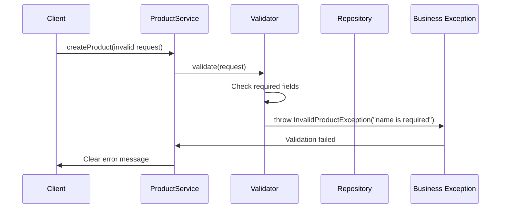
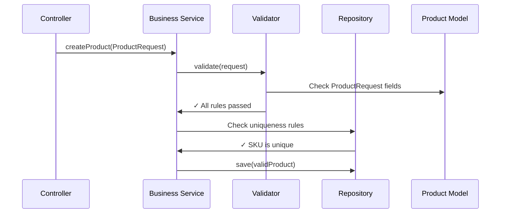

# Chapter 6: Business Rule Validation

Now that we've built our [Business Logic Service Layer](05_business_logic_service_layer_.md) with intelligent processing capabilities, you might wonder: "How exactly does our system ensure that a product with a negative price never enters our catalog? What prevents someone from creating a product without a name?" This is where **Business Rule Validation** comes in - the quality control inspector of our product catalog system.

## What Problem Does Business Rule Validation Solve?

Imagine you're running a high-end electronics store, and you've hired several new employees to manage inventory. Without clear quality control procedures, chaos would ensue: one employee enters a laptop with a price of -$500, another creates a product called "" (empty string), and a third tries to add two different mice with the same barcode "MOUSE-001". These mistakes could crash your point-of-sale system, confuse customers, and cause serious business problems.

Business Rule Validation solves this exact problem in our software. It acts like a **meticulous quality control inspector** who checks every piece of data before it enters our system:

- Ensures all required information is provided (no missing names or prices)
- Prevents illogical data (negative prices, empty descriptions)
- Enforces uniqueness rules (no duplicate SKU codes)
- Validates data formats and business constraints
- Provides clear, helpful error messages when problems are found

Let's say a mobile app tries to create a new product with the data: `{"name": "", "price": -25.99, "sku": ""}`. Our validation system acts like a vigilant inspector - it catches all three problems (empty name, negative price, missing SKU) and prevents this corrupted data from damaging our catalog.

## Key Players: Validation Methods and Exception Handling

Our validation system has two main components working together like a quality control team:

### Validation Methods: The Inspection Checklist
Validation methods systematically check each piece of data against our business rules, like having a detailed inspection checklist that covers every quality standard.

### Business Exceptions: The Problem Report System
When validation finds issues, business exceptions create clear, specific reports about what went wrong and how to fix it, like having a standardized incident report system.

## The Validation Process: Step-by-Step Quality Control

Let's look at how our quality control inspector examines incoming product data:

```java
private void validate(ProductRequest request) {
    if (request == null) {
        throw new InvalidProductException("Request body is required.");
    }
}
```

**First Quality Check**: "Do we have any product information at all?" This is like a basic sanity check - if someone sends us absolutely no data, we can't create a product. The error message is clear and helpful: it tells the user exactly what's missing.

```java
if (isBlank(request.getSku())) {
    throw new InvalidProductException("sku is required.");
}
```

**SKU Inspection**: "Does this product have a stock keeping unit code?" Every product in our catalog needs a unique identifier, just like every item in a physical store needs a barcode. The `isBlank()` method checks for both null values and empty strings.

```java
if (isBlank(request.getName())) {
    throw new InvalidProductException("name is required.");
}
```

**Name Validation**: "Does this product have a display name?" Customers need to know what they're looking at, so every product must have a meaningful name that can be shown in our catalog.

## Advanced Business Rule Validation

Our quality control gets more sophisticated with complex business rules:

```java
if (request.getPrice() == null || request.getPrice().compareTo(BigDecimal.ZERO) < 0) {
    throw new InvalidProductException("price must be zero or greater.");
}
```

**Price Intelligence**: "Is this price reasonable for business?" This rule prevents several problems:
- **Null prices**: Products must have defined prices
- **Negative prices**: No paying customers to take products (business logic violation)
- **Zero prices**: Allowed for free samples or promotional items

The `compareTo(BigDecimal.ZERO)` ensures precise money calculations without floating-point errors.

```java
if (isBlank(request.getCategory())) {
    throw new InvalidProductException("category is required.");
}
```

**Category Organization**: "Is this product properly categorized?" Our catalog organizes products by category (Electronics, Books, Clothing), so every product must belong somewhere. This helps customers find what they need.

## The Helper Inspector: Detecting Empty Data

Our validation system includes a smart helper that understands different types of "empty":

```java
private boolean isBlank(String value) {
    return value == null || value.trim().length() == 0;
}
```

This simple method is surprisingly intelligent:
- **`value == null`**: Catches completely missing data
- **`value.trim().length() == 0`**: Catches strings that contain only spaces, tabs, or other whitespace

**Examples of what `isBlank()` catches:**
- `null` → `true` (no data)
- `""` → `true` (empty string)
- `"   "` → `true` (only spaces)
- `"Mouse"` → `false` (valid data)

## Uniqueness Validation: Preventing Duplicates

Beyond basic field validation, our system enforces uniqueness rules:

```java
if (repository.findBySku(request.getSku()) != null) {
    throw new DuplicateSkuException(request.getSku());
}
```

**Uniqueness Inspector**: "Is this SKU code already taken?" This check prevents business disasters:
- **Inventory confusion**: Two products with same SKU would break inventory tracking
- **Customer confusion**: Duplicate codes make it impossible to identify specific products
- **System integrity**: Maintains data consistency across our entire catalog

The validation happens at the business logic level, ensuring the rule applies regardless of how data enters our system (mobile app, admin panel, API calls).

## How Validation Works: The Complete Quality Control Process

Let's trace what happens when someone tries to create a product with multiple validation problems:



Here's the step-by-step quality control process:

1. **Product Creation Request**: Client sends product data to our service
2. **Quality Control Initiated**: Service immediately starts validation before processing
3. **Systematic Inspection**: Validator checks each field against business rules
4. **Problem Detection**: Finds the first validation failure (missing product name)
5. **Immediate Stop**: Validation throws specific exception to prevent bad data
6. **Clear Communication**: Client receives helpful error message explaining the problem

The key insight: **validation stops at the first problem** it finds. This prevents cascading errors and gives users clear, actionable feedback.

## Real-World Validation Example: Catching Multiple Problems

Let's see how our validation handles a realistic problematic request:

**Problematic Input:**
```json
{
  "sku": "",
  "name": "   ",
  "price": -15.99,
  "category": null
}
```

**Quality Control Process:**
```java
// Step 1: Check for missing SKU
if (isBlank(request.getSku())) {
    throw new InvalidProductException("sku is required.");
    // STOPS HERE - validation fails immediately
}
```

**What happens:** The validator detects the empty SKU and immediately throws an exception with the message "sku is required." It doesn't continue checking other fields - it gives the user one clear problem to fix at a time.

**After fixing the SKU, if user submits:**
```json
{
  "sku": "GADGET-001",
  "name": "   ",
  "price": -15.99,
  "category": null
}
```

**Next Quality Check:**
```java
// Now checks the name field
if (isBlank(request.getName())) {
    throw new InvalidProductException("name is required.");
    // STOPS HERE - next validation problem found
}
```

This step-by-step approach helps users fix problems systematically rather than overwhelming them with a long list of errors.

## Validation Integration: Working with Other Layers

Our validation system integrates seamlessly with other parts of our architecture:



The validation process coordinates across layers:

1. **Controller Layer**: Receives raw JSON and converts it to `ProductRequest` using our [Product Domain Model](02_product_domain_model_.md)
2. **Service Layer**: Immediately validates business rules before any processing
3. **Validation Logic**: Uses domain model structure to check each field systematically
4. **Repository Layer**: Helps enforce uniqueness rules by checking existing data
5. **Exception Handling**: Communicates validation failures back through the layers

## Under the Hood: Complete Validation Implementation

Let's examine how validation works internally in our ProductServiceImpl:

```java
@Override
public Product createProduct(ProductRequest request) {
    validate(request);  // Quality control first!
    
    // Additional business rule checks
    if (repository.findBySku(request.getSku()) != null) {
        throw new DuplicateSkuException(request.getSku());
    }
    
    // Only proceed if all validation passes
    Product product = new Product();
    copy(request, product, true);
    return repository.save(product);
}
```

**The Validation Strategy:**
1. **Input validation first**: Check all basic business rules before touching the database
2. **Uniqueness validation second**: Check constraints that require database queries
3. **Processing last**: Only create and save products that pass all quality checks

This order is intentional - it catches simple problems quickly (without database calls) before checking more expensive uniqueness constraints.

## Data Cleaning: Smart Quality Enhancement

Our validation system doesn't just reject bad data - it also intelligently cleans good data:

```java
private void copy(ProductRequest request, Product product, boolean create) {
    product.setSku(request.getSku().trim());        // Remove extra spaces
    product.setName(request.getName().trim());      // Clean display name
    product.setCategory(request.getCategory().trim().toUpperCase()); // Standardize
}
```

**Smart Data Processing:**
- **`trim()`**: Removes accidental spaces that users might add
- **`toUpperCase()`**: Standardizes category format for consistency
- **Automatic defaults**: Sets reasonable values for optional fields

**Example transformation:**
- Input: `"  Electronics  "` 
- Output: `"ELECTRONICS"`

This makes our system user-friendly while maintaining data quality standards.

## Exception Types: Specific Problem Reports

Our validation system uses different exception types for different kinds of problems:

```java
// Basic validation failures
throw new InvalidProductException("price must be zero or greater.");

// Business constraint violations  
throw new DuplicateSkuException(request.getSku());

// Resource not found issues
throw new ProductNotFoundException(id);
```

**Why different exception types?**
- **InvalidProductException**: Input data doesn't meet basic quality standards
- **DuplicateSkuException**: Violates uniqueness business rules
- **ProductNotFoundException**: Requested resource doesn't exist in our system

Different exceptions allow different parts of our system (like error handlers) to respond appropriately to different types of problems.

## Validation in Update Operations: Protecting Existing Data

Validation becomes more sophisticated when updating existing products:

```java
@Override
public Product updateProduct(Long id, ProductRequest request) {
    Product existing = getProduct(id);  // Ensure product exists
    validate(request);                  // Apply same quality standards
    
    // Smart uniqueness check for updates
    Product sameSku = repository.findBySku(request.getSku());
    if (sameSku != null && !sameSku.getId().equals(id)) {
        throw new DuplicateSkuException(request.getSku());
    }
}
```

**Update Validation Logic:**
1. **Existence check**: Can't update something that doesn't exist
2. **Standard validation**: Apply same quality rules as creation
3. **Smart uniqueness**: Allow keeping the same SKU, but prevent stealing another product's SKU

This prevents accidentally corrupting existing products while maintaining all our quality standards.

## Real-World Example: Comprehensive Validation

Let's trace a complete validation scenario where a user fixes problems step by step:

**Attempt 1 - Multiple Problems:**
```json
{
  "sku": "",
  "name": "",
  "price": -50,
  "category": ""
}
```

**Validation Result:** `InvalidProductException: "sku is required."`

**Attempt 2 - Fixed SKU:**
```json
{
  "sku": "TABLET-001",
  "name": "",
  "price": -50,
  "category": ""
}
```

**Validation Result:** `InvalidProductException: "name is required."`

**Attempt 3 - Fixed Name:**
```json
{
  "sku": "TABLET-001", 
  "name": "Gaming Tablet",
  "price": -50,
  "category": ""
}
```

**Validation Result:** `InvalidProductException: "price must be zero or greater."`

**Attempt 4 - Fixed Price:**
```json
{
  "sku": "TABLET-001",
  "name": "Gaming Tablet", 
  "price": 299.99,
  "category": ""
}
```

**Validation Result:** `InvalidProductException: "category is required."`

**Final Attempt - All Fixed:**
```json
{
  "sku": "TABLET-001",
  "name": "Gaming Tablet",
  "price": 299.99,
  "category": "Electronics"
}
```

**Validation Result:** ✅ **Success!** Product created with cleaned data:
```json
{
  "id": 42,
  "sku": "TABLET-001",
  "name": "Gaming Tablet",
  "price": 299.99,
  "category": "ELECTRONICS",
  "active": true
}
```

Notice how validation guided the user through fixing problems one at a time, and the final result includes our smart data cleaning (category standardization, default active status).

## Integration with Spring Framework

Our validation system integrates naturally with Spring's architecture:

```java
@Service
public class ProductServiceImpl implements ProductService {
    
    private void validate(ProductRequest request) {
        // Business rule validation happens here
    }
}
```

**Spring Integration Benefits:**
- **Automatic transaction handling**: If validation fails, no database changes occur
- **Exception translation**: Spring converts our business exceptions into appropriate HTTP responses
- **Dependency injection**: Validation logic has access to repositories for uniqueness checks
- **AOP integration**: Could add cross-cutting concerns like logging validation attempts

## Conclusion

Business Rule Validation serves as the vigilant quality control system of our product catalog. Like a meticulous inspector at a manufacturing plant, it:

- **Prevents corruption**: Stops invalid data from entering our system before it causes problems
- **Enforces consistency**: Applies the same quality standards regardless of how data arrives
- **Provides clear feedback**: Gives users specific, actionable error messages to fix problems
- **Maintains integrity**: Protects business constraints like SKU uniqueness across the entire system
- **Enhances quality**: Automatically cleans and standardizes valid data for consistency

Key components of our validation system:
- **Field validation**: Ensures required data is present and properly formatted
- **Business rule validation**: Enforces logical constraints like positive prices
- **Uniqueness validation**: Prevents duplicate SKUs and other constraint violations
- **Smart data processing**: Cleans and standardizes valid input automatically
- **Specific exceptions**: Provides clear, targeted error messages for different problem types

Our validation system creates a protective barrier around our [Business Logic Service Layer](05_business_logic_service_layer_.md), ensuring that only high-quality data flows through to processing and storage. This maintains system reliability while providing a user-friendly experience with helpful error guidance.

Next, we'll explore how validated business objects get stored and retrieved in our [Data Access Repository Layer](07_data_access_repository_layer_.md), where we'll learn the techniques for managing persistent data storage while maintaining the data quality that our validation system ensures.

