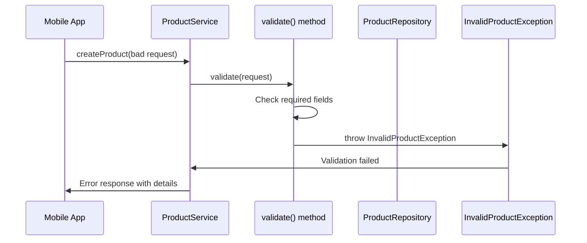

# Chapter 7: Business Rule Validation

Now that we understand how our [Data Access Repository Layer](06_data_access_repository_layer_.md) stores and retrieves product data, we need to ensure that only high-quality, valid data enters our system. This is where **Business Rule Validation** comes in - the quality control inspector of our product catalog system.

## What Problem Does Business Rule Validation Solve?

Imagine you're running a physical electronics store and suppliers keep sending you defective products: smartphones with negative prices, laptops without model numbers, or headphones labeled as "washing machines." Without a quality inspector at your receiving dock, these bad products would make it onto your shelves, confusing customers and damaging your store's reputation.

**Business Rule Validation** solves this exact problem in our software. It acts like a **thorough quality inspector** that checks every piece of product data before it enters our system:

- Product names cannot be empty or just spaces
- SKUs must be provided and unique across all products
- Prices must be zero or greater (no negative prices!)
- Categories are required for proper organization
- All required fields must be filled out

Let's say a mobile app tries to create a product with the name "   " (just spaces) and a price of -50.00. Our validation system will catch these problems and reject the product with clear error messages, just like a quality inspector would reject defective merchandise.

## Key Players: The Quality Control Team

Our validation system has several components working together like a quality control department:

### The Validation Inspector: validate() Method
The main inspector that checks all basic quality standards - like having a primary quality checker who examines every product.

### The Uniqueness Checker: SKU Validation
A specialist who ensures no two products have the same stock number - like a barcode inspector who prevents duplicate product codes.

### The Helper Tools: isBlank() Method
Utility tools that help inspectors do their job efficiently - like having standardized checklists and measurement tools.

## The Main Validation Inspector

Let's see how our primary quality inspector works:

```java
private void validate(ProductRequest request) {
    if (request == null) {
        throw new InvalidProductException("Request body is required.");
    }
}
```

The first check is like asking "Did someone actually send us a product to inspect?" If there's no product data at all, we immediately reject it with a clear error message.

### Checking Required Information

```java
if (isBlank(request.getSku())) {
    throw new InvalidProductException("sku is required.");
}
if (isBlank(request.getName())) {
    throw new InvalidProductException("name is required.");
}
```

These checks ensure essential product information is provided:
- **SKU Check**: "Every product needs a stock number for tracking"
- **Name Check**: "Every product needs a name customers can see"

If either field is missing or empty, our inspector rejects the product with a specific error message explaining what's wrong.

### Validating Business Rules

```java
if (request.getPrice() == null || 
    request.getPrice().compareTo(BigDecimal.ZERO) < 0) {
    throw new InvalidProductException("price must be zero or greater.");
}
```

This enforces our business rule about pricing: no negative prices allowed! The inspector checks two conditions:
- **Null check**: Price must be provided
- **Negative check**: Price cannot be less than zero

### Category Requirements

```java
if (isBlank(request.getCategory())) {
    throw new InvalidProductException("category is required.");
}
```

This ensures every product belongs to a category for proper organization - like requiring every item in a store to have a department label.

## The Helper Inspector Tool

Our validation system uses a helpful utility method:

```java
private boolean isBlank(String value) {
    return value == null || value.trim().length() == 0;
}
```

This little helper defines what we mean by "blank" text:
- **Null values**: No text provided at all
- **Empty after trimming**: Just spaces or empty string

**Example Usage:**
```java
isBlank(null)        // Returns: true (no value)
isBlank("")          // Returns: true (empty)
isBlank("   ")       // Returns: true (just spaces)
isBlank("Mouse")     // Returns: false (valid text)
```

## The Uniqueness Specialist

Beyond basic validation, we have a specialist who ensures SKU uniqueness:

```java
if (repository.findBySku(request.getSku()) != null) {
    throw new DuplicateSkuException(request.getSku());
}
```

This check prevents duplicate stock numbers in our system:
1. **Search existing products**: Look for any product with the same SKU
2. **Duplicate detection**: If found, reject the new product
3. **Clear error message**: Explain exactly what the problem is

## How Validation Flows Through the System

Let's trace what happens when someone tries to create a product with validation problems:



Here's what happens step by step:

1. **Request Arrives**: Mobile app sends product data with validation problems
2. **Validation Starts**: Service calls the validation inspector
3. **Problem Detected**: Validator finds missing or invalid data
4. **Exception Thrown**: Validator throws specific error about the problem
5. **Error Handled**: Service passes the clear error message back to the app

## Real Example: Catching Validation Errors

Let's see what happens when someone tries to create an invalid product:

**Bad Request:**
```json
{
  "sku": "   ",
  "name": "",
  "price": -25.00,
  "category": null
}
```

**Validation Process:**

**Step 1: Check SKU**
```java
if (isBlank("   ")) {  // true - just spaces
    throw new InvalidProductException("sku is required.");
}
```
**Result**: Validation fails immediately with "sku is required."

If the SKU was valid, validation would continue:

**Step 2: Check Name**
```java
if (isBlank("")) {  // true - empty string
    throw new InvalidProductException("name is required.");
}
```

**Step 3: Check Price**
```java
if (-25.00 < 0) {  // true - negative price
    throw new InvalidProductException("price must be zero or greater.");
}
```

**Final Result**: The user gets a clear error message explaining exactly what's wrong, and no invalid data enters our system.

## Preventing Duplicate SKUs

Our validation also prevents duplicate stock numbers across the entire system:

```java
// During product creation
if (repository.findBySku("MOUSE-001") != null) {
    throw new DuplicateSkuException("MOUSE-001");
}
```

**Example Scenario:**
1. **Existing Product**: We already have a product with SKU "MOUSE-001"
2. **New Request**: Someone tries to create another product with SKU "MOUSE-001"
3. **Duplicate Detection**: Our validator finds the existing product
4. **Rejection**: Throws `DuplicateSkuException` with clear message

This prevents inventory chaos by ensuring every product has a unique identifier.

## Smart Validation During Updates

Updating products requires more sophisticated validation logic:

```java
Product sameSku = repository.findBySku(request.getSku());
if (sameSku != null && !sameSku.getId().equals(id)) {
    throw new DuplicateSkuException(request.getSku());
}
```

This smart check allows two scenarios:
- **Keep same SKU**: Product can keep its existing SKU during update
- **Prevent stealing**: Product cannot take another product's SKU

**Example:**
- **Allowed**: Update product #5 to keep SKU "MOUSE-001" (its current SKU)
- **Rejected**: Update product #5 to use SKU "KEYBOARD-002" (belongs to product #7)

## When Validation Passes: Data Processing

After validation succeeds, our system processes the clean data:

```java
private void copy(ProductRequest request, Product product, boolean create) {
    product.setSku(request.getSku().trim());        // Clean spaces
    product.setName(request.getName().trim());      // Clean spaces
    product.setCategory(request.getCategory().trim().toUpperCase());
}
```

**Data Cleaning Benefits:**
- **Trim whitespace**: Remove extra spaces that users might accidentally add
- **Standardize format**: Convert categories to uppercase for consistency
- **Apply defaults**: Set reasonable default values for optional fields

## Complete Validation Example

Let's trace a complete example where validation catches and fixes various issues:

**Input Request:**
```json
{
  "sku": "  HEADSET-001  ",
  "name": "Gaming Headset   ",
  "price": 89.99,
  "category": "electronics"
}
```

**Validation Process:**

**Step 1: Basic Validation**
```java
validate(request);  // All checks pass
// - SKU: "  HEADSET-001  " (not blank after trimming)
// - Name: "Gaming Headset   " (not blank after trimming)  
// - Price: 89.99 (positive number)
// - Category: "electronics" (not blank)
```

**Step 2: Uniqueness Check**
```java
if (repository.findBySku("HEADSET-001") != null) {
    // No existing product found - good to proceed
}
```

**Step 3: Data Processing**
```java
product.setSku("HEADSET-001");        // Trimmed spaces
product.setName("Gaming Headset");    // Trimmed spaces
product.setCategory("ELECTRONICS");   // Cleaned and standardized
```

**Final Result:**
```json
{
  "id": 42,
  "sku": "HEADSET-001",
  "name": "Gaming Headset", 
  "price": 89.99,
  "category": "ELECTRONICS",
  "active": true
}
```

Notice how validation not only prevented errors but also cleaned and standardized the data!

## Different Types of Validation Errors

Our system throws specific exceptions for different validation problems:

### InvalidProductException
```java
throw new InvalidProductException("sku is required.");
throw new InvalidProductException("price must be zero or greater.");
```
**Used for**: Basic validation rule violations (missing data, invalid formats, business rule violations)

### DuplicateSkuException  
```java
throw new DuplicateSkuException("MOUSE-001");
```
**Used for**: SKU uniqueness violations (trying to create products with existing stock numbers)

### ProductNotFoundException
```java
throw new ProductNotFoundException(999L);
```
**Used for**: Operations on non-existent products (trying to update or delete products that don't exist)

## Integration with Error Handling

Our validation exceptions work seamlessly with our error handling system:

```java
// In GlobalExceptionHandler
@ExceptionHandler(InvalidProductException.class)
@ResponseStatus(HttpStatus.BAD_REQUEST)
public ErrorResponse handleInvalidProduct(InvalidProductException ex) {
    return new ErrorResponse("INVALID_PRODUCT", ex.getMessage());
}
```

When validation fails, users get helpful error responses:
```json
{
  "code": "INVALID_PRODUCT",
  "message": "price must be zero or greater."
}
```

## Benefits of Thorough Validation

### Data Quality Assurance
```java
// Only valid products enter our system
validate(request);  // Catches all quality problems upfront
```

### Consistent Error Messages
```java
// Same validation rules apply everywhere
if (isBlank(request.getName())) {
    throw new InvalidProductException("name is required.");
}
```

### Prevention Over Correction
Instead of storing bad data and fixing it later, we prevent bad data from entering the system in the first place.

### User-Friendly Feedback
```json
{
  "code": "INVALID_PRODUCT", 
  "message": "sku is required."
}
```

Users get specific, actionable error messages that tell them exactly how to fix their request.

## Real-World Quality Control

Our validation system works like a comprehensive quality control department:

- **Inspection Checkpoints**: Every product gets thoroughly examined before acceptance
- **Standardized Procedures**: Same validation rules apply consistently across all entry points
- **Clear Rejection Reasons**: When products fail inspection, we explain exactly why
- **Data Cleanup**: Valid products get cleaned and standardized automatically
- **Duplicate Prevention**: No two products can have the same stock number

## Validation in the Bigger Picture

Our Business Rule Validation integrates with other parts of our system:

- **Works with [Product Domain Model](03_product_domain_model_.md)**: Validates `ProductRequest` objects and creates clean `Product` objects
- **Called by [Business Logic Service Layer](05_business_logic_service_layer_.md)**: Service layer enforces validation before any data operations  
- **Coordinates with [Data Access Repository Layer](06_data_access_repository_layer_.md)**: Checks for duplicates using repository searches
- **Feeds into [Exception Handling System](08_exception_handling_system_.md)**: Validation errors get converted to user-friendly responses

## Conclusion

Business Rule Validation serves as the quality control system of our product catalog, ensuring that only valid, clean data enters our system. Like a thorough quality inspector, it:

- **Enforces business standards**: Checks that all data meets our quality requirements
- **Prevents bad data**: Stops invalid information from corrupting our catalog
- **Provides clear feedback**: Gives specific, actionable error messages when validation fails
- **Maintains data integrity**: Ensures consistency and reliability across our entire system
- **Cleans and standardizes**: Processes valid data to maintain consistent formatting

**Key takeaways:**
- The `validate()` method checks all required fields and business rules
- The `isBlank()` helper consistently defines what empty data looks like
- SKU uniqueness checks prevent duplicate products in the system
- Different exception types provide specific error information for different problems
- Validation happens before any data reaches the repository layer
- Clean, validated data gets processed and standardized automatically

Our validation system creates a protective barrier that ensures data quality, making our entire product catalog more reliable and trustworthy. It's like having a quality control department that never sleeps and never lets defective products through.

Next, we'll explore how validation errors and other problems get handled gracefully through our [Exception Handling System](08_exception_handling_system_.md), where we'll learn how to convert technical errors into user-friendly messages.

