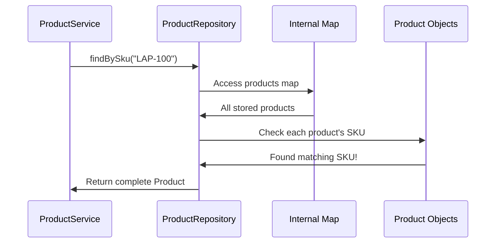
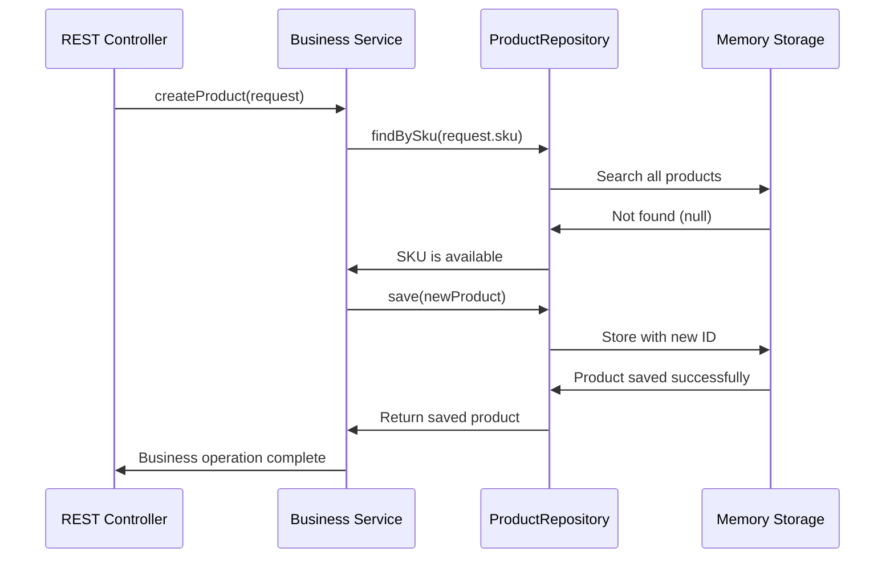

# Chapter 7: Data Access Repository Layer

Building on our [Business Rule Validation](06_business_rule_validation_.md), we now have a smart quality control system that ensures only valid, high-quality product data enters our system. But once our business logic validates a product, where does it actually get stored? And when a customer searches for "Gaming Mouse," how does our system find it? This is where the **Data Access Repository Layer** comes in - the professional warehouse manager of our product catalog system.

## What Problem Does the Repository Layer Solve?

Imagine you're running a large electronics store with an excellent store manager who knows all the business rules and quality standards. A customer walks in looking for a specific laptop model. Your manager knows exactly what constitutes a valid product request, but without an organized warehouse system, chaos would ensue:

- The manager would have to search through random boxes scattered around the building
- Products might be stored in different places with no consistent system
- Finding a specific item could take hours of manual searching
- Adding new inventory would mean randomly placing items wherever there's space
- No one would know if a product is actually in stock without physically searching everywhere

The Data Access Repository Layer solves this exact problem for our software. It acts like a **professional warehouse manager with a perfect inventory system** who:

- Knows exactly where every product is stored and how to find it instantly
- Provides a consistent way to add, find, update, and remove products
- Handles all the technical details of data storage behind a simple interface
- Can easily swap storage mechanisms (memory, database, files) without affecting business logic

Let's say our service layer needs to check if SKU "MOUSE-001" already exists before creating a new product. Our repository layer will efficiently search through all stored products and give a definitive answer - just like asking our warehouse manager "Do we have MOUSE-001 in stock?" and getting an instant, reliable response.

## Key Players: Repository Interface and Implementation

Our repository system has two main components working together like a warehouse operations manual and an actual warehouse manager:

### ProductRepository Interface: The Operations Manual
The `ProductRepository` interface defines **what** storage operations are available - like a comprehensive manual that lists all the warehouse services: "You can store products, find products by ID, search by SKU, update existing products, and remove products."

### InMemoryProductRepository: The Warehouse Manager
The `InMemoryProductRepository` class implements **how** we actually perform those storage operations - like an experienced warehouse manager who knows the specific procedures for organizing, finding, and managing inventory.

## The ProductRepository Interface: Our Storage Contract

Let's examine our repository interface - the operations manual:

```java
public interface ProductRepository {
    List<Product> findAll();
    Product findById(Long id);
    Product findBySku(String sku);
}
```

This interface defines our **storage contract** - the fundamental operations our warehouse supports. Each method represents a core way to retrieve products:

- **`findAll()`**: "Show me everything in the warehouse" - returns complete product catalog
- **`findById(Long id)`**: "Find the product with ID number 123" - precise lookup by unique identifier  
- **`findBySku(String sku)`**: "Find the product with SKU code 'MOUSE-001'" - search by business identifier

```java
Product save(Product product);
Product update(Product product);  
boolean delete(Long id);
```

The remaining operations handle product lifecycle management:
- **`save(Product product)`**: "Store this new product and assign it an ID number"
- **`update(Product product)`**: "Replace the existing product with this updated version"
- **`delete(Long id)`**: "Remove the product with ID number 123 from inventory"

Notice how this interface uses our [Product Domain Model](02_product_domain_model_.md) - it speaks the same "product language" as the rest of our system.

## The InMemoryProductRepository: Our Warehouse Manager in Action

Now let's see how our warehouse manager actually handles storage operations:

```java
@Repository
public class InMemoryProductRepository implements ProductRepository {
    private final Map<Long, Product> products = new LinkedHashMap<>();
    private long sequence = 3L;
}
```

The `@Repository` annotation tells Spring "this class handles data storage," while the `Map<Long, Product>` is our warehouse storage system. Think of it like having numbered storage locations where each product has a specific shelf number (the Long ID) and we can instantly find any product by its number.

The `LinkedHashMap` preserves the order products were added - like organizing our warehouse so items appear in the sequence they arrived. The `sequence` variable acts like a numbering system for assigning unique ID numbers to new products.

### Pre-loaded Inventory: Starting with Sample Products

```java
public InMemoryProductRepository() {
    products.put(1L, new Product(1L, "LAP-100", "Developer Laptop",
            "16GB RAM, 512GB SSD", new BigDecimal("1299.99"), "COMPUTER", true));
    products.put(2L, new Product(2L, "MON-200", "27 Inch Monitor", 
            "4K IPS monitor", new BigDecimal("449.00"), "DISPLAY", true));
}
```

The constructor loads sample products into our warehouse - like starting a new electronics store with some initial inventory. Each product gets stored at its ID location (1L, 2L, etc.) for instant retrieval. This gives us realistic data to work with immediately.

### Finding All Products: The Complete Inventory List

```java
@Override
public synchronized List<Product> findAll() {
    return new ArrayList<Product>(products.values());
}
```

This method returns all products in our warehouse. The `synchronized` keyword ensures thread safety - like making sure only one person can access the inventory system at a time to prevent conflicts when multiple customers browse simultaneously.

**Example Usage:**
```java
List<Product> catalog = repository.findAll();
// Returns: [Developer Laptop, 27 Inch Monitor, Mechanical Keyboard]
```

## Finding Specific Products: The Search System

### Finding by ID: Direct Shelf Lookup

```java
@Override
public synchronized Product findById(Long id) {
    return products.get(id);
}
```

This finds a product by its ID number - like going directly to shelf location #2 to see what's stored there. It's the fastest possible lookup because we know exactly where to look.

**Example Usage:**
```java
Product laptop = repository.findById(1L);
// Returns: Developer Laptop with all its details (name, price, etc.)

Product missing = repository.findById(999L);  
// Returns: null (no product found with that ID)
```

### Finding by SKU: The Barcode Scanner Search

```java
@Override
public synchronized Product findBySku(String sku) {
    for (Product product : products.values()) {
        if (product.getSku() != null && product.getSku().equalsIgnoreCase(sku)) {
            return product;
        }
    }
    return null;
}
```

This searches through all products to find one with a matching SKU - like scanning through the warehouse with a barcode scanner. The `equalsIgnoreCase` makes the search user-friendly, so "MOUSE-001" and "mouse-001" both work.

**Example Usage:**
```java
Product keyboard = repository.findBySku("KEY-300");
// Returns: Mechanical Keyboard

Product notFound = repository.findBySku("MISSING-SKU");
// Returns: null (SKU doesn't exist in our catalog)
```

## Storage Operations: Managing the Warehouse

### Saving New Products: Adding to Inventory

```java
@Override
public synchronized Product save(Product product) {
    product.setId(sequence++);
    products.put(product.getId(), product);
    return product;
}
```

This method stores a new product in our warehouse using a three-step process:
1. **Assign ID**: Give the product the next available ID number (sequence++ means use current number, then increment)
2. **Store**: Place the product at that location in our storage map  
3. **Return**: Give back the product with its new ID so the caller knows it was stored successfully

**Example Usage:**
```java
Product newMouse = new Product(null, "MOUSE-001", "Wireless Mouse", /*...*/);
Product savedMouse = repository.save(newMouse);
// Result: savedMouse now has id=4L and is safely stored in warehouse
```

### Updating Products: Replacing Inventory

```java
@Override
public synchronized Product update(Product product) {
    products.put(product.getId(), product);
    return product;
}
```

This replaces an existing product at its shelf location - like swapping out the old version with an updated version while keeping the same ID number and storage location.

### Removing Products: Taking from Inventory

```java
@Override
public synchronized boolean delete(Long id) {
    return products.remove(id) != null;
}
```

This removes a product from storage and returns `true` if something was actually removed, `false` if that ID didn't exist. It's like asking "Did you successfully remove item from shelf 5?" and getting a yes/no answer.

## How Repository Operations Work Under the Hood

Let's trace what happens when our [Business Logic Service Layer](05_business_logic_service_layer_.md) asks to find a product by SKU:



Here's what happens step by step when the service layer calls `repository.findBySku("LAP-100")`:

1. **Service Request**: Our business logic asks the repository to find a product with SKU "LAP-100"
2. **Storage Access**: Repository accesses its internal storage map containing all products
3. **Sequential Search**: Repository loops through each stored product one by one
4. **SKU Comparison**: For each product, compares its SKU with "LAP-100" (ignoring case differences)
5. **Match Detection**: When a product with matching SKU is found, the search stops
6. **Complete Result**: Service layer receives the full Product object with all its details

The beauty is that our service layer doesn't need to know how the search works - it just asks for a product by SKU and gets back either the complete product or `null` if not found.

## Integration with Business Logic: Seamless Coordination

Our repository layer works seamlessly with other parts of our architecture:

```java
// In ProductService.createProduct():
public Product createProduct(ProductRequest request) {
    validate(request);  // Business validation first
    
    // Check for duplicate SKU using repository
    if (repository.findBySku(request.getSku()) != null) {
        throw new DuplicateSkuException(request.getSku());
    }
    
    // Create and save new product using repository
    Product product = new Product();
    copy(request, product, true);
    return repository.save(product);
}
```

This shows perfect coordination between layers:
- **Service handles business logic**: Validates data and enforces business rules
- **Repository handles storage**: Provides simple, reliable data operations
- **Clean separation**: Each layer focuses on its specific responsibility

The service layer doesn't know whether products are stored in memory, database, or files - it just calls repository methods and gets reliable results.

## Thread Safety: Preventing Storage Conflicts

Notice every repository method uses `synchronized`:

```java
public synchronized Product findById(Long id) { /*...*/ }
public synchronized Product save(Product product) { /*...*/ }
```

This prevents problems when multiple users access our store simultaneously. Without synchronization, imagine this scenario:
- User A searches for products at the exact moment User B is adding a new product
- The internal storage map could be in an inconsistent state
- User A might get corrupted data or the system could crash

The `synchronized` keyword acts like a traffic light - it ensures only one operation happens at a time, keeping our data safe and consistent.

## Internal Storage Structure: How Data is Organized

Let's see what our internal storage looks like as operations occur:

```java
// Initial state after constructor:
Map<Long, Product> products = {
    1L -> Product(id=1, sku="LAP-100", name="Developer Laptop", ...),
    2L -> Product(id=2, sku="MON-200", name="27 Inch Monitor", ...),  
    3L -> Product(id=3, sku="KEY-300", name="Mechanical Keyboard", ...)
}
long sequence = 4L;  // Next ID to assign
```

After saving a new product:
```java
Product mouse = repository.save(new Product(null, "MOUSE-001", "Gaming Mouse", ...));
// Internal storage becomes:
{
    1L -> Product(id=1, sku="LAP-100", ...),
    2L -> Product(id=2, sku="MON-200", ...),
    3L -> Product(id=3, sku="KEY-300", ...),
    4L -> Product(id=4, sku="MOUSE-001", name="Gaming Mouse", ...)  // Newly added
}
long sequence = 5L;  // Ready for next product
```

The `LinkedHashMap` maintains insertion order, so products always appear in the sequence they were added to our catalog. Each product is stored at its unique ID location for instant retrieval.

## Why Use Interface and Implementation Pattern?

This pattern provides powerful flexibility for our system:

### Easy Storage Swapping
```java
// Could easily swap to different storage mechanisms:
@Repository
public class DatabaseProductRepository implements ProductRepository {
    // Same interface, stores in database instead of memory
}

@Repository
public class FileProductRepository implements ProductRepository {  
    // Same interface, stores in files instead of memory
}
```

The amazing part: our [Business Logic Service Layer](05_business_logic_service_layer_.md) code never changes! It just calls `ProductRepository` methods, and the actual storage mechanism can be completely different behind the scenes.

### Testing Benefits
```java
// Easy to create simplified versions for testing:
public class MockProductRepository implements ProductRepository {
    // Provides controlled test data without real storage complexity
}
```

This makes unit testing much easier since we can provide predictable test data without setting up databases or files.

## Real-World Example: Complete Product Lifecycle

Let's trace a complete example where a mobile app creates, finds, and updates a product:

**Step 1: Create New Product**
```java
Product headset = new Product(null, "HEADSET-001", "Gaming Headset", /*...*/);
Product saved = repository.save(headset);
// Result: saved.getId() returns 4L, product is stored at location 4L
```

**Step 2: Find Product by SKU**
```java
Product found = repository.findBySku("HEADSET-001");
// Result: Returns the same headset object with complete details
```

**Step 3: Update Product Price**
```java
found.setPrice(new BigDecimal("79.99"));
Product updated = repository.update(found);
// Result: Location 4L now contains headset with new price
```

**Step 4: Verify the Update**
```java
Product verified = repository.findById(4L);
// Result: Returns headset with updated price $79.99
```

Throughout this entire lifecycle, our repository ensures data integrity, provides consistent operations, and maintains thread safety automatically.

## Memory vs Database: Understanding Trade-offs

Our in-memory implementation has specific characteristics that make it perfect for learning and development:

**Benefits:**
- **Lightning fast**: No disk access needed, everything stored in RAM
- **Simple setup**: No database configuration or installation required
- **Predictable performance**: All operations complete in microseconds
- **Perfect for learning**: Easy to understand and debug

**Limitations:**
- **Data disappears**: When application restarts, all products are lost
- **Memory usage**: All products must fit in available RAM
- **Single application**: Data can't be shared between multiple application instances

This makes our in-memory repository ideal for development, testing, and learning, while production systems would typically use database-backed implementations that persist data permanently.

## Error Handling: Graceful Failure Management

Our repository handles various edge cases gracefully:

```java
// Missing products return null instead of crashing
Product missing = repository.findById(999L);        // Returns null  
Product notFound = repository.findBySku("FAKE-SKU"); // Returns null

// Delete operations confirm success/failure
boolean deleted = repository.delete(1L);     // Returns true if product existed
boolean failed = repository.delete(999L);    // Returns false if ID doesn't exist
```

This allows our [Business Logic Service Layer](05_business_logic_service_layer_.md) to handle missing data appropriately:
- When a product isn't found, the service can throw a `ProductNotFoundException`
- When deletion fails, the service knows nothing was actually removed
- The repository never crashes - it always returns a meaningful result

## Complete Integration: How Everything Works Together

Let's see how our repository integrates with the complete system when handling a request:



This shows the complete flow:
1. **[REST API Controller Layer](03_rest_api_controller_layer_.md)** receives HTTP request and calls service
2. **[Business Logic Service Layer](05_business_logic_service_layer_.md)** validates business rules and coordinates operations  
3. **Repository Layer** provides reliable, consistent data operations
4. **Storage** handles the actual data persistence (memory, database, etc.)

Each layer focuses on its specific responsibility, creating a clean, maintainable system.

## Conclusion

The Data Access Repository Layer serves as the professional warehouse manager of our product catalog system. Like a world-class inventory system, it:

- **Provides consistent interface**: Same operations work whether data is stored in memory, database, or files
- **Ensures data safety**: Thread-safe operations prevent corruption when multiple users access simultaneously
- **Offers efficient access**: Fast retrieval by ID or SKU to support business operations
- **Maintains abstraction**: Business logic doesn't need to know storage implementation details
- **Supports flexibility**: Easy to swap storage mechanisms without changing any other code

Key components of our repository system:
- `ProductRepository` interface defines the storage contract and available operations
- `InMemoryProductRepository` provides fast, memory-based storage implementation
- Thread synchronization ensures data integrity in multi-user environments
- Auto-generated IDs provide unique identification for all products
- Integration patterns support clean separation between business and storage concerns

Our repository layer creates intelligent separation between business logic and data storage. The [Business Logic Service Layer](05_business_logic_service_layer_.md) can focus entirely on business rules and validation, while the repository handles all the technical details of where and how data gets stored.

This abstraction is incredibly powerful - we can start with simple in-memory storage for development and testing, then seamlessly upgrade to database storage for production, all without changing a single line of business logic code.

Next, we'll explore how our entire system handles problems and unexpected situations gracefully through the [Exception Handling System](08_exception_handling_system_.md), where we'll learn to provide clear, helpful feedback when things don't go as planned and ensure our application remains stable even when errors occur.

