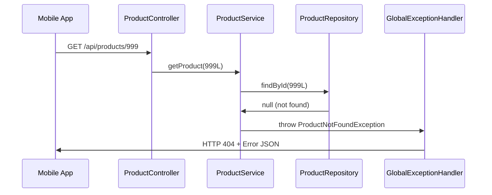
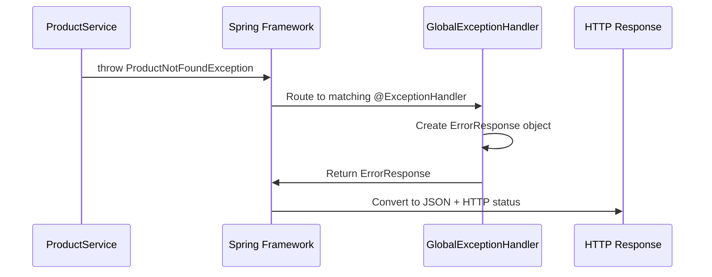

# Chapter 8: Exception Handling System

Building on our understanding of [Business Rule Validation](07_business_rule_validation_.md), we now know how our system prevents bad data from entering our product catalog. But what happens when validation fails? What if someone tries to find a product that doesn't exist? How do we communicate these problems to users in a helpful, professional way? This is where the **Exception Handling System** comes in - the professional customer service department that handles all problems gracefully.

## What Problem Does Exception Handling System Solve?

Imagine you're managing a customer service desk at a busy electronics store. Throughout the day, various problems occur: customers ask for products that are out of stock, someone tries to return an item without a receipt, or a person attempts to buy something with insufficient information on their order form.

Without a trained customer service system, chaos would ensue:
- Each employee gives different responses to similar problems
- Customers receive confusing technical jargon instead of clear explanations  
- Some problems cause the entire operation to shut down
- There's no consistent way to categorize and handle different types of issues

The Exception Handling System solves this exact problem in our software. When things go wrong (product not found, duplicate SKU, invalid data), specific exception classes categorize the problem type, and the GlobalExceptionHandler converts them into user-friendly HTTP responses. It's like having trained customer service staff who know exactly how to handle each type of complaint professionally.

Let's say a mobile app requests product #999, but it doesn't exist in our catalog. Instead of crashing or returning confusing error messages, our exception handling system will catch this problem and return a clear response: "Product with id 999 was not found" with an appropriate HTTP 404 status code.

## Key Players: Exception Classes and GlobalExceptionHandler

Our exception handling system has two main components, like having complaint categories and a customer service manager:

### Exception Classes: The Problem Categories
Custom exception classes like `ProductNotFoundException`, `DuplicateSkuException`, and `InvalidProductException` represent specific types of business problems - like having different forms for "item not found," "duplicate barcode," and "invalid information."

### GlobalExceptionHandler: The Customer Service Manager
The `GlobalExceptionHandler` catches all business exceptions from across our application and converts them into polite, helpful HTTP responses - like a skilled manager who knows exactly how to respond to each type of customer complaint.

## Business Exception Classes: Categorizing Problems

Let's explore our specific problem categories:

### ProductNotFoundException: When Items Don't Exist

```java
public class ProductNotFoundException extends RuntimeException {
    public ProductNotFoundException(Long id) {
        super("Product with id " + id + " was not found.");
    }
}
```

This exception represents when someone asks for a specific product that isn't in our catalog. The constructor automatically creates a helpful message explaining exactly which product couldn't be found.

**When it's thrown:**
```java
public Product getProduct(Long id) {
    Product product = repository.findById(id);
    if (product == null) {
        throw new ProductNotFoundException(id);
    }
    return product;
}
```

When our service layer discovers that a requested product doesn't exist, it throws this specific exception to clearly identify the problem.

### DuplicateSkuException: When Product Codes Conflict

```java
public class DuplicateSkuException extends RuntimeException {
    public DuplicateSkuException(String sku) {
        super("Product SKU already exists: " + sku);
    }
}
```

This handles attempts to create products with SKUs that are already taken - like preventing two different items from having the same barcode in a store.

**When it's thrown:**
```java
if (repository.findBySku(request.getSku()) != null) {
    throw new DuplicateSkuException(request.getSku());
}
```

### InvalidProductException: When Information Is Wrong

```java
public class InvalidProductException extends RuntimeException {
    public InvalidProductException(String message) {
        super(message);
    }
}
```

This represents validation failures - when someone provides incomplete, missing, or invalid product information.

**When it's thrown:**
```java
if (isBlank(request.getName())) {
    throw new InvalidProductException("name is required.");
}
```

## The ErrorResponse Model: Standardized Problem Reports

Before handling exceptions, we need a consistent format for error messages:

```java
public class ErrorResponse {
    private String code;
    private String message;
    private List<String> details = new ArrayList<String>();
}
```

This creates standardized error reports that include:
- **`code`**: A computer-readable error category (like "PRODUCT_NOT_FOUND")
- **`message`**: A human-friendly explanation
- **`details`**: Additional helpful information when needed

## GlobalExceptionHandler: The Professional Problem Solver

Now let's see our customer service manager in action:

```java
@ControllerAdvice
public class GlobalExceptionHandler {
    
    @ExceptionHandler(ProductNotFoundException.class)
    @ResponseStatus(HttpStatus.NOT_FOUND)
    @ResponseBody
    public ErrorResponse handleNotFound(ProductNotFoundException ex) {
        return new ErrorResponse("PRODUCT_NOT_FOUND", ex.getMessage());
    }
}
```

The `@ControllerAdvice` tells Spring "this class helps all controllers handle problems automatically." When any part of our application throws a `ProductNotFoundException`, this method catches it and creates a professional response.

### Handling Different Types of Problems

```java
@ExceptionHandler(DuplicateSkuException.class)
@ResponseStatus(HttpStatus.CONFLICT)
@ResponseBody
public ErrorResponse handleDuplicate(DuplicateSkuException ex) {
    return new ErrorResponse("DUPLICATE_SKU", ex.getMessage());
}
```

```java
@ExceptionHandler(InvalidProductException.class)
@ResponseStatus(HttpStatus.BAD_REQUEST)
@ResponseBody
public ErrorResponse handleInvalid(InvalidProductException ex) {
    return new ErrorResponse("INVALID_PRODUCT", ex.getMessage());
}
```

Each exception type gets its own appropriate HTTP response:
- **404 NOT_FOUND**: When something doesn't exist
- **409 CONFLICT**: When there's a business rule conflict
- **400 BAD_REQUEST**: When input data is invalid

## How Exception Handling Flows Through Our System

Let's trace what happens when a customer requests a non-existent product:



Here's the step-by-step process:

1. **Client Request**: Mobile app asks for product ID 999
2. **Controller Delegates**: Controller passes request to service layer
3. **Repository Search**: Service asks repository to find the product
4. **Not Found**: Repository returns null (product doesn't exist)
5. **Exception Thrown**: Service throws `ProductNotFoundException`
6. **Automatic Handling**: GlobalExceptionHandler catches the exception
7. **Professional Response**: Handler returns HTTP 404 with helpful error message

## Real-World Exception Examples

Let's see complete examples of our exception system in action:

### Example 1: Product Not Found

**Request:**
```http
GET /api/products/999
```

**What happens internally:**
```java
public Product getProduct(Long id) {
    Product product = repository.findById(id);
    if (product == null) {
        throw new ProductNotFoundException(id);
    }
    return product;
}
```

**Response to client:**
```http
HTTP/1.1 404 Not Found
Content-Type: application/json

{
  "code": "PRODUCT_NOT_FOUND",
  "message": "Product with id 999 was not found."
}
```

### Example 2: Duplicate SKU Prevention

**Request:**
```http
POST /api/products
{
  "sku": "LAP-100",
  "name": "Another Laptop",
  "price": 999.99
}
```

**What happens internally:**
```java
if (repository.findBySku("LAP-100") != null) {
    throw new DuplicateSkuException("LAP-100");
}
```

**Response to client:**
```http
HTTP/1.1 409 Conflict
Content-Type: application/json

{
  "code": "DUPLICATE_SKU",
  "message": "Product SKU already exists: LAP-100"
}
```

### Example 3: Invalid Product Data

**Request:**
```http
POST /api/products
{
  "sku": "TABLET-001",
  "price": 299.99
}
```

**What happens internally:**
```java
if (isBlank(request.getName())) {
    throw new InvalidProductException("name is required.");
}
```

**Response to client:**
```http
HTTP/1.1 400 Bad Request
Content-Type: application/json

{
  "code": "INVALID_PRODUCT",
  "message": "name is required."
}
```

## Under the Hood: How Spring Routes Exceptions

Let's understand the internal magic of how exceptions become user-friendly responses:



**Step-by-step process:**

**Step 1: Exception Creation**
```java
throw new ProductNotFoundException(999L);
```

**Step 2: Spring Catches Exception**
Spring automatically intercepts the exception as it bubbles up from the service layer.

**Step 3: Handler Method Selection**
```java
@ExceptionHandler(ProductNotFoundException.class)
public ErrorResponse handleNotFound(ProductNotFoundException ex) {
    return new ErrorResponse("PRODUCT_NOT_FOUND", ex.getMessage());
}
```

Spring finds the method with the matching `@ExceptionHandler` annotation.

**Step 4: Error Response Creation**
```java
return new ErrorResponse("PRODUCT_NOT_FOUND", 
    "Product with id 999 was not found.");
```

**Step 5: HTTP Response Generation**
Spring converts the `ErrorResponse` to JSON and adds the appropriate HTTP status code (404).

## Handling Unexpected Problems

Sometimes unexpected errors occur that aren't business-related:

```java
@ExceptionHandler(Exception.class)
@ResponseStatus(HttpStatus.INTERNAL_SERVER_ERROR)
@ResponseBody
public ErrorResponse handleUnexpected(Exception ex) {
    return new ErrorResponse("INTERNAL_ERROR", 
        "Unexpected server error.");
}
```

This catch-all handler ensures that even unexpected problems result in professional error responses rather than confusing stack traces.

## Integration with Other System Components

Our exception handling system works seamlessly with every part of our application:

- **[REST API Controller Layer](04_rest_api_controller_layer_.md)**: Controllers don't need try/catch blocks - exceptions are handled automatically
- **[Business Logic Service Layer](05_business_logic_service_layer_.md)**: Services throw meaningful exceptions when business rules are violated
- **[Data Access Repository Layer](06_data_access_repository_layer_.md)**: Repository null returns trigger appropriate business exceptions
- **[Business Rule Validation](07_business_rule_validation_.md)**: Validation failures become clear error messages

## Why This Exception System Matters

### Consistent User Experience
```json
// Every error follows the same format
{
  "code": "ERROR_TYPE",
  "message": "Clear explanation of what went wrong"
}
```

### Automatic Error Handling
```java
// Controllers stay clean - no error handling code needed
@GetMapping("/{id}")
public Product getProduct(@PathVariable Long id) {
    return service.getProduct(id); // Exceptions handled automatically
}
```

### Clear Problem Communication
Instead of technical stack traces, users receive helpful messages like "Product with id 123 was not found" that clearly explain what happened and often suggest solutions.

## Complete Exception Flow Example

Let's trace a complete example where someone tries to create a product with multiple problems:

**Bad Request:**
```json
{
  "sku": "",
  "name": null,
  "price": -10.99
}
```

**Validation Process:**
```java
if (isBlank(request.getSku())) {
    throw new InvalidProductException("sku is required.");
}
```

**Exception Handling:**
```java
@ExceptionHandler(InvalidProductException.class)
@ResponseStatus(HttpStatus.BAD_REQUEST)
public ErrorResponse handleInvalid(InvalidProductException ex) {
    return new ErrorResponse("INVALID_PRODUCT", ex.getMessage());
}
```

**Final Response:**
```json
{
  "code": "INVALID_PRODUCT",
  "message": "sku is required."
}
```

The user receives clear, actionable feedback about the first problem found, making it easy to fix their request step by step.

## Benefits of Professional Exception Handling

Our exception handling system provides several key advantages:

1. **User-Friendly Messages**: Clear explanations instead of technical jargon
2. **Consistent Format**: All errors follow the same structure across the entire API
3. **Appropriate HTTP Codes**: Status codes that client applications can programmatically handle
4. **Automatic Processing**: No manual error handling code cluttering business logic
5. **Problem Categorization**: Different exception types for different kinds of issues

## Conclusion

The Exception Handling System serves as the professional customer service department of our product catalog, ensuring that when things go wrong, users receive clear, helpful guidance rather than confusion. Like trained customer service representatives who know exactly how to handle each type of complaint, our system:

- **Catches all business problems**: Every type of error gets handled consistently
- **Provides clear communication**: Users receive helpful messages in a standard format
- **Uses appropriate channels**: HTTP status codes tell clients exactly what type of problem occurred
- **Works automatically**: Controllers and services can focus on business logic while exceptions are handled seamlessly
- **Maintains professionalism**: Even error responses reflect well on our API's quality

**Key takeaways:**
- Business exception classes (`ProductNotFoundException`, `DuplicateSkuException`, `InvalidProductException`) categorize specific problem types
- `GlobalExceptionHandler` with `@ControllerAdvice` automatically catches and handles all exceptions
- `ErrorResponse` provides consistent error message formatting across the API
- Spring automatically routes exceptions to appropriate handler methods
- The system integrates seamlessly with all layers of our Spring MVC architecture

Our exception handling system ensures that problems become opportunities to guide users toward success, creating a professional and reliable experience that builds trust in our product catalog API.

Next, we'll explore how all these components work together through [Dependency Injection and Spring Configuration](09_dependency_injection_and_spring_configuration_.md), where we'll learn how Spring automatically connects our controllers, services, repositories, and exception handlers into a cohesive, working system.

