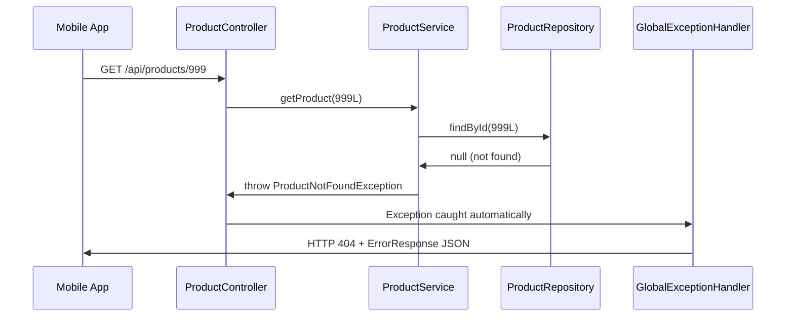
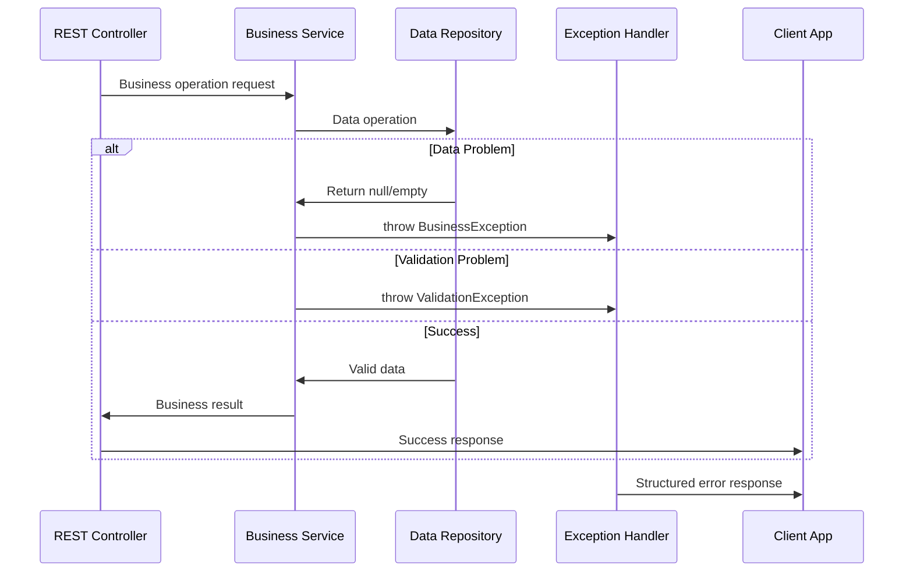

# Chapter 8: Exception Handling System

Building on our [Data Access Repository Layer](07_data_access_repository_layer_.md), we now have a complete system where controllers receive requests, services enforce business rules, and repositories manage storage. But what happens when something goes wrong? What if a customer asks for a product that doesn't exist, or tries to create a product with invalid data? This is where the **Exception Handling System** comes in - the customer service department of our product catalog.

## What Problem Does the Exception Handling System Solve?

Imagine you're running a physical electronics store with well-trained staff at every level: front desk clerks, store managers, and warehouse workers. Everything runs smoothly until problems arise. A customer asks for product #999 that doesn't exist, another tries to register two products with the same barcode, and someone submits a product form with missing information. Without a coordinated customer service system, chaos ensues:

- The front desk clerk panics and gives confusing error messages
- Each employee handles problems differently 
- Customers receive technical jargon instead of helpful explanations
- Some errors crash the entire operation instead of being handled gracefully

The Exception Handling System solves this exact problem in our software. It's like having a **professional customer service department** with standardized procedures for every type of problem:

- When a product isn't found → "Sorry, that product doesn't exist in our catalog"
- When someone tries to use a duplicate SKU → "That product code is already taken"
- When required information is missing → "Please provide the product name and price"
- When unexpected errors occur → "Something went wrong, please try again later"

Let's say a mobile app tries to create a product with SKU "MOUSE-001", but that SKU already exists. Instead of the app receiving a confusing technical error, our exception handling system will catch the problem and return a clear, helpful message: "Product SKU already exists: MOUSE-001".

## Key Players: Business Exceptions and GlobalExceptionHandler

Our exception handling system has two main components, like having specific problem categories and a customer service manager:

### Business Exception Classes: The Problem Categories
Custom exception classes like `ProductNotFoundException`, `DuplicateSkuException`, and `InvalidProductException` represent specific types of business problems - like having different complaint forms for "item not found", "duplicate barcode", and "missing information".

### GlobalExceptionHandler: The Customer Service Manager
The `GlobalExceptionHandler` catches all these business exceptions and converts them into polite, helpful responses for customers - like a customer service manager who knows exactly how to handle each type of complaint professionally.

## Business Exception Classes: Categorizing Problems

Let's look at our specific problem categories:

### ProductNotFoundException: The "Item Not Found" Problem

```java
public class ProductNotFoundException extends RuntimeException {
    public ProductNotFoundException(Long id) {
        super("Product with id " + id + " was not found.");
    }
}
```

This exception represents the situation where someone asks for a specific product that doesn't exist in our catalog. The constructor automatically creates a helpful message like "Product with id 123 was not found."

**When it's used:**
```java
// In ProductService when looking up a specific product
Product product = repository.findById(id);
if (product == null) {
    throw new ProductNotFoundException(id);  // Clear problem identification
}
```

### DuplicateSkuException: The "Already Taken" Problem

```java
public class DuplicateSkuException extends RuntimeException {
    public DuplicateSkuException(String sku) {
        super("Product SKU already exists: " + sku);
    }
}
```

This handles attempts to create products with SKUs that are already in use - like preventing two different products from having the same barcode.

**When it's used:**
```java
// In ProductService when checking SKU uniqueness
if (repository.findBySku(request.getSku()) != null) {
    throw new DuplicateSkuException(request.getSku());  // Prevent duplicates
}
```

### InvalidProductException: The "Missing Information" Problem

```java
public class InvalidProductException extends RuntimeException {
    public InvalidProductException(String message) {
        super(message);
    }
}
```

This represents validation failures - when someone provides incomplete or invalid product information.

**When it's used:**
```java
// In ProductService validation
if (request.getName() == null || request.getName().trim().isEmpty()) {
    throw new InvalidProductException("name is required.");  // Clear requirement
}
```

## The ErrorResponse Model: Standardized Problem Reports

Before we handle exceptions, we need a consistent way to format error responses:

```java
public class ErrorResponse {
    private String code;
    private String message;
    private List<String> details = new ArrayList<String>();
}
```

This is like having a standard complaint form that always includes:
- **`code`**: A computer-readable error type (like "PRODUCT_NOT_FOUND")
- **`message`**: A human-readable explanation
- **`details`**: Additional information if needed (like which specific fields are missing)

## GlobalExceptionHandler: The Customer Service Manager

Now let's see how our customer service manager handles different types of problems:

```java
@ControllerAdvice
public class GlobalExceptionHandler {
    
    @ExceptionHandler(ProductNotFoundException.class)
    @ResponseStatus(HttpStatus.NOT_FOUND)
    @ResponseBody
    public ErrorResponse handleNotFound(ProductNotFoundException ex) {
        return new ErrorResponse("PRODUCT_NOT_FOUND", ex.getMessage());
    }
}
```

The `@ControllerAdvice` annotation tells Spring "this class helps all controllers handle problems." When any controller throws a `ProductNotFoundException`, this method automatically steps in to handle it professionally.

### Handling Different Problem Types

```java
@ExceptionHandler(DuplicateSkuException.class)
@ResponseStatus(HttpStatus.CONFLICT)
public ErrorResponse handleDuplicate(DuplicateSkuException ex) {
    return new ErrorResponse("DUPLICATE_SKU", ex.getMessage());
}
```

```java
@ExceptionHandler(InvalidProductException.class)
@ResponseStatus(HttpStatus.BAD_REQUEST)  
public ErrorResponse handleInvalid(InvalidProductException ex) {
    return new ErrorResponse("INVALID_PRODUCT", ex.getMessage());
}
```

Each exception type gets its own professional response:
- **404 NOT_FOUND**: When something doesn't exist
- **409 CONFLICT**: When there's a business rule conflict (like duplicate SKU)
- **400 BAD_REQUEST**: When the input data is invalid

## How Exception Handling Works in Action

Let's trace what happens when a customer tries to find a product that doesn't exist:



Here's what happens step by step:

1. **Client Request**: Mobile app asks for product with ID 999
2. **Controller Delegation**: Controller asks service layer to find the product
3. **Repository Search**: Service asks repository to look up ID 999
4. **Not Found**: Repository returns null (product doesn't exist)
5. **Exception Thrown**: Service throws `ProductNotFoundException(999L)`
6. **Automatic Handling**: Spring automatically routes the exception to our handler
7. **Professional Response**: Handler converts exception to helpful HTTP 404 response

## Real-World Exception Examples

Let's see complete examples of how our exception system handles different scenarios:

### Scenario 1: Product Not Found

**Request:**
```bash
GET /api/products/999
```

**Service Layer:**
```java
public Product getProduct(Long id) {
    Product product = repository.findById(id);
    if (product == null) {
        throw new ProductNotFoundException(id);  // Business problem identified
    }
    return product;
}
```

**Response:**
```http
HTTP/1.1 404 Not Found
Content-Type: application/json

{
  "code": "PRODUCT_NOT_FOUND",
  "message": "Product with id 999 was not found."
}
```

### Scenario 2: Duplicate SKU Attempt

**Request:**
```bash
POST /api/products
{
  "sku": "LAP-100",  // This SKU already exists!
  "name": "Another Laptop",
  "price": 999.99
}
```

**Service Layer:**
```java
public Product createProduct(ProductRequest request) {
    if (repository.findBySku(request.getSku()) != null) {
        throw new DuplicateSkuException(request.getSku());  // Conflict detected
    }
    // ... continue with creation
}
```

**Response:**
```http
HTTP/1.1 409 Conflict
Content-Type: application/json

{
  "code": "DUPLICATE_SKU", 
  "message": "Product SKU already exists: LAP-100"
}
```

### Scenario 3: Invalid Product Data

**Request:**
```bash
POST /api/products
{
  "sku": "TABLET-001",
  // Missing required "name" field!
  "price": 299.99
}
```

**Service Layer:**
```java
private void validate(ProductRequest request) {
    if (request.getName() == null || request.getName().trim().isEmpty()) {
        throw new InvalidProductException("name is required.");  // Validation failure
    }
}
```

**Response:**
```http
HTTP/1.1 400 Bad Request
Content-Type: application/json

{
  "code": "INVALID_PRODUCT",
  "message": "name is required."
}
```

## Under the Hood: How Spring Routes Exceptions

Let's understand what happens internally when an exception occurs:

```java
// Step 1: Business logic detects problem
Product product = repository.findById(999L);
if (product == null) {
    throw new ProductNotFoundException(999L);  // Exception created
}
```

```java
// Step 2: Exception bubbles up through layers
// ProductService -> ProductController -> Spring Framework
```

```java
// Step 3: Spring's exception resolver finds matching handler
@ExceptionHandler(ProductNotFoundException.class)  // This matches!
public ErrorResponse handleNotFound(ProductNotFoundException ex) {
    return new ErrorResponse("PRODUCT_NOT_FOUND", ex.getMessage());
}
```

The beauty is that this happens automatically - when any layer throws a business exception, Spring routes it to the appropriate handler without any manual intervention.

## Integration with Other Layers

Our exception handling system works seamlessly with the entire Spring MVC architecture:



The exception system integrates with:
- **[REST API Controller Layer](03_rest_api_controller_layer_.md)**: Controllers don't need to handle exceptions - the global handler does it automatically
- **[Business Logic Service Layer](05_business_logic_service_layer_.md)**: Services throw meaningful business exceptions instead of returning error codes
- **[Data Access Repository Layer](07_data_access_repository_layer_.md)**: Repository null returns trigger appropriate business exceptions
- **[Product Domain Model](02_product_domain_model_.md)**: Exception messages reference domain concepts like "Product" and "SKU"

## Advanced Error Handling: Catching Unexpected Problems

Sometimes unexpected errors occur that we haven't planned for:

```java
@ExceptionHandler(Exception.class)
@ResponseStatus(HttpStatus.INTERNAL_SERVER_ERROR)
@ResponseBody
public ErrorResponse handleUnexpected(Exception ex) {
    return new ErrorResponse("INTERNAL_ERROR", "Unexpected server error.");
}
```

This acts as a safety net - if any exception occurs that we don't have a specific handler for, this method catches it and provides a generic but professional error message.

## Exception Hierarchy: Organizing Problem Types

Our exceptions inherit from `RuntimeException`, which means they're **unchecked exceptions**:

```java
RuntimeException
├── ProductNotFoundException     // Specific business problem
├── DuplicateSkuException       // Specific business problem  
└── InvalidProductException     // Specific business problem
```

**Why RuntimeException?**
- **No forced handling**: Controllers don't need try/catch blocks
- **Automatic propagation**: Exceptions bubble up to the global handler automatically
- **Clean business logic**: Service methods focus on business rules, not error handling syntax

## Complete Error Flow: From Problem to Response

Let's trace a complete example where validation errors occur:

**Input Request:**
```json
{
  "sku": "",           // Empty SKU
  "name": null,        // Missing name
  "price": -10.50      // Negative price
}
```

**Validation Process:**
```java
// Service validation catches first problem
private void validate(ProductRequest request) {
    if (isBlank(request.getSku())) {
        throw new InvalidProductException("sku is required.");  // First problem found
    }
    // Other validations would follow...
}
```

**Output Response:**
```json
{
  "code": "INVALID_PRODUCT",
  "message": "sku is required."
}
```

Our system reports the first problem found, which gives users clear, actionable feedback to fix their input step by step.

## Benefits of This Exception System

1. **Consistent Error Responses**: All errors follow the same format across the entire API
2. **Meaningful HTTP Status Codes**: Clients can programmatically handle different error types
3. **Clean Business Logic**: Services focus on business rules, not error formatting
4. **Automatic Handling**: No boilerplate try/catch code cluttering controllers
5. **User-Friendly Messages**: Clear explanations instead of technical stack traces

## Conclusion

The Exception Handling System serves as the professional customer service department of our product catalog system. Like a well-trained support team, it:

- **Catches all business problems**: Every type of error gets handled consistently and professionally
- **Provides clear explanations**: Users receive helpful messages instead of technical jargon
- **Uses appropriate communication channels**: HTTP status codes tell clients exactly what happened
- **Maintains professional standards**: All error responses follow the same structured format
- **Works automatically**: Controllers and services don't need manual error handling code

Key components:
- **Business exception classes** (`ProductNotFoundException`, `DuplicateSkuException`, `InvalidProductException`) categorize specific problem types
- **GlobalExceptionHandler** converts exceptions into user-friendly HTTP responses  
- **ErrorResponse model** provides consistent error message formatting
- **Automatic exception routing** eliminates boilerplate error handling code
- **Integration patterns** work seamlessly with all layers of our Spring MVC architecture

Our exception handling system ensures that when things go wrong (and they always do), users receive clear, helpful feedback that guides them toward a solution. This creates a professional, reliable experience that builds trust in our product catalog API.

Now that we have comprehensive error handling in place, let's explore how all these components work together through Spring's [Dependency Injection Container](09_dependency_injection_container_.md), where we'll learn how Spring automatically wires up our controllers, services, repositories, and exception handlers into a cohesive system.

