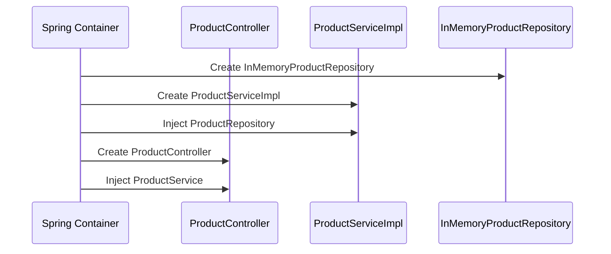
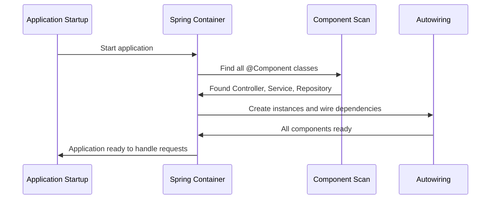

# Chapter 9: Dependency Injection and Spring Configuration

Building on our comprehensive [Exception Handling System](08_exception_handling_system_.md), we now understand how all the layers of our product catalog work together to handle requests, validate data, store information, and manage errors. But here's a crucial question: how does Spring actually connect all these pieces together? How does the ProductController know about the ProductService? How does the ProductService find the ProductRepository? This is where **Dependency Injection and Spring Configuration** comes in - the intelligent HR department that automatically connects everyone in our digital company.

## What Problem Does Dependency Injection Solve?

Imagine you're organizing a large electronics store with many departments: sales, inventory, customer service, and management. Without proper coordination, chaos would ensue:

- Salespeople would have to personally hunt down inventory managers when they need stock information
- Each employee would need to memorize who to contact for different tasks
- When someone quits or moves departments, everyone else needs to update their contact lists manually
- New employees wouldn't know who anyone is or how to get help

**Dependency Injection and Spring Configuration** solves this exact problem in our software. It acts like a **smart HR department** that automatically ensures everyone knows who they need to work with:

- Controllers automatically get connected to the right services
- Services automatically get connected to the right repositories
- When we change implementations, Spring handles all the reconnections
- New components get integrated seamlessly without manual wiring

Let's say a mobile app sends a request to create a product. Our ProductController needs a ProductService to handle the business logic, and that ProductService needs a ProductRepository to store data. Instead of manually creating these connections, Spring's "HR department" automatically provides each component with exactly what it needs to do its job.

## Key Players: Annotations and the Spring Container

Our dependency injection system has two main components, like having employee badges and an HR manager:

### Annotations: The Employee Badges
Annotations like `@Controller`, `@Service`, and `@Repository` are like special employee badges that tell Spring what role each class plays in our company.

### Spring Container: The HR Manager
The Spring Container is like a brilliant HR manager who reads all the employee badges, understands who needs to work with whom, and automatically makes all the introductions.

## The Employee Badges: Understanding Annotations

Let's see how our classes identify themselves to Spring:

### @Controller: The Customer Service Badge

```java
@Controller
@RequestMapping("/api/products")
public class ProductController {
    // "I handle customer requests"
}
```

The `@Controller` annotation tells Spring "this class handles web requests from customers." It's like wearing a badge that says "Customer Service Representative" so everyone knows your role.

### @Service: The Business Logic Badge

```java
@Service
public class ProductServiceImpl implements ProductService {
    // "I handle business rules and coordination"
}
```

The `@Service` annotation tells Spring "this class contains business logic and rules." It's like wearing a badge that says "Business Operations Manager."

### @Repository: The Data Management Badge

```java
@Repository
public class InMemoryProductRepository implements ProductRepository {
    // "I handle data storage and retrieval"
}
```

The `@Repository` annotation tells Spring "this class manages data storage." It's like wearing a badge that says "Warehouse Manager."

## The Magic Connection: @Autowired

Here's where the real magic happens - Spring automatically connects the right people together:

```java
@Controller
public class ProductController {
    
    @Autowired
    private ProductService productService;
}
```

The `@Autowired` annotation is like telling the HR department "I need someone who can handle business logic for products." Spring automatically finds the class with the `@Service` badge and connects them together.

**What happens automatically:**
- Spring finds the `ProductServiceImpl` class (it has the `@Service` badge)
- Spring creates an instance of `ProductServiceImpl` 
- Spring gives that instance to `ProductController`
- The controller can now use the service without creating it manually

## How Spring Connects the Chain

Let's see how all our components get connected automatically:

```java
@Service
public class ProductServiceImpl implements ProductService {
    
    @Autowired
    private ProductRepository repository;
}
```

Our service also needs a repository, so it asks the HR department (Spring) for one. Spring automatically provides the `InMemoryProductRepository` because it has the `@Repository` badge.

## The Complete Connection Chain

Here's how Spring automatically builds our entire system:



**Step-by-step automatic process:**

1. **Spring scans for badges**: Finds all classes with `@Controller`, `@Service`, `@Repository`
2. **Create instances**: Makes one instance of each class
3. **Analyze dependencies**: Sees what each class needs (via `@Autowired`)
4. **Connect automatically**: Provides each class with what it needs
5. **Ready to work**: All components are connected and ready to handle requests

## Constructor Injection: The Professional Way

While field injection (`@Autowired` on fields) works great for learning, the professional approach uses constructor injection:

```java
@Controller
public class ProductController {
    
    private final ProductService productService;
    
    public ProductController(ProductService productService) {
        this.productService = productService;
    }
}
```

This approach is like having HR introduce new team members during their first day meeting, rather than leaving notes on their desks. Spring automatically calls this constructor and provides the right ProductService.

**Benefits of constructor injection:**
- Makes dependencies explicit and required
- Allows fields to be `final` (unchangeable after creation)
- Easier to test because you can provide mock services directly

## Spring Configuration: The Company Organization Chart

Spring needs to know where to look for our employees and how to organize them. We use configuration to set this up:

### Component Scanning: Finding All Employees

```java
@SpringBootApplication
public class CatalogApplication {
    public static void main(String[] args) {
        SpringApplication.run(CatalogApplication.class, args);
    }
}
```

The `@SpringBootApplication` annotation tells Spring "scan this package and all sub-packages to find all employees (classes with badges)." It's like telling HR "look through all departments to find everyone who works here."

### Configuration Classes: Special Setup Instructions

```java
@Configuration
public class ProductConfig {
    
    @Bean
    public ProductValidator validator() {
        return new ProductValidator();
    }
}
```

Configuration classes with `@Configuration` are like special setup instructions. The `@Bean` annotation tells Spring "create this specific instance and make it available to anyone who needs it."

## How Dependency Injection Works in Practice

Let's trace what happens when our application starts up and handles its first request:

### Application Startup: HR Orientation Day



**What happens during startup:**

1. **Application starts**: Our `CatalogApplication.main()` method runs
2. **Component scanning**: Spring finds all classes with `@Controller`, `@Service`, `@Repository`
3. **Instance creation**: Spring creates one instance of each class
4. **Dependency injection**: Spring connects each instance with what it needs
5. **Ready state**: All components are connected and ready to work

### First Request: The Connected System in Action

```java
// When a request comes in, everything is already connected!
@GetMapping("/{id}")
public Product getProduct(@PathVariable Long id) {
    return productService.getProduct(id);  // Service is already injected!
}
```

The beautiful part is that by the time the first request arrives, all our components are already connected and ready to work together seamlessly.

## Real Example: Creating the Complete Chain

Let's see how Spring automatically builds our entire product creation flow:

### Step 1: Repository Creation

```java
@Repository
public class InMemoryProductRepository implements ProductRepository {
    // Spring creates this first (no dependencies)
}
```

Spring creates the repository first because it doesn't need anything else.

### Step 2: Service Creation with Injection

```java
@Service  
public class ProductServiceImpl implements ProductService {
    
    public ProductServiceImpl(ProductRepository repository) {
        this.repository = repository;  // Spring provides the repository!
    }
}
```

Spring creates the service and automatically provides the repository it just created.

### Step 3: Controller Creation with Injection

```java
@Controller
public class ProductController {
    
    public ProductController(ProductService productService) {
        this.productService = productService;  // Spring provides the service!
    }
}
```

Finally, Spring creates the controller and provides the fully-configured service.

## Interface-Based Injection: The Smart Matching

Notice how our injection uses interfaces rather than concrete classes:

```java
@Autowired
private ProductService productService;  // Interface, not ProductServiceImpl
```

```java
@Autowired  
private ProductRepository repository;   // Interface, not InMemoryProductRepository
```

This is like asking HR for "someone who can handle business logic" rather than specifically requesting "John from accounting." Spring automatically finds the class that implements the interface.

**Benefits:**
- Easy to swap implementations (change from in-memory to database storage)
- Better testing (can provide mock implementations)
- Cleaner code (depends on what classes can do, not how they do it)

## When Spring Can't Find What You Need

Sometimes Spring encounters problems during the wiring process:

### No Implementation Found

```java
// If no class implements ProductService
@Autowired
private ProductService productService;  // Spring error: "No bean of type ProductService"
```

### Multiple Implementations

```java
// If two classes implement ProductService  
@Service
public class ProductServiceImpl implements ProductService { }

@Service  
public class AdvancedProductService implements ProductService { }
```

Spring gets confused: "Which ProductService should I provide?" You need to be more specific using `@Primary` or `@Qualifier`.

## Error Handling: When Wiring Fails

Spring provides clear error messages when dependency injection fails:

```
***************************
APPLICATION FAILED TO START
***************************

Description:
Field productService in ProductController required a bean of type ProductService that could not be found.

Action:
Consider defining a bean of type ProductService in your configuration.
```

These messages are like HR saying "I couldn't find anyone with the right qualifications for this position."

## Benefits of This Automatic System

### No Manual Object Creation

Instead of writing:
```java
// Without Spring (manual and error-prone)
ProductRepository repository = new InMemoryProductRepository();
ProductService service = new ProductServiceImpl(repository);
ProductController controller = new ProductController(service);
```

Spring does all of this automatically when you use annotations!

### Easy Testing

```java
@Test
public void testProductCreation() {
    // Easy to provide test doubles
    ProductRepository mockRepo = new MockProductRepository();
    ProductService service = new ProductServiceImpl(mockRepo);
    
    // Test just the service logic
}
```

### Configuration Flexibility

You can easily swap implementations by changing which class has the `@Repository` annotation, without modifying any other code.

## Integration with All Our Previous Concepts

Dependency Injection connects everything we've learned:

- **[HTTP Request/Response Flow](01_http_request_response_flow_.md)**: Spring wires the components that handle the complete request flow
- **[Spring MVC Architecture Pattern](02_spring_mvc_architecture_pattern_.md)**: Dependency injection connects the MVC layers automatically
- **[Product Domain Model](03_product_domain_model_.md)**: All layers work with the same Product and ProductRequest objects
- **[REST API Controller Layer](04_rest_api_controller_layer_.md)**: Controllers get their services automatically injected
- **[Business Logic Service Layer](05_business_logic_service_layer_.md)**: Services get their repositories automatically injected
- **[Data Access Repository Layer](06_data_access_repository_layer_.md)**: Repository implementations are automatically discovered and provided
- **[Business Rule Validation](07_business_rule_validation_.md)**: Validation logic is part of services that get injected
- **[Exception Handling System](08_exception_handling_system_.md)**: Exception handlers are automatically discovered and connected

## Advanced Configuration Features

### Conditional Beans

```java
@Bean
@ConditionalOnProperty(name = "app.storage", havingValue = "database")
public ProductRepository databaseRepository() {
    return new DatabaseProductRepository();
}
```

This creates different implementations based on configuration properties - like having HR automatically assign database experts when the project requires database storage.

### Profile-Specific Configuration

```java
@Profile("development")
@Repository
public class InMemoryProductRepository implements ProductRepository { }

@Profile("production")  
@Repository
public class DatabaseProductRepository implements ProductRepository { }
```

Different implementations for different environments - like having different staff assignments for training vs. real customer service.

## Complete Example: Following the Injection Chain

Let's trace a complete request to see dependency injection in action:

**Request comes in:**
```http
GET /api/products/123
```

**Spring-wired components handle it:**

```java
// 1. Controller (has ProductService injected by Spring)
@Controller
public class ProductController {
    private final ProductService productService; // Injected by Spring
    
    @GetMapping("/{id}")
    public Product getProduct(@PathVariable Long id) {
        return productService.getProduct(id);
    }
}
```

```java
// 2. Service (has ProductRepository injected by Spring)  
@Service
public class ProductServiceImpl implements ProductService {
    private final ProductRepository repository; // Injected by Spring
    
    public Product getProduct(Long id) {
        return repository.findById(id);
    }
}
```

```java
// 3. Repository (created and managed by Spring)
@Repository
public class InMemoryProductRepository implements ProductRepository {
    public Product findById(Long id) {
        return products.get(id);
    }
}
```

Every component in this chain was automatically created and connected by Spring's dependency injection system!

## Conclusion

Dependency Injection and Spring Configuration serves as the intelligent HR department of our product catalog system. Like an amazing company coordinator who ensures everyone knows who they work with and has the resources they need, it:

- **Automatically discovers components**: Finds all classes with appropriate badges (`@Controller`, `@Service`, `@Repository`)
- **Creates instances intelligently**: Makes one instance of each component at startup
- **Wires dependencies automatically**: Connects each component with exactly what it needs to do its job
- **Maintains loose coupling**: Components depend on interfaces, not specific implementations
- **Enables easy testing**: Simple to provide mock implementations for isolated testing
- **Supports configuration flexibility**: Easy to swap implementations without changing business logic

**Key takeaways:**
- Annotations (`@Controller`, `@Service`, `@Repository`) tell Spring what role each class plays
- `@Autowired` (or constructor injection) requests dependencies automatically
- Spring Container acts like an HR manager, creating and connecting all components
- Interface-based injection allows easy swapping of implementations
- Component scanning finds all classes automatically at startup
- The entire system is wired and ready before the first request arrives

Our dependency injection system eliminates the tedious and error-prone work of manually creating and connecting objects, while making our code more flexible, testable, and maintainable. It's the foundation that makes everything else in our Spring application work together seamlessly.

This completes our journey through building a Spring REST product catalog! We've learned how HTTP requests flow through our system, how the MVC architecture organizes our code, how domain models represent our data, how controllers handle web requests, how services implement business logic, how repositories manage data, how validation ensures quality, how exception handling provides professional error responses, and finally how dependency injection connects it all together into a cohesive, working system.

