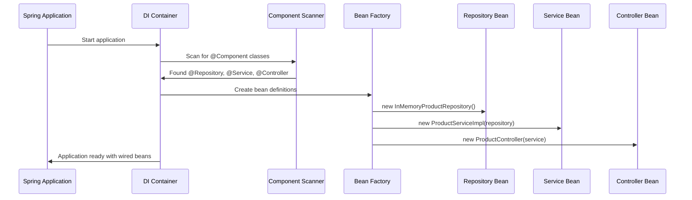
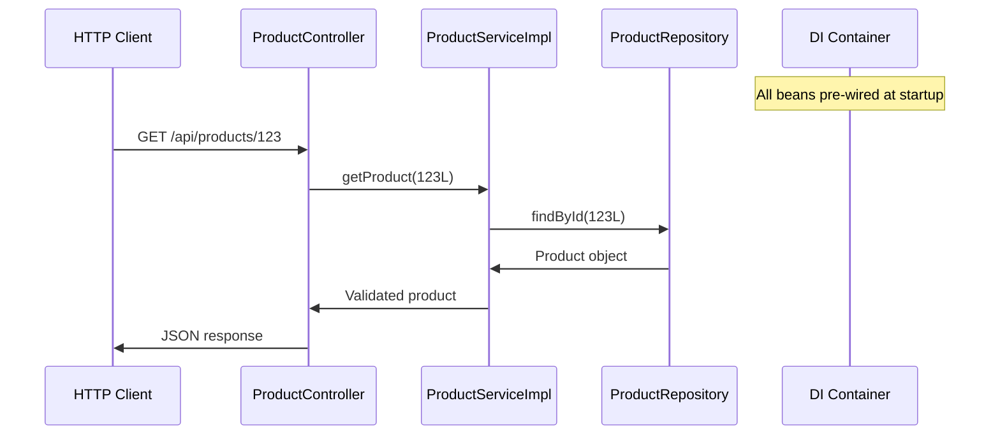

# Chapter 9: Dependency Injection Container

Building on our [Exception Handling System](08_exception_handling_system_.md), we now have a complete product catalog with controllers, services, repositories, and professional error handling. But you might wonder: "How does Spring know to automatically provide my `ProductService` to my `ProductController`? How does it create all these objects and wire them together?" This is where the **Dependency Injection Container** comes in - the behind-the-scenes HR department that ensures everyone knows who to work with.

## What Problem Does the Dependency Injection Container Solve?

Imagine you're opening a new electronics store with different departments: customer service (controllers), store management (services), and warehouse operations (repositories). Without an HR department coordinating everything, chaos would ensue:

- Customer service clerks don't know which store manager to ask for help
- Store managers don't know which warehouse worker handles inventory
- Everyone has to find and introduce themselves to coworkers manually
- When someone quits, you have to manually reconnect everyone
- New employees don't know who their teammates are

The Dependency Injection Container solves this exact problem in our software. It acts like a **super-efficient HR department** that automatically:

- Creates all the objects your application needs (controllers, services, repositories)
- Introduces them to each other so they can work together
- Ensures everyone has the right teammates when they need them
- Handles all the coordination behind the scenes

Let's say our `ProductController` needs a `ProductService` to handle business logic. Instead of manually creating and connecting these objects, Spring's container automatically provides the service to the controller - just like having an HR department that ensures every customer service clerk knows exactly which manager to contact for help.

## Key Players: Spring Beans and the Application Context

Our dependency injection system has two main components working together like an employee directory and an HR coordinator:

### Spring Beans: The Employee Directory
**Spring Beans** are simply objects that Spring manages for you - like having every employee registered in an official directory with their role and responsibilities clearly defined.

### Application Context: The HR Coordinator  
The **Application Context** is Spring's container that creates, manages, and connects all your beans automatically - like having an HR coordinator who knows everyone's job and ensures the right people work together.

## Spring Beans: Registering Your Team Members

Let's see how our classes become Spring-managed beans:

```java
@Controller
@RequestMapping("/api/products") 
public class ProductController {
    // Spring automatically manages this as a bean
}
```

The `@Controller` annotation tells Spring: "This is a customer service representative that handles web requests. Please include them in your employee directory and manage their lifecycle."

```java
@Service
public class ProductServiceImpl implements ProductService {
    // Spring automatically manages this as a bean
}
```

The `@Service` annotation says: "This is a store manager that handles business logic. Please register them and make them available to other team members."

```java
@Repository
public class InMemoryProductRepository implements ProductRepository {
    // Spring automatically manages this as a bean  
}
```

The `@Repository` annotation declares: "This is a warehouse manager that handles data storage. Please include them in your system and coordinate their work with others."

## Dependency Injection: Automatic Teamwork

Here's where the magic happens - automatic wiring of dependencies:

```java
@Controller
public class ProductController {
    private final ProductService service;
    
    public ProductController(ProductService service) {
        this.service = service;  // Spring automatically provides this!
    }
}
```

This constructor tells Spring: "I need a ProductService teammate to do my job." Spring's container automatically:
1. **Looks up** a ProductService bean in its directory
2. **Creates** the ProductController with that service  
3. **Connects** them so they can work together

It's like telling HR "I need to work with a store manager" and having them automatically introduce you to the right person.

## How the Container Creates Your Application

Let's see what happens when your application starts up:

```java
@SpringBootApplication
public class CatalogApplication {
    public static void main(String[] args) {
        SpringApplication.run(CatalogApplication.class, args);
    }
}
```

The `@SpringBootApplication` annotation triggers Spring to:
1. **Scan** your code for classes with annotations like `@Controller`, `@Service`, `@Repository`
2. **Register** these classes as bean definitions in its container
3. **Create** instances of these beans when needed
4. **Wire** them together based on their constructor parameters

## Container Initialization: Setting Up the Team

Let's trace what happens during application startup:



Here's what happens step by step during startup:

1. **Application Launch**: Spring Boot starts your application
2. **Component Scanning**: Container scans your packages for annotated classes
3. **Bean Registration**: Discovers your `@Repository`, `@Service`, and `@Controller` classes
4. **Dependency Analysis**: Figures out what each class needs (constructor parameters)
5. **Bean Creation**: Creates repository first, then service (with repository), then controller (with service)
6. **Application Ready**: All objects are created and wired together automatically

## Constructor Injection: The Professional Handoff

Our classes use constructor injection - the most reliable way to receive dependencies:

```java
@Service
public class ProductServiceImpl implements ProductService {
    private final ProductRepository repository;
    
    public ProductServiceImpl(ProductRepository repository) {
        this.repository = repository;  // Permanent connection established
    }
}
```

Constructor injection works like a professional employee handoff:
- **Clear requirements**: "I need a ProductRepository to do my job"
- **Immediate availability**: Repository is provided when the service is created  
- **Permanent connection**: The `final` keyword ensures the relationship never changes
- **No null references**: Service can't exist without its required repository

## Bean Lifecycle: From Hiring to Retirement

The container manages the complete lifecycle of your beans:

```java
// 1. Bean Definition Phase
@Service  // "We need a ProductService employee"
public class ProductServiceImpl implements ProductService {
    // Class definition registered
}
```

```java
// 2. Bean Creation Phase  
public ProductServiceImpl(ProductRepository repository) {
    // Spring calls constructor with required dependencies
}
```

```java
// 3. Bean Usage Phase
@Autowired  // Alternative to constructor injection
private ProductService service;  // Bean available for use
```

```java
// 4. Bean Destruction Phase
// Spring automatically cleans up when application shuts down
```

The container handles each phase automatically, like an HR department that manages hiring, onboarding, daily coordination, and retirement processes.

## Interface-Based Injection: Flexible Team Assignments

Notice our controller depends on the interface, not the implementation:

```java
public class ProductController {
    private final ProductService service;  // Interface, not implementation!
    
    public ProductController(ProductService service) {
        this.service = service;
    }
}
```

This provides powerful flexibility:
- **Loose coupling**: Controller doesn't know or care which specific implementation it gets
- **Easy swapping**: Could switch from `ProductServiceImpl` to `DatabaseProductService` without changing controller
- **Testability**: Easy to provide mock implementations during testing

It's like telling HR "I need someone who can handle store management" rather than requesting a specific person by name.

## Real-World Example: Complete Dependency Chain

Let's trace how Spring wires up our complete application:

**Step 1: Repository Creation**
```java
@Repository
public class InMemoryProductRepository implements ProductRepository {
    // Spring creates: repository = new InMemoryProductRepository()
}
```

**Step 2: Service Creation**  
```java
@Service
public class ProductServiceImpl implements ProductService {
    public ProductServiceImpl(ProductRepository repository) {
        // Spring calls: service = new ProductServiceImpl(repository)
    }
}
```

**Step 3: Controller Creation**
```java
@Controller  
public class ProductController {
    public ProductController(ProductService service) {
        // Spring calls: controller = new ProductController(service)  
    }
}
```

**Final Result**: Spring has created a complete dependency chain where:
- Repository manages data storage independently
- Service has access to repository for data operations
- Controller has access to service for business operations
- All connections are automatic and type-safe

## Under the Hood: How Dependency Resolution Works

Let's understand what Spring does internally when resolving dependencies:

```java
// When Spring sees this constructor:
public ProductController(ProductService service) {
    this.service = service;
}
```

**Internal Resolution Process:**
1. **Analyze Constructor**: "ProductController needs a ProductService"
2. **Search Container**: "Do I have any beans that implement ProductService?"
3. **Find Implementation**: "Yes, I have ProductServiceImpl registered as @Service"  
4. **Check Dependencies**: "Does ProductServiceImpl need anything? Yes, ProductRepository"
5. **Resolve Chain**: "I have InMemoryProductRepository for that"
6. **Create in Order**: Create repository → Create service → Create controller
7. **Wire Together**: Pass repository to service, service to controller

## Component Scanning: Automatic Discovery

Spring finds your beans through component scanning:

```java
@SpringBootApplication  // Includes @ComponentScan
public class CatalogApplication {
    // Automatically scans current package and sub-packages
}
```

**What gets scanned:**
- `@Controller` - Web request handlers
- `@Service` - Business logic components  
- `@Repository` - Data access components
- `@Component` - Generic Spring-managed components

**Scanning process:**
1. **Package traversal**: Spring examines every class in your packages
2. **Annotation detection**: Looks for stereotype annotations
3. **Bean registration**: Creates bean definitions for annotated classes
4. **Dependency mapping**: Analyzes constructors to understand relationships

## Configuration: Customizing the HR Department

You can customize how Spring manages beans:

```java
@Configuration
public class AppConfig {
    
    @Bean
    public ProductService customProductService() {
        return new ProductServiceImpl(new DatabaseProductRepository());
    }
}
```

This `@Configuration` class acts like custom HR policies:
- **Custom creation**: Override default bean creation with specific logic
- **Complex wiring**: Handle sophisticated dependency relationships
- **External resources**: Wire in databases, web services, or other external systems

## Integration Patterns: How Everything Works Together

The container enables clean integration across all our layers:



The container's pre-wiring enables:
- **[REST API Controller Layer](03_rest_api_controller_layer_.md)**: Gets service automatically injected
- **[Business Logic Service Layer](05_business_logic_service_layer_.md)**: Gets repository automatically injected  
- **[Data Access Repository Layer](07_data_access_repository_layer_.md)**: Created and managed automatically
- **[Exception Handling System](08_exception_handling_system_.md)**: GlobalExceptionHandler gets registered automatically

## Benefits of Dependency Injection Container

1. **Automatic Wiring**: No manual object creation or connection code
2. **Loose Coupling**: Classes depend on interfaces, not implementations
3. **Easy Testing**: Simple to substitute mock objects during tests
4. **Configuration Flexibility**: Change implementations without touching business code
5. **Lifecycle Management**: Spring handles object creation, destruction, and cleanup

## Troubleshooting: When Wiring Goes Wrong

Sometimes the container can't wire things together:

```java
// Problem: No implementation found
public class ProductController {
    public ProductController(PaymentService payment) {
        // Error: No bean of type PaymentService found!
    }
}
```

**Common issues:**
- **Missing annotations**: Forgot `@Service`, `@Repository`, etc.
- **Package scanning**: Class is outside scanned packages
- **Multiple implementations**: Spring doesn't know which one to choose
- **Circular dependencies**: A needs B, but B also needs A

## Advanced Features: Professional HR Capabilities

The container provides sophisticated features:

```java
@Service
@Scope("prototype")  // Create new instance each time
public class ReportGenerator {
    // Each request gets fresh instance
}
```

```java
@Service  
@Primary  // Prefer this implementation when multiple exist
public class FastProductService implements ProductService {
    // This implementation gets priority
}
```

These features allow fine-tuned control over bean management and selection.

## Conclusion

The Dependency Injection Container serves as the professional HR department of our Spring application. Like an exceptional human resources team, it:

- **Automatically discovers team members**: Finds all your annotated classes and registers them as managed components
- **Handles all introductions**: Wires together your controllers, services, and repositories without manual intervention  
- **Manages lifecycles professionally**: Creates objects in the right order, maintains them during operation, and cleans up when done
- **Provides flexibility**: Supports interface-based injection for easy testing and configuration changes
- **Works behind the scenes**: All this coordination happens automatically, letting you focus on business logic

Key benefits of Spring's dependency injection:
- **Constructor injection** provides clear, required dependencies that are available immediately
- **Interface-based dependencies** create loose coupling and flexible architecture
- **Automatic component scanning** discovers and registers your beans without manual configuration
- **Complete lifecycle management** handles object creation, wiring, and cleanup automatically
- **Integration with all layers** enables seamless coordination between controllers, services, repositories, and exception handlers

Our dependency injection container creates the foundation that makes all other Spring features possible. It's the invisible infrastructure that allows our [REST API Controller Layer](03_rest_api_controller_layer_.md), [Business Logic Service Layer](05_business_logic_service_layer_.md), [Data Access Repository Layer](07_data_access_repository_layer_.md), and [Exception Handling System](08_exception_handling_system_.md) to work together seamlessly.

With Spring managing all the wiring automatically, you can focus on what matters most: building great business functionality that solves real problems for your users. The container handles all the technical plumbing, leaving you free to concentrate on creating value through your product catalog's features and capabilities.

