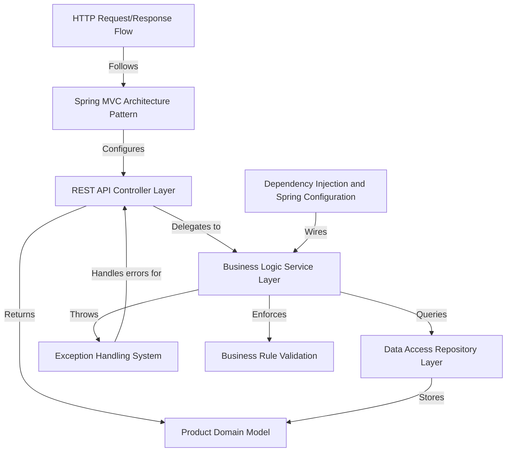

# Tutorial: spring3-rest-product-cata

This is a **Spring 3 REST API** for managing a *product catalog* without using Spring Boot. 
It demonstrates traditional Spring MVC architecture where you can **create, read, update, and delete products** 
through HTTP endpoints. The system validates business rules like *preventing duplicate SKUs* and handles 
errors gracefully with meaningful HTTP responses. It uses an **in-memory storage** system that can easily 
be replaced with a real database.

**Source Repository:** [https://github.com/pr4nj411/spring3-rest-product-cata](https://github.com/pr4nj411/spring3-rest-product-cata)

## Chapters

1. [HTTP Request/Response Flow
](01_http_request_response_flow_.md)
2. [Spring MVC Architecture Pattern
](02_spring_mvc_architecture_pattern_.md)
3. [Product Domain Model
](03_product_domain_model_.md)
4. [REST API Controller Layer
](04_rest_api_controller_layer_.md)
5. [Business Logic Service Layer
](05_business_logic_service_layer_.md)
6. [Data Access Repository Layer
](06_data_access_repository_layer_.md)
7. [Business Rule Validation
](07_business_rule_validation_.md)
8. [Exception Handling System
](08_exception_handling_system_.md)
9. [Dependency Injection and Spring Configuration
](09_dependency_injection_and_spring_configuration_.md)
